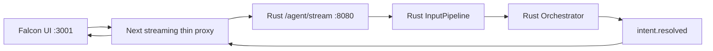

# Falcon Client → Rust Input Pipeline 遷移驗收報告

**驗收日期**：2026-06-30  
**驗收環境**：local Falcon Client `http://localhost:3001` → Docker Rust Agent `http://localhost:8080`  
**對應 PRD**：`docs/agent-runtime-rust-port/prd.md`  
**對應 QA Plan**：`docs/agent-runtime-rust-port/qa/qa-plan.md`  
**整體判定**：✅ **PASS（預設 streaming 路徑）／⚠️ 完整 TS deprecation 尚未完成**

## 1. 驗收目的與判定範圍

本報告驗證目前 Falcon Client 的預設 Chief of Staff streaming 請求，是否已把以下 input-pipeline 責任移交給 Rust `datacenter-agent`：

- 文字 normalize
- `option_id` 與文字 intent 分類
- text override 與 candidate intent
- slot extraction
- answer policy 前置決策
- `intent.resolved` SSE 事件產生

「遷移成功」在本報告中定義為：Falcon 的預設 streaming route 只做 request guard、metadata forwarding 與 SSE transport mapping；input normalization／intent resolution 實際由 Rust 執行，且結果能完整穿過 Falcon bridge 回到 UI。

本報告不把「Falcon repo 已刪除所有 legacy TypeScript pipeline」列入 PASS 定義；該項另列為殘留風險。

## 2. 實際執行架構

目前實際設定：

| 設定 | 實測值 | 判定 |
|---|---|---|
| `EOMC_AGENT_BASE_URL` | `http://localhost:8080` | ✅ Falcon 指向本機 Rust Agent |
| `NEXT_PUBLIC_COS_STREAMING` | `true` | ✅ 使用 streaming thin-proxy 路徑 |
| `RUNTIME_ENABLED` | `true` | ✅ Rust runtime input pipeline 已啟用 |
| Agent 容器 | `running` | ✅ |
| MCP 容器 | `running` | ✅ |
| Catapult 容器 | `running / healthy` | ✅ |

## 3. 程式碼責任歸屬證據

### 3.1 Rust 已承接 input pipeline

| 責任 | Rust 證據 |
|---|---|
| normalize、intent、slots | `src/runtime/input/pipeline.rs:33` 的 `run_with_config` |
| option-path 與 text override | `src/runtime/input/pipeline.rs:73` 起的單元測試 |
| request path 呼叫 pipeline | `src/runtime/orchestrator.rs:276` |
| intent resolved 內部事件 | `src/runtime/orchestrator.rs:213` |
| 對外 `intent.resolved` SSE mapping | `src/server/handler.rs:360` |
| `/agent/stream` 注入 Rust runtime dependencies | `src/server/handler.rs:322` |

### 3.2 Falcon 預設 streaming route 是 transport adapter

| 行為 | Falcon 證據 |
|---|---|
| 預設開啟 streaming | `/Users/liying.chu/falcon-client/src/components/chief-of-staff/ChiefOfStaffPanel.tsx:38` |
| UI 呼叫 streaming route | 同檔案 `:430` |
| route 轉送 prompt/session/option | `/Users/liying.chu/falcon-client/src/app/api/chief-of-staff/nodes/stream/route.ts:93` |
| upstream `intent.resolved` 原樣透傳 | 同檔案 `:115` |
| token/clear/done 僅做 SSE 契約轉譯 | 同檔案 `:111` |

靜態 call-site 掃描確認：`nodes/stream/route.ts` 沒有呼叫 `runRulePipeline` 或 `runInputPipeline`。因此預設 streaming path 不會在 Falcon 重新做 intent 分類。

Falcon 仍保留 edge request guard 與長度檢查；這屬 HTTP 邊界保護，不是 normalize／intent／slots 推理權威。

## 4. 黑箱端到端驗證

### TC-E01：Rust 直連與 Falcon bridge 解析一致

**輸入**：

- prompt：`revenue 營收 收入 賺多少`
- option：`charging.monthly`
- 目的：製造 option 指向 charging、文字明確指向 revenue 的衝突，驗證 text override 真正由 Rust 處理。

| 路徑 | `intent.resolved` | 最終 intent | 完成事件 | 結果 |
|---|---:|---|---|---|
| 直連 Rust `/agent/stream` | 1 | `revenue` | `done`: 1 | ✅ PASS |
| Falcon `/api/chief-of-staff/nodes/stream` | 1 | `revenue` | `answer.final`: 1 | ✅ PASS |

事件統計：

- Rust：`intent.resolved=1`、`token=859`、`clear=1`、`done=1`
- Falcon：`intent.resolved=1`、`answer.delta=915`、`answer.reset=2`、`answer.final=1`

token/delta 數量不同是兩次獨立 LLM 呼叫的非決定性輸出，不影響 input-pipeline 判定；可比較的 deterministic 結果為 intent、source 與 confidence。

### TC-E02：Rust audit 證明 Falcon 請求在 Rust 內完成 normalize

Rust Agent audit 對兩條路徑均記錄：

| session | option_id | intent | confidence | intent_source | terminal status |
|---|---|---|---:|---|---|
| `qa-migration-direct-20260630` | `charging.monthly` | `revenue` | 0.92 | `TextOverride` | `completed` |
| `qa-migration-falcon-20260630` | `charging.monthly` | `revenue` | 0.92 | `TextOverride` | `completed` |

Falcon bridge session 出現在 Rust 的 `request_received → input_normalized → response_completed` audit sequence，直接證明 Falcon 請求不是只在前端本地分類。

## 5. 自動化測試結果

### 5.1 Rust `datacenter-agent`

| Gate | 命令 | 結果 |
|---|---|---|
| Format | `cargo fmt --all -- --check` | ✅ PASS |
| Type / compile | `cargo check` | ✅ PASS |
| Lint | `cargo clippy -- -D warnings` | ✅ PASS |
| Unit / integration / contract | `cargo test` | ✅ 78 passed、0 failed、2 ignored |
| Offline pipeline eval | `cargo run --bin eval -- --pipeline-only` | ✅ 3 passed、0 failed |

Rust 測試涵蓋：CJK/full-width normalize、option-path intent、text override、time/metric/asset/rank slots、unknown option fallback、unknown asset warning、orchestrator event ordering，以及 `intent.resolved` public wire serialization。

### 5.2 Falcon Client

| Gate | 結果 |
|---|---|
| `npm run type-check` | ✅ PASS |
| `npm run lint` | ✅ 0 warnings / 0 errors |
| targeted Vitest | ✅ 4 files、26 tests passed |

Targeted suites：

- `nodes/stream/route.test.ts`
- `agent-client.test.ts`
- `run-agent-turn.test.ts`
- `run-input-pipeline.test.ts`（legacy parity safety net）

## 6. AC 追溯

| AC | 驗收標準 | 證據 | 狀態 |
|---|---|---|---|
| MIG-01 | 預設 Falcon 路徑指向 Rust Agent | runtime env + process config | ✅ PASS |
| MIG-02 | Falcon streaming route 不執行 TS input pipeline | call-site scan + route source | ✅ PASS |
| MIG-03 | prompt/session/option metadata 傳至 Rust | route source + Rust audit | ✅ PASS |
| MIG-04 | Rust 執行 normalize／intent resolution | Rust audit `TextOverride` | ✅ PASS |
| MIG-05 | Rust `intent.resolved` 穿過 Falcon bridge | direct/bridge SSE comparison | ✅ PASS |
| MIG-06 | Falcon 收到完整 final answer | `answer.final=1` | ✅ PASS |
| MIG-07 | TypeScript legacy pipeline 已完全移除或不可達 | non-stream route 仍呼叫 `runRulePipeline` | ⚠️ PARTIAL |

## 7. 殘留風險與限制

1. **Legacy non-stream route 尚未 deprecate**  
   `/Users/liying.chu/falcon-client/src/app/api/chief-of-staff/nodes/route.ts:95` 仍執行 TypeScript `runRulePipeline`。當 `NEXT_PUBLIC_COS_STREAMING=false` 時，UI 可切回此路徑。因此目前證實的是「預設 streaming cutover 成功」，不是「Falcon repo 已完全沒有 input pipeline」。

2. **建議的收尾條件**  
   rollback 觀察期結束後，將 non-stream POST 改為直接轉送 Rust `/agent`，再移除 Falcon 的 inference pipeline call sites；legacy TS fixtures 可轉為 Rust parity fixtures 或封存。

3. **圖表渲染不屬於本報告範圍**  
   圖表是否出現取決於 LLM 回傳的 chart content block 與 Falcon renderer，與 input-pipeline 是否由 Rust 執行是兩個獨立驗收面向。

4. **QA wrapper 工具問題**  
   repo 的 `run-qa.sh` 目前會把 Cargo 輸出的 `running` 與 manifest 的 `N/A` 誤判為 shell command。本報告改以 manifest 中的原始 Cargo 命令直接執行並取得 exit 0；產品測試本身沒有因此失敗。

## 8. 結論

目前 local 環境已證實：**Falcon Client 的預設 streaming input path 已成功遷移到 Rust `datacenter-agent`**。Falcon 對 input 的主要角色已收斂為 transport、request metadata forwarding 與 UI event mapping；normalize、intent resolution、text override、slots 與 `intent.resolved` 事件來源均位於 Rust。

驗收狀態為 **PASS with residual legacy path**。若 release 定義要求「Falcon 完全不再擁有 input-pipeline 執行能力」，則仍需完成 non-stream route deprecation 後再做最終 full-cutover sign-off。
