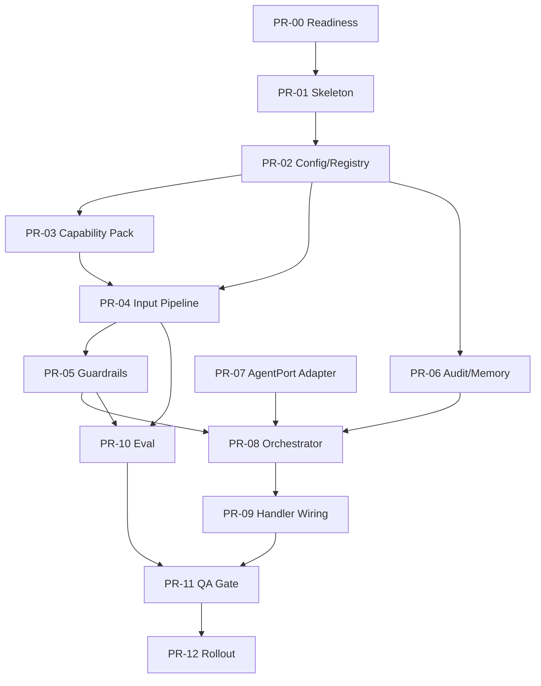

# Agent Runtime Rust Port — Implementation Plan

**Story ID**: S-RUNTIME-01  
**Date**: 2026-06-25  
**Status**: draft  
**Target repo**: `datacenter-agent`  
**Source repo**: `falcon-client`  
**Primary specs**: `prd.md`, `runtime-architecture-spec.md`, `file-structure.md`, `spec/*`  
**QA plan**: `.agent/artifacts/qa/2026-06-25-agent-runtime-rust-port/qa-plan.md`

---

## 1. Purpose

This plan converts the approved PRD/spec/migration docs into an execution-ready implementation sequence.

It answers:

1. Which PRs should be opened, in what order.
2. Which files each PR owns.
3. Which tests must be written before each PR can merge.
4. How to keep `/agent` and `/agent/stream` stable while the Rust runtime is built.
5. How to preserve `falcon-client` as the behavioral oracle until Rust parity is green.

This document is narrower than `migration-plan.md`: migration-plan covers source repo lifecycle, rollout, and deprecation; this plan covers day-to-day coding execution in `datacenter-agent`.

---

## 2. Ground Rules

1. **No route cutover before runtime gates are green.** New runtime code can compile and be tested behind config/feature flags before handlers call it.
2. **Keep external wire stable.** `/agent` JSON and `/agent/stream` SSE expose only existing client events: token/done/error/clear.
3. **Runtime core is HTTP-free.** `src/runtime/**` must not import `axum`, `server::*`, or host DTO types.
4. **Config drives domain and assembly.** EV Chief-of-Staff is the first capability pack, not hardcoded runtime behavior.
5. **Fail fast at boot, classify per request.** Config/registry errors abort startup; request validation maps to `AppError`.
6. **Audit must not be best-effort by accident.** `AuditSink::write` returns `Result`; `[runtime.audit].failure_policy` decides fail-open or fail-closed.
7. **LLM normalizer fallback stays optional.** Implement trait/config seam only; default is disabled.
8. **No duplicated memory authority.** With `session_id`, server memory is authoritative and upstream `history` is empty; without it, client `history` remains fallback.
9. **No production dependency on live LLM for CI.** `cargo run --bin eval -- --pipeline-only` is mandatory; response eval is live/replay only.

---

## 3. Definition of Ready

Implementation can start when these are true:

| Item | Required Output |
|------|-----------------|
| Source reference frozen | `falcon-client` commit/tag recorded in `docs/agent-runtime-rust-port/migration-log.md` |
| Baseline-capture method agreed | Approach for documenting existing `/agent` and `/agent/stream` behavior chosen (tests or snapshots); the capture itself is PR-00's deliverable, not a precondition |
| QA plan available | `.agent/artifacts/qa/2026-06-25-agent-runtime-rust-port/qa-plan.md` |
| File structure accepted | `docs/agent-runtime-rust-port/file-structure.md` |
| Feature flag decision made | Default-off route wiring strategy selected |

If implementation must begin before source tag is available, only PR-00 and PR-01 may proceed. Porting parity logic should wait.

---

## 4. PR Sequence

### PR-00: Readiness and Baseline

**Goal**: create an immutable baseline before behavior changes.

| Area | Work |
|------|------|
| Docs | Add `migration-log.md` with source commit/tag, target branch, date, owner |
| Tests | Add baseline tests around current handler validation and SSE event mapping |
| Approved diffs | Record known intentional behavior changes vs current Rust, including the prompt cap moving from `USER_PROMPT_LENGTH_CAP = 2000` (`src/server/handler.rs`) to the EV pack's `input.max_prompt_chars = 4000` |
| Tooling | Confirm `cargo test` and `cargo clippy` baseline |
| Source repo | Export or identify TS characterization fixture command |

Files:

- `docs/agent-runtime-rust-port/migration-log.md`
- `tests/runtime_contract.rs` or existing integration test location
- No runtime route behavior changes

Gate:

```bash
cargo test
cargo clippy --all-targets --all-features -- -D warnings
```

Rollback: delete added baseline docs/tests; no product behavior changes.

---

### PR-01: Runtime Skeleton and Dependency Wiring

**Goal**: add empty module skeleton and dependencies without changing handlers.

| Area | Work |
|------|------|
| Dependencies | Add `uuid`, `sha2`, `unicode-normalization`, `regex`, `async-trait`, `thiserror` |
| Modules | Add `src/runtime/**` skeleton per file-structure |
| Exports | Add `pub mod runtime;` in `src/lib.rs` |
| Config | Add minimal parser placeholders, no runtime loading in `AppState` yet |

Files:

- `Cargo.toml`
- `src/lib.rs`
- `src/runtime/mod.rs`
- `src/runtime/{config,registry,schema,error,orchestrator,audit,llm_normalizer}.rs`
- `src/runtime/input/{mod,normalizer,intent,slots,pipeline}.rs`
- `src/runtime/guardrails/{mod,injection,input_guard,answer_policy}.rs`
- `src/runtime/memory/{mod,store,context}.rs`
- `src/runtime/eval/{mod,evaluator,fixtures,baseline,report,runner}.rs`
- `src/bin/eval.rs`

Gate:

```bash
cargo check
cargo test
```

Rollback: remove module export; handlers still untouched.

---

### PR-02: Config, Schema, Error, Registry

**Goal**: build the runtime contract foundation.

| Area | Work |
|------|------|
| Schema | `NormalizedInput`, `NormalizedSlots`, intent strings, warnings, eval-observable structs, and the `AgentTurnFrame::{Token, Clear, ToolCalled, ToolResult, Done, Error}` enum (defined here so PR-07 can adapt to it) |
| Config | Load `config/config.toml` runtime refs and pack TOML/JSON files |
| Validation | intent allowlist, `unknown`, duplicate ids, option-prefix target, module ids |
| Registry | Builtin registry for stages, answer policy, LLM normalizer, memory, audit, evaluators |
| Errors | `RuntimeError` with config vs request variants |

Important decisions:

- `RuntimeConfig` includes `input.max_prompt_chars`; its value is sourced from the `[input]` section of `config/runtime/thresholds.toml` (added in PR-03), not hardcoded.
- `build_memory` returns `Option<Arc<dyn SessionMemoryStore>>`.
- `build_llm_normalizer` returns `Option<Arc<dyn LlmInputNormalizer>>`.
- Unknown enabled module id is a boot/config error.

Gate:

```bash
cargo test runtime::config
cargo test runtime::registry
cargo test runtime::schema
```

Rollback: keep module unused by handlers.

---

### PR-03: Capability Pack Skeleton

**Goal**: create the first EV parity capability pack in config.

| Area | Work |
|------|------|
| Config | Add `config/runtime/{intents,lexicon,thresholds,injection}.toml`; `thresholds.toml` carries `[input] max_prompt_chars = 4000` (the value PR-02's `RuntimeConfig` reads) |
| Eval fixtures | Add seed `config/runtime/evals/inputs.json` |
| Baseline | Add placeholder/provenance file for `response-baseline.json` or omit until PR-10 with explicit TODO |
| Parser tests | Verify all files load from existing `config/config.toml` refs |

Files:

- `config/config.toml`
- `config/runtime/intents.toml`
- `config/runtime/lexicon.toml`
- `config/runtime/thresholds.toml`
- `config/runtime/injection.toml`
- `config/runtime/evals/inputs.json`
- `config/runtime/evals/response-baseline.json` when provenance is ready

Gate:

```bash
cargo test runtime::config
```

Rollback: remove `[runtime]` refs from `config/config.toml`; handlers do not use runtime yet.

---

### PR-04: L5 Input Pipeline

**Goal**: port deterministic input engineering.

| Area | Work |
|------|------|
| Normalizer | NFKC + explicit fullwidth/CJK punctuation map |
| Intent | option-path, lexicon scoring, margin tiers, text override |
| Slots | time range, metric, asset, rank limit extractors |
| Pipeline | Ordered `PipelineStage` execution from `[runtime.pipeline]` |
| Unknown option | Known prefix maps option-path; unknown prefix logs/audits warning and falls back, not 400 |

Tests:

- Character normalization matrix.
- Intent confidence and margin tiers.
- Option id known/unknown prefix.
- Slot extraction including unknown asset from config allowlist.
- Pipeline stage ordering.

Gate:

```bash
cargo test runtime::input
cargo run --bin eval -- --pipeline-only
```

Rollback: revert PR; handlers never referenced this code (the `RUNTIME_ENABLED` flag does not exist until PR-09).

---

### PR-05: L6 Guardrails and Answer Policy

**Goal**: refuse or annotate unsafe/unsupported requests before LLM/MCP.

| Area | Work |
|------|------|
| Input guard | Empty and over `input.max_prompt_chars` checks |
| Injection | Versioned regex set with JS regex portability reviewed |
| Answer policy | Rule backend: structural reject, semantic refusal, disclaimer, answer |
| Error mapping | Distinguish structural 400 from semantic 200 refusal |

Tests:

- Empty prompt -> request error.
- Prompt at exactly `max_prompt_chars` (4000) accepted; at `max_prompt_chars + 1` (4001) rejected.
- Regression guard for the approved diff: a 2001-char prompt is now accepted (was 400 under the old 2000 cap).
- Injection refusal does not call upstream.
- Low confidence disclaimer is first emitted token.

Gate:

```bash
cargo test runtime::guardrails
cargo run --bin eval -- --pipeline-only
```

Rollback: revert PR; handlers never referenced this code (the `RUNTIME_ENABLED` flag does not exist until PR-09).

---

### PR-06: L14 Audit and L12 Memory

**Goal**: add governance and session continuity primitives.

| Area | Work |
|------|------|
| Audit event model | request received, input normalized/rejected, refused, memory, tool, clear, response completed/failed |
| Audit sink | `AuditSink::write -> Result<(), RuntimeError>` |
| Failure policy | fail-open continues with error log; fail-closed returns request error |
| Redaction | PII hash, secret masking, preview env gate |
| Memory store | `SessionMemoryStore` trait + in-memory implementation |
| Memory context | sanitize, truncate, budget, session mismatch drop |

Tests:

- Monotonic `seq`.
- Secret redaction with Rust-side env names.
- Fail-open continues.
- Fail-closed aborts.
- Memory disabled uses client history.
- Memory enabled folds context into prompt and sends upstream `history: []`.

Gate:

```bash
cargo test runtime::audit
cargo test runtime::memory
```

Rollback: revert PR; handlers never referenced this code and in-memory state is ephemeral (the `RUNTIME_ENABLED` flag does not exist until PR-09).

---

### PR-07: AgentPort Adapter and Tool Frames

**Goal**: adapt existing `llm_connector` loop to runtime frames.

| Area | Work |
|------|------|
| Internal frames | Add/bridge `AgentTurnFrame::{Token, Clear, ToolCalled, ToolResult, Done, Error}` |
| Adapter | Wrap `llm_connector::generate` and `agent_stream` behavior behind `AgentPort` |
| Tool metadata | Surface tool called/result metadata internally without changing external SSE |
| Clear semantics | Preserve `LlmEvent::Clear` and make it observable to orchestrator |

Tests:

- Token passthrough.
- Clear frame appears and later orchestrator clears buffer.
- Tool called/result metadata is observable internally.
- External SSE still emits only token/done/error/clear.

Gate:

```bash
cargo test llm_connector
```

> Adapter-frame tests extend the existing `#[cfg(test)]` modules in `src/llm_connector/agent.rs` (the `cargo test llm_connector` filter matches these; the `tests/llm_connector.rs` integration file in `file-structure.md` is optional and need not be created if in-module coverage suffices). `runtime::orchestrator` tests do not exist until PR-08 and are gated there.

Rollback: revert PR; handlers stay on the direct `llm_connector` path (nothing referenced the adapter yet).

---

### PR-08: Orchestrator Core

**Goal**: own one full turn in runtime core.

Flow:

```text
AgentTurnInput
  -> audit RequestReceived
  -> input pipeline
  -> optional LLM normalizer
  -> answer policy
  -> memory context
  -> AgentPort stream
  -> buffer / emit / audit
  -> memory append
  -> ResponseCompleted
```

Tests:

- Semantic refusal emits `[Token(refusal), Done]` and does not call `AgentPort`.
- Disclaimer emits first token then continues.
- `Clear` clears final buffer.
- Agent error with empty buffer -> failed.
- Agent abort with partial buffer -> completed(aborted).
- InputRejected audit is emitted for blocked request.
- LLM normalizer disabled by default and not called.

Gate:

```bash
cargo test runtime::orchestrator
```

Rollback: handlers still direct unless PR-09 enables route wiring.

---

### PR-09: AppState and Handler Wiring Behind Flag

**Goal**: integrate runtime into host edge without breaking clients.

| Area | Work |
|------|------|
| AppState | Store runtime config, input pipeline, answer policy, optional LLM normalizer, optional sessions, audit, agent port |
| DTO | Add `session_id: Option<String>` and `option_id: Option<String>`, each `#[serde(default)]` so absent fields deserialize to `None` (matching how `history` is handled today in `src/server/dto.rs`) |
| Handler | Choose runtime path only when feature/config flag is enabled |
| JSON response | Preserve `AgentResponse { user_prompt, model_response }` |
| SSE response | Map runtime frames to existing `StreamFrame` |
| Error mapping | `RuntimeError` -> `AppError` with 400/502/500 semantics |

Feature flag:

```text
RUNTIME_ENABLED=false   # default during PR
RUNTIME_ENABLED=true    # integration and staging
```

Tests:

- Flag off -> old path.
- Flag on -> orchestrator path.
- DTO remains backward-compatible when new fields are absent.
- `/agent/stream` wire frames unchanged.

Gate:

```bash
cargo test
```

Rollback: set `RUNTIME_ENABLED=false`.

---

### PR-10: Eval Runner and Baselines

**Goal**: make regression visible and repeatable.

| Area | Work |
|------|------|
| CLI | `cargo run --bin eval -- --pipeline-only` |
| Pipeline eval | intent/slots/action assertions from fixtures |
| Response eval | `--response --replay <artifact>` and `--response --live` modes |
| Baseline | Create `response-baseline.json` from recorded TS responses or approved live samples |
| Report | pass/fail, latency, token, refusal/fallback budget |

Tests:

- CLI argument parsing.
- Pipeline-only does not require provider env vars.
- Replay mode reads artifact without network.
- Baseline provenance is recorded.

Gate:

```bash
cargo run --bin eval -- --pipeline-only
cargo test runtime::eval
```

Rollback: do not wire eval to CI until fixed; runtime remains usable.

---

### PR-11: Full QA Gate and Hardening

**Goal**: close gaps before staging rollout.

| Area | Work |
|------|------|
| QA | Execute QA plan levels L0-L4 |
| Rust hygiene | Remove request-path `unwrap`/`expect` in `src/runtime/**` |
| Observability | Confirm tracing spans include request/session correlation |
| Docs | Update migration log with completed PR refs and any approved parity diffs |
| CI | Add mandatory pipeline eval if CI exists |

Gate:

```bash
cargo fmt --check
cargo clippy --all-targets --all-features -- -D warnings
cargo test
cargo run --bin eval -- --pipeline-only
rg -n "unwrap\\(|expect\\(" src/runtime
```

`rg` must return no request-path violations. Test-only `expect` may be allowed if scoped under `#[cfg(test)]`.

Rollback: keep runtime flag off.

---

### PR-12: Staging Rollout and Frontend Cutover

**Goal**: switch consumers only after Rust runtime has proven parity.

This PR may be split across `datacenter-agent` and `falcon-client`.

| Repo | Work |
|------|------|
| `datacenter-agent` | Enable runtime in staging config |
| `falcon-client` | Add endpoint flag and send `session_id` / `option_id` |
| `falcon-client` | Stop forwarding `memoryPayload` in server-memory mode |
| Both | Dual-run comparison and rollback docs |

Gate:

- Pipeline eval green.
- Response eval live/replay accepted.
- Staging smoke passes for `/agent` and `/agent/stream`.
- No schema/wire change required by frontend.

Rollback:

1. Disable frontend endpoint flag.
2. Set Rust `RUNTIME_ENABLED=false`.
3. Keep TS runtime fallback until agreed soak period completes.

---

## 5. Dependency Graph



Parallelizable work:

- PR-03 capability pack can start after PR-02 config structs are stable.
- PR-06 audit/memory can proceed while PR-04/PR-05 port deterministic input logic.
- PR-07 adapter can proceed once `AgentTurnFrame` is defined.
- PR-10 eval can begin with pipeline-only mode before response baseline is ready.

---

## 6. Suggested Implementation Order Inside Each PR

Use the same loop for every PR:

1. Add failing tests for the target contract.
2. Add minimal types/interfaces.
3. Implement the smallest behavior slice.
4. Run the PR gate command.
5. Run one broader command (`cargo test`) before marking ready.
6. Update docs/checklists only for decisions discovered during implementation.

For runtime modules, prefer this file order:

1. `error.rs`
2. `schema.rs`
3. `config.rs`
4. `registry.rs`
5. leaf modules (`input/*`, `guardrails/*`, `memory/*`, `audit.rs`)
6. `orchestrator.rs`
7. host wiring (`appstate.rs`, `server/*`)

---

## 7. Test Matrix

| Layer | Required Test Types | Command |
|------|---------------------|---------|
| Config/registry | unit + config fixture load | `cargo test runtime::config && cargo test runtime::registry` |
| Input | pure unit + parity fixtures | `cargo test runtime::input` |
| Guardrails | unit + policy table tests | `cargo test runtime::guardrails` |
| Audit | unit + fake failing sink | `cargo test runtime::audit` |
| Memory | unit + store/context tests | `cargo test runtime::memory` |
| Adapter | fake LLM stream/tool frames | `cargo test llm_connector` |
| Orchestrator | fake trait objects, no live LLM | `cargo test runtime::orchestrator` |
| Handler | JSON/SSE wire compatibility | `cargo test --test runtime_contract` |
| Eval | offline pipeline fixtures | `cargo run --bin eval -- --pipeline-only` |
| Full repo | integration safety net | `cargo test` |

---

## 8. Review Checklist

Every implementation PR should answer these before review:

- [ ] Does this change keep `/agent` and `/agent/stream` externally compatible?
- [ ] Is the new runtime code free of `axum` and `server::*` imports?
- [ ] Is any domain-specific value in config rather than Rust code?
- [ ] Are unknown config module ids caught at boot?
- [ ] Are request-path errors represented as `RuntimeError` and mapped once at the edge?
- [ ] Are audit events emitted for every new decision path?
- [ ] If memory is involved, is server-memory vs client-history behavior explicit?
- [ ] If LLM/tooling is involved, can tests run without provider credentials?
- [ ] Did `cargo test` and the PR-specific gate pass?

---

## 9. Risk Controls

| Risk | Control |
|------|---------|
| Runtime behavior diverges from TS silently | Characterization fixtures before port; pipeline eval gate |
| Handler cutover breaks frontend | Runtime flag default off; DTO fields optional |
| Tool metadata disappears | Internal `AgentTurnFrame::{ToolCalled, ToolResult}` required before orchestrator merge |
| Audit sink outage blocks all traffic unexpectedly | Configured fail-open/fail-closed policies and tests for both |
| Double memory injection | Explicit `session_id` rule: server-memory uses upstream `history: []` |
| Live LLM dependency destabilizes CI | Pipeline eval is offline; response eval live/replay only |
| Capability pack becomes hardcoded | Review checklist requires domain values in `config/runtime/*` |
| Config schema drift | `deny_unknown_fields` preserved where applicable; validation tests added |

---

## 10. Release Readiness

The Rust runtime can be enabled in staging only when:

- [ ] PR-00 through PR-11 are merged.
- [ ] `cargo test` passes.
- [ ] `cargo clippy --all-targets --all-features -- -D warnings` passes.
- [ ] `cargo run --bin eval -- --pipeline-only` passes.
- [ ] Response eval live or replay has an approved report.
- [ ] QA plan required L0-L4 cases are completed or waived with owner/date.
- [ ] `falcon-client` has endpoint flag support.
- [ ] Rollback path is documented and tested.

Production cutover requires the same gates plus staging soak approval.

---

## 11. Immediate Next Actions

1. Create `migration-log.md` and record source repo commit/tag.
2. Open PR-00 for baseline tests around existing handlers.
3. Open PR-01 for runtime skeleton and dependencies.
4. Export TS characterization fixtures before PR-04 begins.
5. Keep `RUNTIME_ENABLED=false` until PR-11 is complete.
