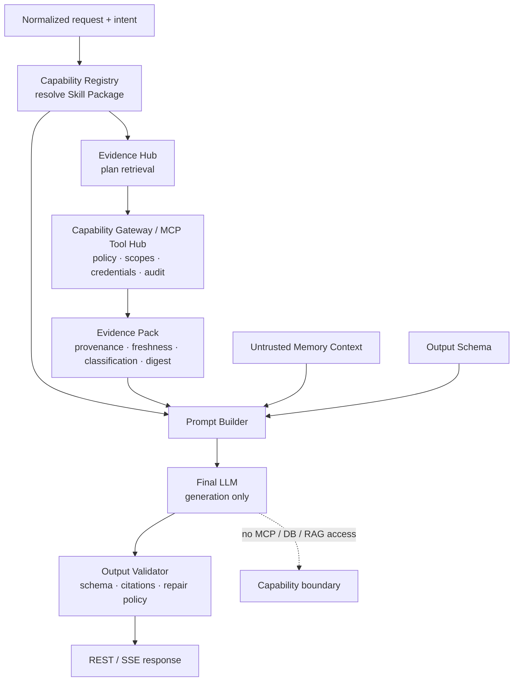

# datacenter-agent Runtime 平台 PRD

**Story ID**：S-RUNTIME-01  
**版本**：v1.4.0  
**狀態**：Target-state product source of truth  
**對應現況 Spec**：[spec v1.4.0](./spec/spec.md)
**對應現況 QA**：[qa v1.4.0](./tests/qa-plan.md)
**Source**：產品目標來自本頁；建置狀態以 [`src/`](../../src/lib.rs)、[`config/`](../../config/config.toml) 與 [QA evidence](./tests/qa-plan.md) 驗證

> 本 PRD 描述**全部完成後的產品樣貌**。每條需求都標示目前建置狀態，未完成不代表已上線。現況技術行為以 [Spec](./spec/spec.md) 為準；部分完成／待建置 項目的執行順序以 [程式修改計劃](../../.agent/artifacts/plan/2026-06-29-runtime-correctness/implementation.md) 為準。

## 版本歷史

| 版本 | 日期 | 內容 | 對應 Spec |
|---|---|---|---|
| v1.0.0 | 2026-06-29 | 初版 reverse PRD | v1.0.0 |
| v1.1.0 | 2026-06-29 | 改為 target-state PRD；逐項標建置狀態並連結現況證據/計劃 | v1.1.0 |
| v1.2.0 | 2026-06-29 | 加入 Capability/Evidence architecture、Evidence Pack contract 與 Final LLM isolation | v1.2.0 |
| v1.3.0 | 2026-06-29 | output format 改由 capability config 決定（避免 markdown 隱性硬編）；明列 Platform Control Plane／infra 為 non-goal | v1.2.0 |
| v1.4.0 | 2026-07-11 | 新增 FR-014 HTML 報表產生器與圖表輸出（`/report`、`/report/stream`）並註記其現況繞過 runtime；新增 member intent 至 analytics 能力範圍；登錄 FR-015 本地去識別化／逆向還原（Privacy Proxy，待建置）與 NFR-010 PII egress 控制 | v1.4.0 |

## 1. 狀態定義

| 標記 | 意義 |
|---|---|
| 已完成 | production request path 已接線，且有足以支持本條需求的自動測試 |
| 部分完成 | 有實作，但 wiring、failure path、測試或運維契約仍缺一部分 |
| 待建置 | 只有目標、seam 或 isolated unit test；不可視為可用功能 |
| 待決策 | 完成樣貌仍需產品/安全決策；計劃只能先建立 decision gate |

「有 struct／trait／config／單元測試」本身不構成已完成。

## 2. 完成後產品定位

`datacenter-agent` 是一套**可複用、可治理、config 驅動的 Rust LLM runtime**，並以資料中心 analytics agent 作為第一個能力包。Host 對外提供穩定的 JSON/SSE API；runtime 對內統一處理輸入、intent/slots、guardrails、memory、audit、LLM/MCP tool loop 與 evaluation。

完成後，新增一個垂直應用時：

1. 以 capability pack 定義 intents、lexicon、slots、stages、guardrails、policy thresholds、output format、memory/audit/evaluator backend。
2. 只選用 registry 已註冊的通用 Rust 元件；純內容/組合變更不需改 Rust。
3. 真正需要新機制時才新增 Rust plugin，並透過 registry 暴露，不在 handler 寫領域分支。
4. 相同 runtime contract 同時供 REST 與 SSE 使用，且 failure/cancellation semantics 一致。
5. 所有「已支援」聲明都由 contract test 或可失敗的 CI gate 證明。

## 3. Capability / Evidence 目標架構

完成後的能力引用把**能力選擇、資料取得、證據封裝、prompt 組裝與最終生成拆成不同信任邊界**；Final LLM 不直接持有 MCP tools：

### 3.1 節點契約與信任邊界

每個節點的 input→output 是可抽換的前提（契約穩定才換得了實作）；下表同時定義資料契約與信任邊界，欄位級內容引用既有契約不重複。

| Component | Input | Output | Owns | Must not own | 狀態 |
|---|---|---|---|---|---|
| Capability Registry | normalized request + resolved intent | versioned Skill Package（instructions/allowed sources/scopes/output schema/budget/policy refs，見 FR-013） | capability/skill ID、version、allowed evidence sources、output contract | credentials、tool execution | 部分完成 config/registry seam 部分存在 |
| MCP / Tool Hub + Capability Gateway | scoped tool/query request（來自 Evidence Hub） | tool result + policy_decisions（見 §3.2 `policy_decisions[]`） | tool registry、policy、least-privilege scopes、credentials、execution、audit | final answer generation | 部分完成 現有 MCP client 可執行，但沒有 gateway/policy boundary |
| RAG / Evidence Hub | Skill Package allowed sources + query/normalized slots | Evidence Pack（欄位見 §3.2） | retrieval plan、受控 tool/query calls、Evidence Pack construction | Final LLM credentials、直接輸出 public answer | 待建置 |
| Prompt Builder | Skill Package + Evidence Pack + untrusted memory + output schema + request context | compiled prompt（deterministic；含選定的 output_format） | Skill Package + Evidence Pack + schema + memory 的 deterministic composition | tool execution、credential access | 待建置 |
| Final LLM | compiled prompt（無 tool schema/handle/credential） | 候選輸出（依 output schema） | 只依 compiled prompt 生成候選答案 | MCP tools、DB connection、RAG client、credentials | 待建置；現況相反 |
| Output Validator | 候選輸出 + output schema + citations | validated REST/SSE response（schema/citation 通過；markdown 或 JSON） | schema、citation、policy validation；依 capability 選定 output format（markdown/JSON）；有限 repair | 任意資料存取或未受控 tool call、寫死單一輸出格式 | 待建置 |

### 3.2 Evidence Pack contract

Evidence Pack 是 Evidence Hub 交給 Prompt Builder 的 immutable、request-scoped 資料產品；外部內容一律視為 untrusted data，不是 system instruction。

最小欄位：

- `pack_id`、`request_id`、`capability_id`、`capability_version`。
- `query`／resolved intent／normalized slots 的摘要或 hash。
- `items[]`：stable evidence id、typed content 或 data reference、source/tool id、provenance、retrieved/observed timestamp、freshness/expiry、classification、trust/confidence、content digest。
- `citations[]`：public citation id 到 evidence item/source 的映射。
- `policy_decisions[]`：requested/granted scopes、deny/filter/redact reason，不含 credentials。
- `warnings[]`、partial/failure state、pack-level digest、size/token budget。

Evidence Pack 不得包含 bearer/API key、DB/MCP credentials、可執行 instruction、未標 source 的 raw text，或讓 Final LLM 反向呼叫資料源的 handle。

### 3.3 Security rationale

這個隔離模型把外部 evidence 明確標成不可信內容，並把 function/tool 執行留在 code-controlled gateway。它是本產品採用的嚴格架構選擇，對應 [OWASP LLM01](https://genai.owasp.org/llmrisk/llm01-prompt-injection/) 的 least privilege、code-mediated functions 與 untrusted-content segregation，也對應 [MCP Security Best Practices](https://modelcontextprotocol.io/docs/tutorials/security/security_best_practices) 的 progressive least-privilege scopes、credential/audit boundaries。

## 4. 產品原則

| 原則 | 完成樣貌 | 現況 |
|---|---|---|
| 單一推理權威 | input/policy/memory/audit/orchestration 都在 Rust runtime | 部分完成 legacy/runtime 雙路徑仍有契約差異；`/report` 端點目前亦繞過 runtime（FR-014） |
| Config 負責內容與組合 | stage/guardrail/extractor/evaluator 依 config dispatch | 部分完成 ID 有驗證，但多數沒有 dispatch |
| 機制可插拔 | registry builder 回傳真正會被 AppState/request path 使用的 component | 部分完成 部分 backend 已接線 |
| Secure by default | 最小 CORS、標準 bearer、secret-safe log、tenant-safe memory | 部分完成／待建置 |
| Streaming 可取消 | 有 backpressure、deadline、disconnect cancellation、terminal event | 待建置 |
| Evidence before claim | CI 對 regression 回 nonzero，QA 區分 unit/contract/live | 部分完成 process gate 已生效；evaluator coverage仍有限 |
| 可回滾 | runtime 關閉時不載入 runtime config，legacy 可獨立開機 | 部分完成 false/0 startup rollback 已接線/測試；staging smoke待補 |
| 能力隔離 | Final LLM 只做生成；所有 MCP/DB/RAG 存取經 gateway 產出 Evidence Pack | 待建置 現況 Final LLM tool loop 直接持有 MCP tools |
| 證據可追溯 | 每個可驗證事實能回指 Evidence Pack item/citation/provenance | 待建置 沒有 Evidence Pack/Output Validator |

## 5. 功能需求

### FR-001：穩定 HTTP API — 部分完成

完成樣貌：

- `/agent` 回 JSON 聚合答案；`/agent/stream` 回 SSE。
- `AgentRequest` 支援 `prompt`、default-empty `history`、optional `session_id`/`option_id`。
- JSON 與 SSE 共用同一 runtime validation/orchestration contract。
- legacy compatibility path 在 rollout 完成前保留，不改既有 wire event。
- 所有 route status/body/header 都有 Router-level contract tests。

現況缺口：runtime SSE 在 response 建立後才驗證 prompt，錯誤是 HTTP 200 + error frame；body cap/auth/timeout 沒有 Router-level tests。

### FR-002：明確且一致的 limits — 部分完成

完成樣貌：

- legacy compatibility cap 保持 2000 Unicode chars。
- runtime cap 由 capability config 決定，EV pack 預設 4000 chars。
- 同一路徑的 REST/SSE 使用相同 cap，且結構錯誤都在 streaming 前回 400。
- body >64 KiB 保留 extractor/middleware 的 413，不被統一轉成 400。
- 120 秒是完整 turn deadline：REST deadline 前未完成回 504；SSE 在 deadline emit terminal error 並取消 producer/upstream。

現況缺口：runtime SSE validation timing、SSE body deadline、JSON rejection status。

### FR-003：可配置 input pipeline — 部分完成

完成樣貌：

- `assembly.input_stages` 決定 stage 順序與啟用狀態。
- 每個 stage 實作同一 contract，registry 解析 ID 並建立 pipeline。
- normalize、input guard、injection、intent、slots 都走同一 dispatcher。
- config validation 防止缺 stage、重複、不合法順序與未知 ID。
- stage ordering 有 integration tests，不能只測 builder。

現況：request path 硬編 `normalize → injection → intent → slots`；`InputPipeline.stages` 未使用。

### FR-004：Guardrails 與 answer policy — 部分完成

完成樣貌：

- injection detector 在 normalize/input guard 後執行並產生 typed warning。
- answer policy 在 request path 消費 warning；injection/off-scope/low-confidence 都有 REST/SSE E2E tests。
- refusal/disclaimer/answer thresholds 全部讀 capability config，並驗證 `0 ≤ gray ≤ normal ≤ 1`。
- 語意拒絕不呼叫 LLM/MCP、不消耗 upstream token，audit 記錄穩定 reason code。

現況：injection/off-scope/low-confidence 都已接入 request path，policy thresholds 讀 capability config；仍缺 REST/SSE Router-level E2E 與 confidence numeric/order validation。

### FR-005：Config-driven registry — 部分完成

完成樣貌：

- answer policy、memory、audit、normalizer、input stages、extractors、guardrails、evaluators 都由 registry 建立並由 AppState 持有。
- registry 不回傳只供驗證的死 metadata。
- 未知 ID、重複/conflicting module、非法數值/順序使 startup fail-fast。
- capability-only 變更有測試證明不需重編 Rust。

現況：answer policy/memory/audit/normalizer 部分接線；stage/extractor/guardrail/evaluator 不完整，evaluator 是 noop。

### FR-006：Session memory 與租戶隔離 — 部分完成／identity contract 待決策

完成樣貌：

- memory key 綁定 server 驗證過的 actor/tenant + session id；client-controlled session id 不能單獨形成安全邊界。
- memory 只保存明確定義的摘要/structured fields，不以 summary 名稱保存完整 raw prompt/response。
- context 被視為 untrusted data；sanitization、budget、drop/truncation 行為有精確契約。
- backend 可替換，clear/retention/expiry 行為一致。
- memory 失敗遵循明確 fail-open/fail-closed policy 並有 audit。

現況：in-memory store 已接線；production `actor_id=None` 且保存 full text。injection refusal 不寫 memory，context sanitizer 重用 capability detector；budget 仍是整段 drop。可信 actor 來源尚需決策。

### FR-007：結構化且去敏的 Audit — 部分完成

完成樣貌：

- 每個 turn 有 request id、monotonic seq、stable event codes 與 terminal outcome。
- sink boundary 對所有文字欄位執行 central redaction；不輸出 token、credential URL、raw tool args、raw upstream error。
- actor/session identifier 依 data classification hash 或 tokenization。
- refusal、aborted、cancelled、timeout、tool semantic error 都有 terminal audit。
- fail-open/fail-closed 行為可配置並有 handler-level tests。

現況：event model、seq、sink 與 failure policy 已有；redaction helper 未接 sink，actor 未接入，aborted/cancelled terminal evidence 不完整。

### FR-008：可靠 SSE lifecycle — 待建置

完成樣貌：

- bounded channel 提供 backpressure 與明確 capacity。
- client disconnect 或 send failure 立即 cancel/abort producer 及上游 LLM/MCP。
- spawned task panic/cancel 轉成 terminal error/audit，不靜默結束。
- 每個 stream 恰有一個 terminal outcome：done、error、cancelled 或 timeout。
- slow consumer、disconnect、deadline、JoinError 有 deterministic tests。

現況：unbounded channel、send error ignored、dropped JoinHandle detaches producer、JoinError 未映射。

### FR-009：LLM/MCP terminal semantics — 部分完成

完成樣貌：

- provider stream 只有觀察到合法 finish reason 才能 emit Done。
- natural EOF without finish、partial tool call、non-convergence 都回 typed aborted/error。
- `generate` 不得在沒有 terminal event 時回 `Ok(partial)`。
- MCP `is_error=true` 保留為 semantic failure，模型仍可自我修正，但 `ToolResult.ok=false` 且 audit 真實。
- 對 client 只回 stable code；完整 upstream chain 去敏後留 server log。

現況：transport error、natural EOF、length/content-filter 與不相容 finish reason 都不會 emit Done；`generate` 的無 terminal fallback 與 MCP semantic `ok=true` 仍待修。

### FR-010：可信 Eval / CI gate — 部分完成

完成樣貌：

- pipeline eval 覆蓋完整 configured pipeline，不只 intent/slots。
- response replay/live 的 evaluator 實作與 config ID 相符，不用 Noop 冒充。
- `EvalReport.failed > 0` 必須 process exit nonzero。
- CI 同時有 positive 與 intentional-negative process tests，證明 gate 會擋 regression。
- quality claim 明列 evaluator 類型；沒有 judge 就不能宣稱 grounding/hallucination 已評估。

現況：runner/fixtures/replay/CLI 已有，reported failure 會 exit nonzero 並有 process integration test；pipeline-only 仍只有 3 fixtures，registry evaluator 仍是 noop，沒有 LLM judge。

### FR-011：Authentication、CORS 與 probes — 部分完成／compatibility 待決策

完成樣貌：

- bearer failure 使用標準 401 + `WWW-Authenticate: Bearer`；若必須保留 418，需 versioned compatibility policy 與 characterization test。
- CORS 使用明確 origin/method/header allowlist；非 browser 部署可關閉。
- probe auth policy 與 deployment profile 一致並有自動 smoke test；不假設 Kubernetes 不能帶 header。
- `/ready` 的外部依賴 probe 有 rate/timeout/cache policy，不洩漏 raw URL。

現況：全 route bearer、constant-time compare 已有；失敗 418；CORS very-permissive；repo 無 deployment manifest。418 migration 與 probe policy需決策。

### FR-012：真正可回滾的 rollout — 部分完成

完成樣貌：

- runtime flag 關閉時不載入、不驗證、不組裝 runtime config/components。
- legacy path 可在 runtime config 損壞時獨立 startup。
- runtime 開啟時 fail-fast 驗證全部 contract。
- rollout/rollback 有 startup tests、smoke runbook 與明確 telemetry。

現況：runtime 預設開啟；明確 `RUNTIME_ENABLED=false/0` 會在載入 capability config 前跳過 runtime build，且有 invalid-config regression test。staging rollback smoke/telemetry 尚未完成。

### FR-013：Evidence Pack 與 Final LLM isolation — 待建置

完成樣貌：

- Capability Registry 解析 versioned Skill Package：instructions、allowed evidence sources/tools、required scopes、output schema、budget 與 policy refs。
- Evidence Hub 只能透過 Capability Gateway 呼叫 MCP/DB/RAG；gateway 持有 credentials並執行 allowlist、scope、argument、rate/cost、timeout與audit policy。
- Evidence Hub 把結果正規化成符合 §3.2 的 immutable Evidence Pack；partial、stale、conflicting、redacted evidence 都有 typed state。
- Prompt Builder deterministic 地組合 Skill Package、Evidence Pack、untrusted memory、output schema 與 request context。
- Final LLM port 不接受 tool schema、MCP handle、DB/RAG client 或 credentials；只能接收 compiled prompt並生成候選輸出。
- Output Validator 驗 schema、citation existence/coverage、policy violations；repair 次數受限，且 repair 同樣沒有 tool/data access。
- 輸出格式由 capability config 的 `output_format`（`markdown` | `json`）決定：`markdown` 相容路徑維持既有前端 renderer 契約，`json` pack 走 strict-schema 驗證，兩者皆不需改 Rust。
- Retrieval、gateway execution、pack construction、prompt compilation、generation、validation 全部以同一 request id audit。

現況：OpenRouter Final LLM 直接收到 MCP tool schemas，並在多輪 tool-calling loop 中要求 tool execution；repo 沒有 Evidence Pack、Evidence Hub、Prompt Builder、Capability Gateway 或 Output Validator contract；輸出格式隱含寫死為 markdown，無 capability 級 `output_format` 選擇。

### FR-014：HTML 報表產生器與圖表輸出 — 部分完成

完成樣貌：

- `/report` 回 JSON、`/report/stream` 回 SSE，與 `/agent` 對稱；由 `report_system` prompt 驅動，產生單一 `falcon-report` fenced block（完整 self-contained HTML 文件）。
- 報表 HTML 內建設計系統 `<style>`，KPI/表格/meta 由 tool 資料寫入；圖表（bar/line）資料 inline 於 `<script>`，唯一外部資源為 Chart.js CDN。
- 「不得杜撰數字」為硬規則：所有數值嚴格來自 tool 結果或既有對話；資料不足即省略或明示，tool 失敗即回報無法取得。
- 部分期間（最新的未完成週/月）標記 `data-partial="true"` 並以 `(部分)` 標示、排除於趨勢線之外。
- output-token ceiling 由 capability config 決定（報表遠大於 chat 預設），且與 `/agent` 共用同一 prompt/body validation 與 error contract。

現況缺口：`/report` 兩端點**繞過 runtime orchestrator**（直接呼叫 `llm_connector`，無 intent/guardrails/memory/runtime-audit），Final LLM 一樣直接持有 MCP tools（見 FR-013）；prompt cap 沿用 legacy 2000 字（非 runtime 4000）；`REPORT_MAX_TOKENS` 為 handler 常數而非 capability config；無 Router-level contract test。此為 sub-agent 化前的**過渡能力**。

### FR-015：本地去識別化 / 逆向還原（Privacy Proxy）— 待建置／待決策

完成樣貌：

- 敏感文本（合約等）出境雲端 LLM 前，於本機完成去識別化：偵測台灣／多語 PII（人名、公司名、身分證、統編、電話、email、地址、銀行帳號）並以一致代稱 `PERSON_1` 遮罩，只有 `[TAG]` 出境。
- 回應在本機逆向還原（streaming-aware，容錯 tag 變體），對照表加密持久化並可跨 session／重啟還原、TTL 清理。
- 偵測為 hybrid（Rust 規則 + checksum，選配本地 Ollama NER），永不呼叫雲端做偵測；殘留掃描與 fail-closed 語意保證原文不外洩。
- 以 `[runtime.privacy]` config 開關；停用時完全 inert，零行為改變。涵蓋 `/agent`、`/report` 與 tool I/O 等所有出境路徑。

現況：尚未實作；能力邊界、對照表信任邊界與 PII 範圍屬 **待決策**。完整需求與技術設計見 [Privacy Proxy 功能 PRD](./features/privacy-proxy/prd.md) 與 [spec](./features/privacy-proxy/spec.md)。

## 6. 非功能需求

| ID | 目標 | 狀態 |
|---|---|---|
| NFR-001 Correctness | partial output 不得被標 Done；tool/audit success 必須符合上游語意 | 部分完成 |
| NFR-002 Reliability | bounded streaming、cancellation、deadline、單一 terminal outcome | 待建置 |
| NFR-003 Security | standard auth、least-privilege CORS、secret-safe log、tenant memory | 部分完成／待建置 |
| NFR-004 Operability | probe/deployment contract、stable error/audit codes、rollback startup | 部分完成 |
| NFR-005 Config safety | 完整 numeric/order/module validation | 部分完成 |
| NFR-006 Compatibility | legacy wire 在 migration window 不破壞；breaking auth/status 需 versioning | 部分完成 |
| NFR-007 Evidence | 每條已完成項有 contract test；CI negative gate 會真的 fail | 部分完成 |
| NFR-008 Capability isolation | Final LLM type/port 不可取得 MCP/DB/RAG handles 或 credentials | 待建置 |
| NFR-009 Evidence integrity | Evidence Pack 有 provenance、freshness、classification、digest、budget 與 citation mapping | 待建置 |
| NFR-010 PII egress control | 啟用 Privacy Proxy 時，原文 PII 不得離開本機；只有代稱出境，殘留掃描 fail-closed，還原/遮罩留稽核（不記原文） | 待建置 |

## 7. Target error contract

| Error | REST target | SSE target | Current status |
|---|---|---|---|
| empty/overlong prompt | 400 before upstream | 400 before stream starts | 部分完成 runtime SSE 不一致 |
| body >64 KiB | 413 | 413 before stream | 待建置 未固定測試/映射 |
| invalid bearer | 401 + challenge（或 versioned 418 compatibility） | same | 決策中 |
| upstream transport | 502 stable code | terminal error + cancel | 部分完成 |
| natural provider truncation | 502/aborted，不回完整成功 | terminal aborted/error | 部分完成 adapter 會 emit error；route/live transport test 缺 |
| semantic refusal | 200 + intent unknown | refusal token + done，不呼叫上游 | 部分完成 request path 已接線；Router test 缺 |
| client disconnect | N/A | cancel producer/upstream + audit | 待建置 |
| turn deadline | 504 | terminal timeout + cancel | 待建置 SSE |
| invalid runtime config while disabled | legacy 正常 startup | N/A | 已完成 false/0 在 config load 前 rollback |
| capability/tool not allowed | stable policy-denied code；不呼叫 tool | terminal policy error/refusal | 待建置 |
| evidence empty/stale/oversized/conflicting | typed insufficient-evidence outcome | terminal insufficient-evidence/refusal | 待建置 |
| Evidence Pack digest/citation invalid | 不呼叫 Final LLM或不發布輸出 | terminal validation error | 待建置 |

## 8. Acceptance criteria 與建置狀態

| AC | 完成條件 | 狀態 | 現況證據／缺口 | Plan |
|---|---|---|---|---|
| AC-001 | REST/SSE 共用明確 prompt/body validation contract | 部分完成 | 雙 cap 有單元測試；runtime SSE/body status 缺 | I02 |
| AC-002 | runtime stream 有 bounded backpressure、cancel、deadline、terminal outcome | 待建置 | 無 lifecycle tests | I01 |
| AC-003 | provider EOF/finish/tool semantics 不會把 partial 當成功 | 部分完成 | finish-state helper 已接 production；真 provider transport test 缺 | I03 |
| AC-004 | MCP semantic error 保留 `ok=false` 並正確 audit | 待建置 | `is_error=true` 被轉成 Ok | I03 |
| AC-005 | config 真正 dispatch input/guardrail/extractor/evaluator | 部分完成 | 多數只 validation metadata | I04 |
| AC-006 | injection 在 request path 生效且 thresholds 讀 config | 部分完成 | production producer/consumer + no-upstream test 已有；Router E2E/numeric validation 缺 | I04 |
| AC-007 | memory 綁可信 actor、摘要/budget/sanitize 契約正確 | 部分完成／待決策 | actor None；identity 待決策 | I05 |
| AC-008 | audit sink central redaction，所有 terminal path 留痕 | 部分完成 | helper 未接線；cancel/aborted 缺口 | I05 |
| AC-009 | eval reported failure 使 process/CI nonzero | 已完成 | synthetic failing replay process test 驗證 nonzero | I06 |
| AC-010 | auth/CORS/probe 符合已決定的 deployment contract | 部分完成／待決策 | 418、very-permissive、無部署檔 | I07 |
| AC-011 | runtime disabled 時壞 config 不阻擋 legacy startup | 已完成 | false/0 skip runtime build + invalid refs regression test | I08 |
| AC-012 | 每個已完成 claim 都有對應 contract test 與 truthful docs | 部分完成 | test fn 存在但多個外部 contract 未覆蓋 | I08 |
| AC-013 | Final LLM 無 MCP/DB/RAG access；只能消費 versioned Skill Package + validated Evidence Pack，且輸出 citation 可追溯 | 待建置 | current LLM receives tools directly；相關 types/modules 不存在 | I09 |
| AC-014 | `/report`、`/report/stream` 產生合法 `falcon-report` HTML（含選配 Chart.js 圖表），數字皆源自 tool 資料，且與 `/agent` 共用 validation/error contract | 部分完成 | member intent pipeline test 已有；報表端點無 Router-level／輸出契約 test，且繞過 runtime | 見 §FR-014 |
| AC-015 | Privacy Proxy 啟用時原文 PII 不出境、可逆還原、可 config 開關且停用時 inert | 待建置 | 尚未實作；細節見 privacy-proxy 功能文件 | features/privacy-proxy |

## 9. 成功指標

| 指標 | 完成標準 |
|---|---|
| Runtime correctness | intentional truncation/tool-error fixtures 100% 被判為非成功 |
| Streaming reliability | disconnect/slow consumer/deadline tests 全綠，無 unbounded queue |
| Config pluggability | 兩個不同 capability packs 只換 config 即通過同一 contract suite（含 markdown↔JSON 輸出） |
| Security | secret fixtures 不出現在 log/audit/HTTP；跨 actor session 無法互讀 |
| Eval gate | intentional failing artifact 使 CI step nonzero |
| Rollback | runtime config 損壞 + flag off 時 legacy 可 build AppState 並服務 |
| Documentation truth | PRD target status、Spec current behavior、QA evidence、Plan task status 可一對一追溯 |
| Evidence traceability | 100% published factual claims 可映射到 pack citation/evidence id；pack digest/expiry/policy tests 全綠 |
| Capability isolation | compile-time dependency/API review證明 Final LLM port 無 tool/MCP/DB/RAG/credential access |

## 10. Non-goals

- 不在本階段建立前端 UI。
- 不承諾任意第三方動態載入 native code；「可拔插」限定為 registry 已註冊元件的 config 組合。
- 不在沒有 identity contract 前宣稱 multi-tenant memory 安全完成。
- 不用 LLM judge 名稱包裝 substring/heuristic checks。
- 不把 historical `docs/agent-runtime-rust-port/**` 當成目前完成狀態。
- 不讓 Final LLM 自行決定或直接執行 MCP/DB/RAG calls；若未來需要 iterative retrieval，必須由受控 planner/gateway 階段完成並輸出新版 Evidence Pack。
- 不把 Evidence Pack 當「把所有 raw data 塞進 prompt」；必須遵守 provenance、classification、budget 與 untrusted-data boundary。
- 不在本 runtime 內建集團級 Platform Control Plane（app/tenant/quota/cost/release-gate console）或機房/GPU 算力規劃；runtime 只需可被上層平台治理，這些屬平台層範圍。

## 11. 相關文件

- [Documentation source of truth](./index.md)
- [Current implementation spec](./spec/spec.md)
- [Current QA evidence](./tests/qa-plan.md)
- [Privacy Proxy 功能 PRD](./features/privacy-proxy/prd.md)｜[Privacy Proxy 功能 spec](./features/privacy-proxy/spec.md)
- [Code change plan](../../.agent/artifacts/plan/2026-06-29-runtime-correctness/implementation.md)
- [Historical migration documents](../agent-runtime-rust-port/prd.md)
