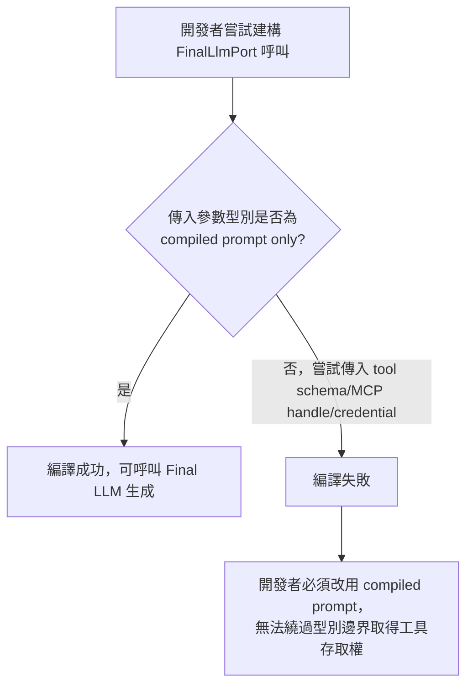

# Evidence Pack 起手式：SkillPackage 型別與 FinalLlmPort 隔離 PRD

**Story ID**: S-EVIDENCE-01
**版本**: v1.3.0
**狀態**: Ready
**Sprint**: Sprint 1
**Tickets**: N/A

---

## 版本歷史

| 版本 | 修改時間 | 修改內容（摘要） | 影響範圍 | 對應 Spec 版本 | 作者 |
|------|---------|----------------|---------|--------------|------|
| v1.0.0 | 2026-07-02 14:30 | 初版 | - | — | Claude / dev-kickoff |
| v1.0.1 | 2026-07-02 15:10 | 確認 FU-001：output_schema 採用 Option B（可擴充型別，不寫死 report 欄位） | FR-001、Dependencies | — | Claude / dev-kickoff |
| v1.1.0 | 2026-07-02 16:15 | Opus review 後修正：AC-002 明定用 `compile_fail` doctest（不新增 `trybuild` 依賴）；Follow-ups 決策已全數收斂進 FR/AC 內文，移除 FU 區塊 | AC-002、§0.5 | — | Claude / dev-kickoff |
| v1.2.0 | 2026-07-03 15:30 | Codex review 後修正：補回 PRD §3.1 明定的 `allowed_tools` allowlist 與缺欄位驗收；文件狀態與 metadata 對齊為 Ready | FR-001、AC-001、AC-003、狀態 | — | Codex / review integration |
| v1.2.1 | 2026-07-03 16:01 | 文件整理：移除已完成使命的 brainstorm artifact 參照，保留正式 PRD 與 plan 作為追溯來源 | §9 相關文件 | — | Codex / docs cleanup |
| v1.3.0 | 2026-07-03 16:06 | Review 修正：`FinalLlmPort` 改為獨立 contract-only workspace crate；以 forbidden dependency allowlist 與 `compile_fail` 雙重驗證，不再用單一錯誤參數案例宣稱完整隔離 | §0、FR-002、NFR、AC-002、Dependencies、範圍外 | — | Codex / review fix |

---

## 0. 防禦性思考（Failure Constraints）

### 三大失敗風險

| 風險 | 說明 | 緩解策略 |
|------|------|---------|
| 🔴 **FinalLlmPort 型別隔離只是表面的，實際仍能拿到 tool 存取權** | 若只限制函式參數，具體 struct 仍可能藏入 MCP/DB/RAG client 或 credential，會讓「Final LLM 無工具能力」的安全承諾名不符實 | 將 `FinalLlmPort` 定義為獨立 contract-only workspace crate 中無資料欄位的 trait；用 crate dependency allowlist 與 `compile_fail` 同時驗證依賴邊界及 API 邊界 |
| 🟡 **SkillPackage 欄位設計過度延伸成完整 Evidence Pack** | 本 sprint 範圍明確排除 CapabilityGateway/EvidenceHub/PromptBuilder，但 `SkillPackage` 型別若設計時夾帶了屬於 Evidence Pack（§3.2 pack_id/citations/provenance 等）的欄位，會造成範圍蔓延且缺乏對應的建構/驗證邏輯 | FR 定義時嚴格對照 PRD §3.1 表格中 Capability Registry 一欄的「Owns」清單（capability/skill ID、version、allowed evidence sources、output contract），不納入屬於 Evidence Hub 的欄位 |
| 🟠 **新型別加入後與既有 Final LLM tool-calling loop 並存造成混淆** | 現況 `src/llm_connector/**` 的 Final LLM 直接持有 MCP tool schema 並跑多輪 tool-calling；新增 `FinalLlmPort` 若沒有明確標示「這是未來狀態的隔離型別，尚未取代現有路徑」，容易讓後續開發者誤以為現有 production 路徑已經套用了這個隔離 | `FinalLlmPort` 本 sprint 只新增型別與測試，不接入 production `run_agent_turn`／`orchestrator.rs` 呼叫路徑；PRD/文件同步時需明確標注「型別存在 ≠ 已接線」，對齊 PRD §1 的狀態定義規則 |

---

## 0.5 最佳實踐搜尋結果

### 業界標準摘要

| 來源 | 關鍵發現 |
|------|---------|
| [Model Context Protocol (MCP) Security](https://github.com/cosai-oasis/ws4-secure-design-agentic-systems/blob/main/model-context-protocol-security.md) | Capability-based access control 能限制 injection 攻擊即使無法完全預防時的損害範圍，支持「Final LLM 不直接持有 tool handle」的設計方向；同時指出型別隔離是必要但非充分條件，CapabilityGateway/EvidenceHub 仍需落地 |

### 採用策略

- ✅ `FinalLlmPort` 放在獨立 contract-only workspace crate；crate dependency graph 禁止主應用、MCP、DB、RAG 與 credential loader，API 只接受 compiled prompt
- ✅ `SkillPackage` 欄位設計嚴格對齊 PRD §3.1 Capability Registry 的「Owns/Must not own」表格，不越界持有 credential 或 tool 執行邏輯
- ❌ 不在本 sprint 嘗試一次做完整多層防禦（gateway policy、request sanitization、response filtering）——業界研究也指出這些需要疊加多層才有效，本 story 只交付其中「型別隔離」這一層，其餘留給後續 I09 工作項

---

## 1. 概述

### 商業目標

證明「Final LLM 只做生成、不持有 MCP/DB/RAG 存取權」這個 capability isolation 方向在型別層可行，作為後續 CapabilityGateway/EvidenceHub/PromptBuilder（PRD FR-013/AC-013）的地基，避免在還沒驗證型別邊界前就投入更大範圍的 orchestrator 重構。

### Personas + 痛點

| Persona | 描述 | 目前痛點 |
|---------|------|---------|
| Runtime 架構維護者 | 負責推動 PRD FR-013 capability isolation 目標落地 | 現況 Final LLM（`src/llm_connector/**`）直接拿到 MCP tool schema 並跑多輪 tool-calling，沒有任何型別層面的邊界能證明「Final LLM 不能執行工具」這個安全承諾 |
| 安全/合規審查者 | 需要對照 PRD NFR-008（Capability isolation）驗證系統是否真的做到 least privilege | 目前沒有 compile-time 或 dependency 層級的證據，只能靠人工 code review 判斷 Final LLM 有沒有 tool access，容易隨著程式碼演進而漂移 |

### 效能期望

不適用，因為本 story 只新增型別定義與 compile-time/單元測試，不涉及 runtime 請求路徑的效能表現。

### 成功指標

| 指標 | 目標值 | 衡量方式 |
|------|--------|---------|
| FinalLlmPort 型別隔離可驗證性 | 100% | dependency allowlist test 證明 contract crate 無 MCP/DB/RAG/credential-loader 依賴，`compile_fail` 證明 API 不接受 tool schema/handle/credential 型別（對應 I09 V01） |
| SkillPackage 欄位覆蓋率 | 100% | `SkillPackage` 包含 PRD §3.1 表格列出的全部必要欄位（capability id/version、instructions refs、allowed evidence sources/tools、required scopes、output schema、budget、policy refs） |

---

## 1.5 流程圖（條件式）

> 本 story 無頁面導航，但型別邊界的「允許/拒絕」判斷屬於有分支的邏輯，繪製功能流程輔助理解。

### 功能流程（Feature Flow）



---

## 2. 功能需求（FR）

### FR-001：`SkillPackage` 型別定義

**描述**：新增 `SkillPackage` 型別，對應 PRD §3.1 Capability Registry 節點的 Owns 欄位：capability id、version、instructions refs、allowed evidence sources/tools、required scopes、output schema、budget、policy refs。

**輸入**：

| 參數 | 型別 | 必要 | 說明 |
|------|------|------|------|
| capability_id | `String` | ✅ | 對應 PRD Capability Registry 的 capability/skill ID |
| capability_version | `String` | ✅ | versioned Skill Package 的版本號 |
| instructions_refs | `Vec<String>` 或等效引用型別 | ✅ | 指向 capability instructions 的參照，不內嵌 credential 或可執行內容 |
| allowed_evidence_sources | `Vec<String>` | ✅ | allowlist，供未來 CapabilityGateway 檢查用（本 sprint 不實作 gateway，只定義欄位） |
| allowed_tools | `Vec<String>` | ✅ | tool ID allowlist，供未來 CapabilityGateway 在執行前驗證；不得包含 tool schema、handle 或執行邏輯 |
| required_scopes | `Vec<String>` | ✅ | least-privilege scope 宣告 |
| output_schema | 可擴充型別（如 `serde_json::Value` 或標註未來擴充的 enum/struct） | ✅ | 決定 markdown/json 等 output_format；不寫死具體 report 欄位（report maker 需求尚未明朗），僅保證未來可擴充 |
| budget | 數值型別（token/size 上限） | ✅ | 對應 PRD Evidence Pack budget 概念在 Skill Package 層的宣告 |
| policy_refs | `Vec<String>` | ✅ | 指向 policy 定義的參照 |

**輸出**：

| 項目 | 型別 | 說明 |
|------|------|------|
| SkillPackage | struct | 可被序列化/反序列化的型別，供未來 Capability Registry resolve 使用 |

**邊界條件**：

- `SkillPackage.allowed_tools` 只能保存穩定 tool ID allowlist；`SkillPackage` 不得包含 credential、tool schema、tool 執行邏輯或 MCP handle——這些屬於 CapabilityGateway 的職責（PRD §3.1 Must not own），本 FR 若誤放會直接違反 PRD 契約
- 本 sprint 不要求 `SkillPackage` 真的被 Capability Registry resolve 出來並接入 request path，只要求型別定義與序列化正確性

**Data 來源狀態**：
- [x] ✅ 已有現成資料源（欄位集合依 PRD §3.1 定義；output_schema 採可擴充型別，不等待 report maker 需求即可定案）

**權限/可見性**：內部 Rust 型別，無終端使用者權限議題。

### FR-002：`FinalLlmPort` 型別隔離與 compile-time 驗證測試

**描述**：新增 workspace member `crates/final-llm-port/`，只放 `CompiledPrompt`、`CandidateOutput`、錯誤契約與無資料欄位的 `FinalLlmPort` trait。root workspace 的 `default-members` 必須同時包含 root package 與此 crate，使既有 `cargo test` 不漏跑 contract tests。trait 的生成方法只接受 compiled prompt，不接受 `ChatCompletionTool`、`McpHandle`、DB/RAG client 或 credential。以 dependency allowlist test 驗 crate graph，再以 `compile_fail` doctest 驗 API 邊界（對應 PRD plan I09 驗收項 V01）。

**輸入**：

| 參數 | 型別 | 必要 | 說明 |
|------|------|------|------|
| compiled_prompt | 純文字或結構化 prompt 型別（不含 tool schema） | ✅ | 唯一允許的輸入，代表 Prompt Builder 已完成組裝（本 sprint 無 Prompt Builder 實作，先用最小 struct 佔位） |

**輸出**：

| 項目 | 型別 | 說明 |
|------|------|------|
| candidate_output | 依 output schema 決定的候選輸出型別 | Final LLM 只生成候選答案，不做 schema/citation 驗證（那是 Output Validator 的職責，本 sprint 不實作） |

**邊界條件**：

- 型別簽名若 technically 允許透過泛型或 `dyn Any` 之類的機制繞過限制，視為不符合本 FR，驗證測試需涵蓋這類邊界情況（對應 §0 風險 1）
- `FinalLlmPort` 必須是無資料欄位的 trait，不得以持有 client/handle/credential 的 struct 充當 contract；本 sprint 不提供 production adapter
- `crates/final-llm-port/Cargo.toml` 只允許 contract 所需的序列化、錯誤與 async abstraction 依賴；禁止依賴 root `datacenter-agent` crate、`rmcp`、`dotenvy`、MCP client、DB/RAG client 或其他 credential loader
- dependency test 必須從 `cargo metadata` 取得 `final-llm-port` 的 transitive dependency closure 並與 forbidden package/module 清單比對；僅 grep source import 不算通過
- `compile_fail` doctest 必須放在 root crate 的文件測試中，讓測試端可同時引用 `final_llm_port::FinalLlmPort` 與 root crate 的 `McpHandle`/tool type；不得因 contract crate 缺少 forbidden dependency、導致 unresolved import 而假通過
- 本 sprint 明確不將 `FinalLlmPort` 接入 production `run_agent_turn`/`orchestrator.rs` 呼叫路徑；現有 `src/llm_connector/**` 的 tool-calling loop 維持原樣不變（對應 §0 風險 3）
- API 負向驗證使用 Rust 內建 `compile_fail` doctest，不新增 `trybuild`；它只證明呼叫介面，必須與 dependency allowlist test 一起通過才能宣稱本 story 的型別/依賴隔離完成

**Data 來源狀態**：
- [x] ✅ 已有現成資料源（型別設計依據 PRD §3.1 Final LLM 節點定義的 Input/Output/Owns/Must not own，非新設計）

**權限/可見性**：內部 Rust 型別，無終端使用者權限議題。

---

## 3. 非功能需求（NFR）

| 類別 | 要求 |
|------|------|
| **Performance** | 不適用，因為本 story 只新增型別與 compile-time/單元測試，不涉及 runtime 請求路徑，無效能指標可衡量 |
| **Security / Compliance** | `SkillPackage` 不得包含 credential 或可執行 instruction；`final-llm-port` contract crate 的 transitive dependency graph 不得包含 MCP/DB/RAG/credential loader，且 trait API 只能接收 compiled prompt |
| **Accessibility** | 不適用，因為本 story 為 Rust 後端型別定義，無使用者介面 |
| **Compatibility** | 不適用，因為 `SkillPackage`/`FinalLlmPort` 是全新型別，不取代任何既有對外介面，也不接入現有 request path，無相容性負擔 |

---

## 4. 錯誤場景（ERR）

### ERR-001：嘗試建構帶有 tool schema 的 `FinalLlmPort` 呼叫

**觸發條件**：開發者（或未來的 CapabilityGateway 誤用）嘗試傳入 `ChatCompletionTool`/`McpHandle`/credential 型別給 `FinalLlmPort` 的函式簽名

**預期行為**：編譯失敗（型別不符），而非 runtime 錯誤——這是本 story 選擇用 Rust 型別系統做 compile-time 隔離而非 runtime 檢查的核心設計

**恢復策略**：開發者需改用 compiled prompt 型別呼叫；若業務上真的需要工具存取，應改走 CapabilityGateway（不在本 sprint 範圍內）而非繞過 `FinalLlmPort`

### ERR-002：`SkillPackage` 欄位反序列化時缺少必要欄位

**觸發條件**：載入 `SkillPackage` 的 JSON/TOML 設定時缺少 §2 FR-001 定義的任一必要欄位（capability_id、version、allowed_evidence_sources 等）

**預期行為**：反序列化失敗並回傳明確錯誤，指出缺少哪個欄位，不得以預設值靜默補齊（避免掩蓋設定錯誤，對齊 PRD NFR-005 config safety 原則）

**恢復策略**：維護工程師需補齊設定檔缺少的欄位

### ERR-003：`SkillPackage` 誤放屬於 Evidence Pack 的欄位

**觸發條件**：Code review 或型別審查發現 `SkillPackage` 定義中包含屬於 §3.2 Evidence Pack 的欄位（例如 `citations[]`、`policy_decisions[]`、pack-level digest）

**預期行為**：視為設計缺陷，本 FR 不得通過驗收；需將這類欄位移除，等未來 EvidenceHub 工作項再定義

**恢復策略**：對照 PRD §3.1 表格的 Owns/Must not own 欄位重新檢視型別定義

---

## 5. 驗收標準（AC）

### AC-001：`SkillPackage` 型別涵蓋 PRD 定義的必要欄位

```gherkin
Given PRD §3.1 Capability Registry 節點定義的 Owns 欄位清單（capability/skill ID、version、allowed evidence sources/tools、output contract 等）
When 檢視 `SkillPackage` 型別定義
Then 型別包含獨立的 `allowed_evidence_sources` 與 `allowed_tools` allowlist，且不包含屬於 Evidence Hub/Gateway 的欄位（如 credentials、citations、tool schema/handle、tool 執行邏輯）
```

### AC-002：`FinalLlmPort` 無法接受 tool schema/handle/credential

```gherkin
Given `FinalLlmPort` 是 `crates/final-llm-port/` 中無資料欄位的 trait，forbidden dependency 清單包含 root crate、`rmcp`、`dotenvy` 與選定的 DB/RAG client packages，且 root doctest 能成功 import 測試所需的兩側型別
When 執行 dependency allowlist test，並執行嘗試把 `ChatCompletionTool` 或 `McpHandle` 傳入生成方法的 root-crate `compile_fail` doctest
Then contract crate 的 transitive dependency closure 不含任何 forbidden package，且 doctest 的預期失敗原因是生成方法參數型別不符、不是 unresolved import；兩項缺一均不得宣稱 isolation 完成
```

### AC-003：`SkillPackage` 反序列化缺少必要欄位時明確失敗

```gherkin
Given 兩份各自缺少 `allowed_evidence_sources` 或 `allowed_tools` 的 `SkillPackage` 設定檔
When 嘗試反序列化該設定檔
Then 每份設定都回傳明確錯誤指出對應缺少欄位，不得以空陣列或其他預設值靜默通過
```

### AC-004：本 story 不影響現有 Final LLM production 呼叫路徑

```gherkin
Given 現有 `src/llm_connector/**` 的 tool-calling loop 在本 story 交付前後保持原樣
When 執行既有 `cargo test` 全部測試
Then 既有測試結果不因新增 `SkillPackage`/`FinalLlmPort` 型別而改變，證明本 sprint 只新增型別、未接入 production 路徑
```

---

## 6. UI/UX 概念

不適用，因為本 story 是 Rust 後端型別定義與 compile-time 驗證，無使用者介面、無設計稿、無 UI States/Microcopy/響應式行為需求。

---

## 7. Dependencies & Constraints

- **上游依賴**：root `Cargo.toml` 需加入 workspace member `crates/final-llm-port/`，且 `default-members` 同時包含 `.` 與 `crates/final-llm-port`；contract crate 不新增 MCP/DB/RAG/credential-loader 依賴，也不依賴 Story 1（Eval evaluator 修正）
- **下游影響**：後續 CapabilityGateway、EvidenceHub、PromptBuilder、OutputValidator（PRD plan I09 剩餘範圍）都建立在本 story 的 `SkillPackage`/`FinalLlmPort` 型別之上；`docs/reference/prd.md` FR-013 現況描述、`docs/reference/modules/` 需在本 story 完成後同步更新，標注型別已存在但未接入 request path
- **Breaking Change**：❌ 否（新增 workspace member 與全新 contract types，不修改既有對外 API，也不接入 production 呼叫路徑；以 workspace `default-members` 維持既有 canonical `cargo test` 指令並涵蓋 contract crate tests）
- **Assumptions**：output_schema 採可擴充型別，不寫死具體 report 欄位（報告需求尚未明朗，見 §8 範圍外）

---

## 8. 範圍外

- ❌ `CapabilityGateway` 實作（獨占 MCP/DB/RAG credentials、執行 allowlist/scope/argument/rate/cost/timeout policy）
- ❌ `EvidenceHub` 實作（規劃 retrieval、產出 immutable Evidence Pack）
- ❌ `PromptBuilder` 實作（deterministic 組合 Skill Package + Evidence Pack + memory + output schema）
- ❌ `OutputValidator` 實作（驗 schema/citation/policy violation、repair 邏輯）
- ❌ 將 `FinalLlmPort` 接入現有 production `run_agent_turn`/`orchestrator.rs` 呼叫路徑（現有 tool-calling loop 本 sprint 維持不變）
- ❌ `FinalLlmPort` production adapter／provider transport 實作；後續 adapter 必須在不擴張 contract crate forbidden dependency closure 的前提下另行設計與驗收
- ❌ Eval evaluator 機制修正相關工作（見獨立 PRD：`docs/sprints/2026-07-02-sprint-1/eval-evaluator-registry-fix/prd.md`）
- ❌ Report maker 具體實作（本 sprint 僅預留 output_schema 擴充空間，不寫 report 生成邏輯）

---

## 9. 相關文件

| 文件 | 連結 |
|------|------|
| 對應 PRD 條目 | `docs/reference/prd.md` FR-013 / AC-013 / §3.1 / §3.2 |
| 對應 Plan section | `.agent/artifacts/plan/2026-06-29-runtime-correctness/implementation.md` I09 |
| 同 Sprint 另一個 Story | `docs/sprints/2026-07-02-sprint-1/eval-evaluator-registry-fix/prd.md` |

---

## Gate 1 自檢清單

**基本檢核**：
- [x] **§0 防禦性思考** 有 3 個失敗風險
- [x] **§0.5 最佳實踐** 有 search_web 紀錄
- [x] 每個 FR 有輸入/輸出/Data 來源狀態
- [x] 所有 AC 的 Given 含可執行 precondition
- [x] 至少 3 個錯誤場景（ERR）
- [x] 「範圍外」有內容
- [x] 沒有「可能」「大概」「應該」等模糊詞
- [x] 版本歷史表已填第一筆

**新增檢核**：
- [x] 所有 FU 決策已收斂：原 FU-001（output_schema → Option B）已回填進 FR-001，Follow-ups 區塊移除
- [x] NFR 四項都已填（或標「不適用 + 原因」）
- [x] UI States 五項齊全（或標「不適用 + 原因」）— 本 story 整個 §6 標不適用並附原因
- [x] Microcopy 主要按鈕 + 主要錯誤訊息已列 — 不適用（同 §6 原因）
- [x] Dependencies 的 Breaking Change 已標記
- [x] 流程圖依條件規則產出（§1.5 已附功能流程，說明型別邊界的允許/拒絕分支）
- [x] （manifest 無 knowledge_boundary 欄位）不適用

**角色視角**：
- [x] PM：Sprint（Sprint 1）/ Dependencies / 商業目標 + 成功指標清楚
- [x] RD：NFR 可實作 / Breaking Change 已標
- [x] User：Persona（架構維護者、安全審查者）+ Pain Point 已列 / 內部工具無權限分級議題
- [x] QA：每個 AC 的 Given 含可執行 precondition
- [x] UI：不適用（後端型別定義），已於 §6 說明原因

> Gate 1 全數通過，無待確認決策，可進入 `/spec` 階段。
