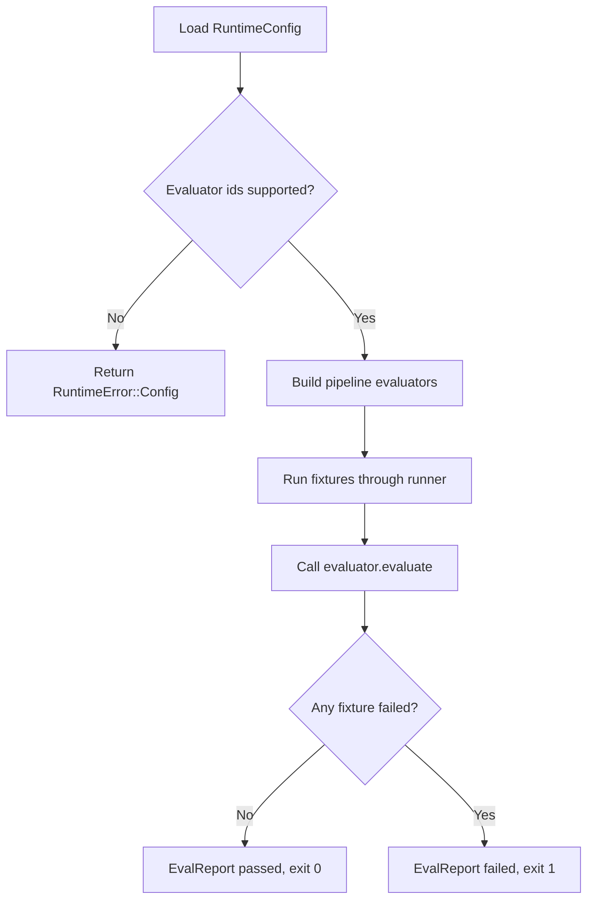

# Eval Evaluator 機制修正與 Rubric v1 PRD

| Field | Value |
|-------|-------|
| Story ID | S-EVAL-01 |
| Version | v1.4.1 |
| Status | Ready |
| Sprint | Sprint 1 |
| has_ui | false |
| Tickets | N/A |

---

## 1. Follow-ups

無 open follow-up。歷史 FU 已收斂：

| ID | Type | Background | Decision |
|----|------|------------|----------|
| FU-001 | Closed | `judge_model` 是否必填會影響 Sprint 1 startup 行為。 | Confirmed：Sprint 1 允許空值；Sprint 2 `LlmJudgeEvaluator` 再要求非空。 |
| FU-002 | Closed | Rubric threshold 是否支援 capability-level 覆寫會改變 config scope。 | Confirmed：採 runtime 全域 threshold，不做 capability-level 覆寫。 |

---

## 2. Context

### Goal

把 eval CI gate 從「更換 evaluator id 不影響結果」修正為 config-driven dispatch。完成後，`pipeline-deterministic` evaluator 會由 registry 建立、runner 實際呼叫，並讓 regression fixture 能使 eval CLI 以非 0 exit code 失敗。

### Persona + Pain

| Persona | Context | Pain point |
|---------|---------|------------|
| Runtime 維護工程師 | 修改 `config/config.toml` 的 `[runtime.eval]` 區塊來調整 evaluator 組合。 | 改了 config，CI 結果完全不變，無法察覺 evaluator 沒有被實際呼叫。 |
| CI/Release 守門人 | 依賴 `cargo run --bin eval -- --pipeline-only` 的 exit code 決定能否合併。 | 目前只有 3 筆 fixtures，且比對邏輯寫死在 `runner.rs`，無法證明 config 宣稱的 evaluator 已接線。 |

### Success metrics

| Metric | Target | Measurement |
|--------|--------|-------------|
| Evaluator dispatch 真實性 | 100% | registry-to-runner contract test 注入 spy evaluator，證明 evaluator 被呼叫且固定結果會改變 `EvalReport`。 |
| CI negative gate 有效性 | 1 個 intentional-failing fixture 使 process exit 1 | Integration test 斷言 `--config tests/fixtures/eval-failing/config.toml --pipeline-only` exit code 為 1。 |
| Registry fail-fast 覆蓋率 | 100% 未實作 evaluator id 在 startup 被拒絕 | Config validation 單元測試。 |
| Rubric threshold 設定安全性 | 100% 非有限值與超出 `[0.0, 1.0]` 的門檻被拒絕 | Config validation 單元測試。 |

### Risk and evidence

| Item | Trigger / Source | Mitigation / Decision |
|------|------------------|-----------------------|
| 高風險：Registry 換了實作但 runner 未呼叫 | `PipelineDeterministicEvaluator` 建立後，runner 仍使用手寫比對邏輯。 | AC-002 要求 spy evaluator 跨 registry builder、runner、report 三層驗證。 |
| 中風險：Rubric v1 被誤解為 citation-level grounding | `must_include` / `must_not_include` 只是 heuristic。 | 文件與程式註解必須標注 v1 grounding 是 heuristic，Evidence Pack 完成後再升級。 |
| 中風險：CI negative self-test 變成恆真測試 | negative test 只呼叫原本就會失敗的路徑。 | AC-003 要求 intentional-failing fixture 先能造成真實 regression exit 1。 |
| Evidence | `docs/agent-runtime-rust-port/spec/spec-06-eval.md`、`docs/reference/modules/runtime-eval.md`、`src/runtime/eval/**`、`src/runtime/registry.rs`。 | Repo evidence sufficient；未新增外部研究，沿用既有 PRD 搜尋紀錄。 |

---

## 3. Scope

### In scope

- 將 `Evaluator` trait 改為 async 版本，並新增 payload-free `EvaluatorKind`。
- 新增 `PipelineDeterministicEvaluator`，把 pipeline fixture 比對邏輯移出 runner。
- 讓 registry 建出的 evaluator 被 runner 實際呼叫。
- 新增 `--config <PATH>`，用 test-only config 執行 intentional-failing fixture。
- 對未支援 evaluator id fail-fast。
- 新增 rubric 欄位、三維度 score/threshold 型別與 threshold 判定。

### Out of scope

- `ResponseBaselineEvaluator` 完整搬遷。
- 規模化 fixtures 到每個 intent 與 `EvalCategory`。
- `LlmJudgeEvaluator` live 評分實作。
- Evidence Pack、SkillPackage、FinalLlmPort 相關工作。
- Report maker 相關工作。

---

## 4. Flow

Flow: eval CLI 有 config 驗證、registry dispatch 與 exit code 分支，需保留流程契約。



---

## 5. Functional Requirements (FR)

### FR-001: Evaluator trait async 化並分離執行種類

**使用者價值**: Runtime 維護工程師可以用一個明確介面接 evaluator，避免 metadata 與單次 CLI 參數耦合。

**Behavior**: 將同步 `Evaluator` trait 改為 `id()`、`kind() -> EvaluatorKind`、`async fn evaluate(&self, case: &EvalCase, observed: &ObservedTurn) -> EvalOutcome`。新增 `EvaluatorKind::{Pipeline, Response}`，只描述 evaluator 適用種類。

**Input**:

| Field | Required | Notes |
|-------|----------|-------|
| `case` | Yes | `&EvalCase`，包含 id、input、option_id、category、expect。 |
| `observed` | Yes | `&ObservedTurn`，代表 pipeline/response 實際觀察結果。 |

**Output**:

| Field | Notes |
|-------|-------|
| `EvalOutcome` | 包含 `case_id`、`passed`、`scores`、`latency_ms`、`tokens`、`failures`。 |

**Data source**: `docs/agent-runtime-rust-port/spec/spec-06-eval.md` 定義型別方向；`PipelineFixture` 來自 `config/runtime/evals/inputs.json`。

**Permissions / Visibility**: 內部 Rust module，無使用者可見性議題。

**Boundary conditions**:

- 移除舊 `NoopEvaluator` 與同步 `run()`，不保留 dual-interface。
- `EvaluatorKind` 不得包含 artifact、baseline path 或 provider credential。
- `EvalCase`、`EvalOutcome`、`ObservedTurn`、`EvalCategory` 需要新建；不是搬遷現有 Rust 型別。

### FR-002: `PipelineDeterministicEvaluator` 實作與 registry 接線

**使用者價值**: CI/Release 守門人能信任 config 宣稱的 evaluator 已被 runner 消費。

**Behavior**: 新增 `PipelineDeterministicEvaluator`，把 `runner.rs::run_pipeline_only()` 中 intent/slots 比對邏輯搬入 evaluator。`registry.rs` 對 id `"pipeline-deterministic"` 回傳真實 impl，runner 改為呼叫 registry 建出的 evaluator。

**Input**:

| Field | Required | Notes |
|-------|----------|-------|
| `fixtures` | Yes | `Vec<PipelineFixture>`，沿用 `config/runtime/evals/inputs.json`。 |
| `runtime_config` | Yes | `&RuntimeConfig`，沿用 `InputPipeline::run_with_config` 呼叫路徑。 |

**Output**:

| Field | Notes |
|-------|-------|
| `EvalReport` | 沿用既有 `passed` / `failed` 欄位語意，不改變外部 CLI 輸出格式。 |

**Data source**: `config/runtime/evals/inputs.json`。

**Permissions / Visibility**: 內部 CLI/CI 使用。

**Boundary conditions**:

- `build_evaluators()` 需拆成 pipeline/response 兩條路徑，避免 `--pipeline-only` 被未實作 response evaluator id 卡住。
- 既有 3 筆 fixture 的 pass/fail 結果需維持不變。
- runner 需提供不依賴檔案或全域 config 的測試接縫。

### FR-003: Rubric v1 型別與 threshold 判定

**使用者價值**: 後續 `LlmJudgeEvaluator` 可以接上 rubric 與 threshold，不需再改 fixture schema。

**Behavior**: Pipeline fixture 與 response fixture 支援 `rubric: Option<String>`；`EvalOutcome.scores` 支援 `grounding`、`insight`、`relevancy`；`EvalReport` 新增各維度 threshold 判定。

**Input**:

| Field | Required | Notes |
|-------|----------|-------|
| `rubric` | No | Per-fixture judging instruction；Sprint 1 只載入，不要求 live judge 消費。 |
| `thresholds` | No | 三個 `f32`：`grounding`、`insight`、`relevancy`；缺少時使用 `0.70`。 |
| `judge_model` | No | 位於 `[runtime.eval]`；Sprint 1 允許空值。 |

**Output**:

| Field | Notes |
|-------|-------|
| `dimension_pass` | `BTreeMap<String, bool>`，任一維度低於門檻時整體 fail。 |

**Data source**: Config schema 擴充。

**Permissions / Visibility**: 內部 config/CLI。

**Boundary conditions**:

- Threshold 必須是 finite 且位於 `[0.0, 1.0]`。
- `rubric` 欄位為空時不得 panic，也不得自動 pass。
- Sprint 1 沒有 evaluator 產出 response 文字，threshold 判定只做單元測試層級驗證。

### FR-004: CI negative self-test

**使用者價值**: CI 能證明 regression 真的會讓 eval binary 失敗。

**Behavior**: Eval CLI 新增全域 `--config <PATH>`；test-only config 指向 intentional-failing fixture，並以 process integration test 斷言 exit code 為 1。

**Input**:

| Field | Required | Notes |
|-------|----------|-------|
| `config` | No | CLI `--config <PATH>`；未提供時預設 `config/config.toml`。 |
| intentional-failing fixture | Yes | JSON 檔案或程式內建 synthetic case。 |

**Output**:

| Field | Notes |
|-------|-------|
| process exit code | Regression 存在時為 1，否則為 0。 |

**Data source**: 既有 `run(EvalMode)` process exit 慣例。

**Permissions / Visibility**: CI-only。

**Boundary conditions**:

- Test-only fixture 不可混入正式 `config/runtime/evals/inputs.json`。
- `--config` 不改變既有 mode flags。
- 不存在、不可讀或格式錯誤的 config path 需回傳 config error 並 exit 1。

### FR-005: Registry 對未支援 evaluator id fail-fast

**使用者價值**: 維護者不會誤以為尚未實作的 evaluator 已生效。

**Behavior**: `registry.rs::build_evaluators()` 對 config 宣稱但沒有真實 impl 的 evaluator id 在 startup 階段回傳明確錯誤，不再用 `NoopEvaluator` 代替。

**Input**:

| Field | Required | Notes |
|-------|----------|-------|
| evaluator id | Yes | 來自 `pipeline_evaluators` 或 `response_evaluators`。 |

**Output**:

| Field | Notes |
|-------|-------|
| `RuntimeResult<Vec<Arc<dyn Evaluator>>>` | 未知或未實作 id 回傳 `RuntimeError::Config`。 |

**Data source**: `registry.rs` 既有 `require_evaluator` 驗證機制。

**Permissions / Visibility**: Startup-time 內部驗證。

**Boundary conditions**:

- `"response-baseline"` 與 `"llm-judge"` 在真實 impl 完成前不得由 config 宣稱。
- Fail-fast 需與 pipeline/response 路徑拆分同一 PR 交付。
- 錯誤訊息需指出不受支援的 evaluator id。

---

## 6. Non-functional Requirements (NFR)

| Category | Requirement |
|----------|-------------|
| Performance | `cargo run --bin eval -- --pipeline-only` 在既有 3 筆 fixture 規模下維持數秒內完成。 |
| Security / Compliance | 不適用，因為本 story 不涉及 credential、PII 或對外資料存取。 |
| Accessibility | 不適用，因為本 story 為 Rust 後端 CLI/library 變更，無使用者介面。 |
| Compatibility | 既有 `--pipeline-only`、`--response --replay`、`--response --live` 行為不變；`--config <PATH>` 是 additive option。 |

---

## 7. Error Scenarios (ERR)

### ERR-001: Config 宣稱未實作 evaluator id

**Trigger**: `config.toml` 的 evaluator list 包含沒有真實 impl 的 id。

**Expected behavior**: Startup 回傳 `RuntimeError::Config`，訊息包含該 id，應用程式或 eval CLI 無法完成啟動。

**Recovery**: 從 config 移除該 id，或等 evaluator 真實 impl 完成後再宣稱。

### ERR-002: Rubric 欄位存在但沒有 judge 消費

**Trigger**: Fixture 有 `rubric` 內容，但 Sprint 1 沒有 `LlmJudgeEvaluator`。

**Expected behavior**: Fixture 正常載入，不因 `rubric` 有值而評分，也不得報錯。

**Recovery**: 不需恢復；文件需標注該欄位目前僅供 Sprint 2 使用。

### ERR-003: Intentional-failing fixture 意外 pass

**Trigger**: Evaluator bug 導致 intentional-failing fixture 被判定為 pass。

**Expected behavior**: CI negative self-test 失敗，指出 process exit code 沒有如預期為 1。

**Recovery**: 檢查 `PipelineDeterministicEvaluator::evaluate()` 與 fixture 欄位是否能觸發不一致條件。

### ERR-004: Rubric threshold 不合法

**Trigger**: 任一 threshold 為 NaN、正負無限、負值或大於 `1.0`。

**Expected behavior**: `RuntimeConfig::load` 回傳 `RuntimeError::Config`，訊息包含維度、非法值與合法範圍 `[0.0, 1.0]`。

**Recovery**: 將 threshold 改為有限且位於 `[0.0, 1.0]` 的數值；未客製時使用 `0.70`。

---

## 8. Acceptance Criteria (AC)

### AC-001: Evaluator trait 改動後既有 fixture 行為不變

```gherkin
Given `config/runtime/evals/inputs.json` 現有 3 筆 pipeline fixture 未變更
When 執行 `cargo run --bin eval -- --pipeline-only`
Then 三筆 fixture 的 pass/fail 結果與重構前一致，process exit code 為 0
```

### AC-002: Registry 建出的 evaluator 會被 runner 實際呼叫

```gherkin
Given 測試 registry 為 pipeline evaluator id 建出一個記錄呼叫次數且固定回傳 fail outcome 的 spy evaluator
When 透過 runner 的內部測試接縫執行一筆原本會通過手寫 intent/slots 比對的 fixture
Then spy evaluator 的呼叫次數為 1，`EvalReport.failed` 增加 1，且 runner 不再執行自己的 intent/slots 判定
```

### AC-003: CI negative self-test 能偵測 regression

```gherkin
Given 已新增一筆 intentional-failing fixture
When 執行 `cargo run --bin eval -- --config tests/fixtures/eval-failing/config.toml --pipeline-only`
Then process exit code 為 1，且輸出包含該 fixture 的 regression 訊息
```

### AC-004: 未實作 evaluator id 導致 startup fail-fast

```gherkin
Given `[runtime.eval]` 宣稱一個沒有真實 impl 的 evaluator id
When 應用程式或 eval CLI 啟動並呼叫 `build_evaluators()`
Then 回傳 `RuntimeError::Config` 且訊息包含該 evaluator id，啟動失敗
```

### AC-005: Rubric 欄位可載入但不影響 Sprint 1 判定

```gherkin
Given 一筆 fixture JSON 包含 `rubric` 欄位且有文字內容
When 執行 `cargo run --bin eval -- --pipeline-only`
Then fixture 正常載入不報錯，且 `rubric` 不影響該筆 fixture 的 pass/fail 判定
```

### AC-006: 三維度 threshold 判定函式可測

```gherkin
Given 三維 threshold 均為 `0.70`，且一組固定分數中有一維為 `0.69`
When 呼叫 threshold 判定函式
Then 該維度的 `dimension_pass` 為 false，且整體 `passed` 為 false
```

### AC-007: `judge_model` 允許為空

```gherkin
Given `config/config.toml` 的 `[runtime.eval]` 沒有設定 `judge_model`
When 應用程式或 eval CLI 啟動
Then 啟動成功，不因 `judge_model` 為空而 fail-fast
```

### AC-008: 非法 threshold 在 config load 階段被拒絕

```gherkin
Given 表格驅動測試依序省略 threshold table，或把任一 threshold 設為 `NaN`、正負無限、`-0.01` 或 `1.01`
When 呼叫 `RuntimeConfig::load`
Then 省略 table 時三維均載入為 `0.70`；非法值回傳 `RuntimeError::Config`；邊界值 `0.0` 與 `1.0` 載入成功
```

---

## 9. UI / UX

UI: N/A (has_ui=false)，因為本 story 是 Rust 後端 CLI/library 內部機制修正。

### Mockup evidence

- N/A (has_ui=false)。

### Interaction and states

| State / Step | Expected behavior | Copy |
|--------------|-------------------|------|
| Default | N/A (has_ui=false) | N/A |
| Loading | N/A (has_ui=false) | N/A |
| Error | N/A (has_ui=false) | N/A |
| Empty | N/A (has_ui=false) | N/A |

### Design tokens

| Token type | Usage |
|------------|-------|
| Color | N/A (has_ui=false) |
| Typography | N/A (has_ui=false) |
| Spacing | N/A (has_ui=false) |

---

## 10. Dependencies & Constraints

- **Upstream**: N/A，本 story 是既有 `src/runtime/eval/` 骨架修正。
- **Downstream**: Sprint 2 的 `ResponseBaselineEvaluator`、fixture 規模化、`LlmJudgeEvaluator` 都建立在新版 `Evaluator` trait 之上。
- **Breaking change**: Yes。`Evaluator` trait 簽名改變，`NoopEvaluator` 移除，`registry.rs::build_evaluators()` 拆成 pipeline/response 兩個函式。
- **Assumptions**: N/A。`config.toml` 現況已核實，未實作 evaluator id 的移除納入 FR-005。

---

## 11. Related Documents

| Document | Link |
|----------|------|
| Target PRD | `docs/reference/prd.md` FR-010 / AC-009 |
| Plan | `.agent/artifacts/plan/2026-06-29-runtime-correctness/implementation.md` I06 |
| Legacy eval spec | `docs/agent-runtime-rust-port/spec/spec-06-eval.md` |
| Runtime eval module | `docs/reference/modules/runtime-eval.md` |
| Paired work item | `docs/work/evidence-pack-skillpackage-finalllmport/prd.md` |

---

## 12. Gate 1 Check

- [x] Every FR has user value, data source, permissions, and boundary conditions.
- [x] Every AC uses Given-When-Then and has an executable precondition.
- [x] ERR covers the main failure and recovery path.
- [x] Scope, dependencies, breaking change, and assumptions are explicit.
- [x] Blocking FU is closed; non-blocking FU has owner and close-by point.
- [x] NFR has measurable target or N/A + reason.
- [x] UI evidence matches `has_ui`.
- [x] `prd-interview/references/gate-1.md` result is PASS.

```text
Gate 1: PASS
Failed checks: 無
Evidence: docs/work/eval-evaluator-registry-fix/prd.md v1.4.1
Reviewed at: 2026-07-06 11:08 +0800
```
