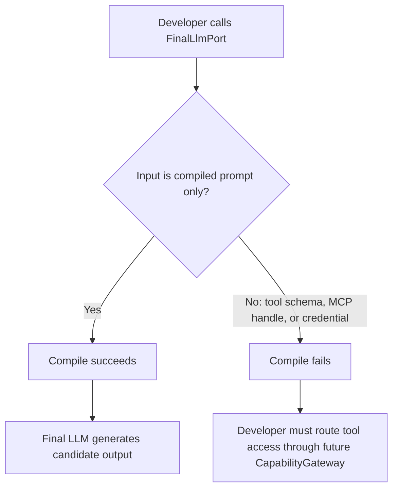

# Evidence Pack 起手式：SkillPackage 型別與 FinalLlmPort 隔離 PRD

| Field | Value |
|-------|-------|
| Story ID | S-EVIDENCE-01 |
| Version | v1.3.1 |
| Status | Ready |
| Sprint | Sprint 1 |
| has_ui | false |
| Tickets | N/A |

---

## 1. Follow-ups

無 open follow-up。歷史 FU 已收斂：

| ID | Type | Background | Decision |
|----|------|------------|----------|
| FU-001 | Closed | `output_schema` 是否寫死 report 欄位會影響 SkillPackage 的演進空間。 | Confirmed：採用可擴充型別，不等待 Report maker 需求。 |

---

## 2. Context

### Goal

證明「Final LLM 只做生成、不持有 MCP/DB/RAG 存取權」可以在 Rust 型別與 dependency graph 層驗證。此 story 先交付 `SkillPackage` 與 `FinalLlmPort` contract，作為後續 CapabilityGateway、EvidenceHub、PromptBuilder 與 OutputValidator 的地基。

### Persona + Pain

| Persona | Context | Pain point |
|---------|---------|------------|
| Runtime 架構維護者 | 推動 PRD FR-013 capability isolation。 | 現況 Final LLM 直接持有 MCP tool schema 並跑多輪 tool-calling，缺少型別層隔離證據。 |
| 安全/合規審查者 | 需驗證系統是否做到 least privilege。 | 目前只能靠人工 review 判斷 Final LLM 是否持有 tool access，容易隨程式碼演進漂移。 |

### Success metrics

| Metric | Target | Measurement |
|--------|--------|-------------|
| FinalLlmPort 型別隔離可驗證性 | 100% | Dependency allowlist test 證明 contract crate 無 MCP/DB/RAG/credential-loader 依賴；`compile_fail` 證明 API 不接受 tool schema、handle 或 credential 型別。 |
| SkillPackage 欄位覆蓋率 | 100% | `SkillPackage` 包含 PRD §3.1 必要欄位：capability id/version、instructions refs、allowed evidence sources/tools、required scopes、output schema、budget、policy refs。 |

### Risk and evidence

| Item | Trigger / Source | Mitigation / Decision |
|------|------------------|-----------------------|
| 高風險：FinalLlmPort 型別隔離只有表面效果 | 具體 adapter struct 藏入 MCP/DB/RAG client 或 credential。 | FR-002 要求獨立 contract-only crate、dependency allowlist 與 `compile_fail` 雙重驗證。 |
| 中風險：SkillPackage 蔓延成完整 Evidence Pack | SkillPackage 夾帶 pack_id、citations、provenance 等 EvidenceHub 欄位。 | FR-001 僅允許 PRD §3.1 Capability Registry 的 Owns 欄位。 |
| 中風險：新型別與既有 tool-calling loop 並存造成混淆 | 開發者誤以為新增 `FinalLlmPort` 等於 production path 已隔離。 | 本 sprint 不接入 `run_agent_turn` / `orchestrator.rs`；文件需標注型別存在不等於已接線。 |
| Evidence | `docs/reference/prd.md` FR-013 / AC-013 / §3.1 / §3.2。 | Repo evidence sufficient；MCP security evidence 沿用既有 PRD 搜尋紀錄。 |

---

## 3. Scope

### In scope

- 新增 `SkillPackage` 型別，涵蓋 Capability Registry Owns 欄位。
- 新增 `crates/final-llm-port/` contract-only workspace member。
- 定義 `CompiledPrompt`、`CandidateOutput`、錯誤契約與無資料欄位的 `FinalLlmPort` trait。
- 用 dependency allowlist test 驗證 contract crate 不依賴 forbidden packages。
- 用 root crate `compile_fail` doctest 驗證 API 不接受 tool schema、MCP handle 或 credential。

### Out of scope

- `CapabilityGateway` 實作。
- `EvidenceHub` 實作。
- `PromptBuilder` 實作。
- `OutputValidator` 實作。
- 將 `FinalLlmPort` 接入 production `run_agent_turn` / `orchestrator.rs`。
- `FinalLlmPort` production adapter 或 provider transport。
- Eval evaluator 機制修正。
- Report maker 具體實作。

---

## 4. Flow

Flow: 型別邊界有允許與拒絕分支，需保留語意流程。



---

## 5. Functional Requirements (FR)

### FR-001: `SkillPackage` 型別定義

**使用者價值**: Runtime 架構維護者可以先固定 capability contract，避免後續 gateway 與 evidence 工作沒有共同資料模型。

**Behavior**: 新增 `SkillPackage` 型別，對應 PRD §3.1 Capability Registry 節點的 Owns 欄位：capability id、version、instructions refs、allowed evidence sources/tools、required scopes、output schema、budget、policy refs。

**Input**:

| Field | Required | Notes |
|-------|----------|-------|
| `capability_id` | Yes | 對應 PRD Capability Registry 的 capability/skill ID。 |
| `capability_version` | Yes | Versioned Skill Package 的版本號。 |
| `instructions_refs` | Yes | 指向 capability instructions 的參照，不內嵌 credential 或可執行內容。 |
| `allowed_evidence_sources` | Yes | Evidence source allowlist，供未來 CapabilityGateway 檢查。 |
| `allowed_tools` | Yes | Tool ID allowlist，不包含 tool schema、handle 或執行邏輯。 |
| `required_scopes` | Yes | Least-privilege scope 宣告。 |
| `output_schema` | Yes | 可擴充型別，例如 `serde_json::Value` 或 enum/struct。 |
| `budget` | Yes | Token 或 size 上限。 |
| `policy_refs` | Yes | 指向 policy 定義的參照。 |

**Output**:

| Field | Notes |
|-------|-------|
| `SkillPackage` | 可序列化 / 反序列化的 Rust struct，供未來 Capability Registry resolve 使用。 |

**Data source**: `docs/reference/prd.md` §3.1 Capability Registry。

**Permissions / Visibility**: 內部 Rust 型別，無終端使用者權限議題。

**Boundary conditions**:

- `SkillPackage` 不得包含 credential、tool schema、tool 執行邏輯或 MCP handle。
- `SkillPackage` 不得包含 Evidence Pack 的 citations、policy_decisions 或 pack-level digest。
- Sprint 1 不要求 `SkillPackage` 接入 request path。

### FR-002: `FinalLlmPort` 型別隔離與 compile-time 驗證

**使用者價值**: 安全/合規審查者可以用編譯與 dependency evidence 驗證 Final LLM contract 沒有 tool access。

**Behavior**: 新增 workspace member `crates/final-llm-port/`，只放 `CompiledPrompt`、`CandidateOutput`、錯誤契約與無資料欄位的 `FinalLlmPort` trait。Trait 的生成方法只接受 compiled prompt，不接受 `ChatCompletionTool`、`McpHandle`、DB/RAG client 或 credential。

**Input**:

| Field | Required | Notes |
|-------|----------|-------|
| `compiled_prompt` | Yes | 純文字或結構化 prompt 型別，不含 tool schema。 |

**Output**:

| Field | Notes |
|-------|-------|
| `candidate_output` | Final LLM 的候選輸出；schema/citation 驗證由未來 OutputValidator 負責。 |

**Data source**: `docs/reference/prd.md` §3.1 Final LLM 節點定義。

**Permissions / Visibility**: 內部 Rust 型別，無終端使用者權限議題。

**Boundary conditions**:

- Contract crate 不得依賴 root `datacenter-agent` crate、`rmcp`、`dotenvy`、MCP client、DB/RAG client 或 credential loader。
- Dependency test 必須從 `cargo metadata` 取得 transitive dependency closure。
- `compile_fail` doctest 必須能同時引用 `final_llm_port::FinalLlmPort` 與 root crate 的 forbidden type，避免 unresolved import 假通過。
- Sprint 1 不提供 production adapter，也不接入 production request path。

---

## 6. Non-functional Requirements (NFR)

| Category | Requirement |
|----------|-------------|
| Performance | N/A，因為本 story 只新增型別與 compile-time / 單元測試，不涉及 runtime request path。 |
| Security / Compliance | `SkillPackage` 不得包含 credential 或可執行 instruction；`final-llm-port` contract crate 的 dependency graph 不得包含 MCP/DB/RAG/credential loader。 |
| Accessibility | N/A，因為本 story 為 Rust 後端型別定義，無使用者介面。 |
| Compatibility | N/A，因為 `SkillPackage` / `FinalLlmPort` 是全新型別，不修改既有對外 API，也不接入現有 request path。 |

---

## 7. Error Scenarios (ERR)

### ERR-001: 嘗試把 tool schema 傳給 `FinalLlmPort`

**Trigger**: 開發者嘗試傳入 `ChatCompletionTool`、`McpHandle` 或 credential 型別給 `FinalLlmPort`。

**Expected behavior**: 編譯失敗，且失敗原因是生成方法參數型別不符。

**Recovery**: 改用 compiled prompt；需要工具存取時等待未來 CapabilityGateway。

### ERR-002: `SkillPackage` 缺少必要欄位

**Trigger**: 反序列化 JSON/TOML 設定時缺少 FR-001 任一必要欄位。

**Expected behavior**: 反序列化失敗並指出缺少欄位，不得以預設值靜默補齊。

**Recovery**: 維護工程師補齊缺少欄位。

### ERR-003: `SkillPackage` 誤放 Evidence Pack 欄位

**Trigger**: 型別審查發現 `SkillPackage` 包含 citations、policy_decisions 或 pack-level digest。

**Expected behavior**: 視為設計缺陷，FR-001 不得通過驗收。

**Recovery**: 移除 Evidence Pack 欄位，等未來 EvidenceHub 工作項再定義。

---

## 8. Acceptance Criteria (AC)

### AC-001: `SkillPackage` 型別涵蓋 PRD 定義的必要欄位

```gherkin
Given PRD §3.1 Capability Registry 節點定義 Owns 欄位清單
When 檢視 `SkillPackage` 型別定義
Then 型別包含 `allowed_evidence_sources` 與 `allowed_tools` allowlist，且不包含 credentials、citations、tool schema、tool handle 或 tool 執行邏輯
```

### AC-002: `FinalLlmPort` 無法接受 tool schema、handle 或 credential

```gherkin
Given `FinalLlmPort` 是 `crates/final-llm-port/` 中無資料欄位的 trait，且 forbidden dependency 清單包含 root crate、`rmcp`、`dotenvy` 與選定 DB/RAG client packages
When 執行 dependency allowlist test，並執行嘗試把 `ChatCompletionTool` 或 `McpHandle` 傳入生成方法的 root-crate `compile_fail` doctest
Then contract crate 的 transitive dependency closure 不含 forbidden package，且 doctest 的預期失敗原因是生成方法參數型別不符
```

### AC-003: `SkillPackage` 缺少必要欄位時明確失敗

```gherkin
Given 兩份各自缺少 `allowed_evidence_sources` 或 `allowed_tools` 的 `SkillPackage` 設定檔
When 嘗試反序列化該設定檔
Then 每份設定都回傳明確錯誤指出對應缺少欄位，不得以空陣列或其他預設值靜默通過
```

### AC-004: 本 story 不影響現有 Final LLM production 呼叫路徑

```gherkin
Given 現有 `src/llm_connector/**` 的 tool-calling loop 在本 story 交付前後保持原樣
When 執行既有 `cargo test` 全部測試
Then 既有測試結果不因新增 `SkillPackage` / `FinalLlmPort` 型別而改變，證明本 sprint 只新增型別、未接入 production 路徑
```

---

## 9. UI / UX

UI: N/A (has_ui=false)，因為本 story 是 Rust 後端型別定義與 compile-time 驗證。

### Mockup evidence

- N/A (has_ui=false)。

### Interaction and states

| State / Step | Expected behavior | Copy |
|--------------|-------------------|------|
| Default | N/A (has_ui=false) | N/A |
| Loading | N/A (has_ui=false) | N/A |
| Error | N/A (has_ui=false) | N/A |
| Empty | N/A (has_ui=false) | N/A |

### Design tokens

| Token type | Usage |
|------------|-------|
| Color | N/A (has_ui=false) |
| Typography | N/A (has_ui=false) |
| Spacing | N/A (has_ui=false) |

---

## 10. Dependencies & Constraints

- **Upstream**: root `Cargo.toml` 需加入 workspace member `crates/final-llm-port/`，且 `default-members` 同時包含 `.` 與 `crates/final-llm-port`。
- **Downstream**: 後續 CapabilityGateway、EvidenceHub、PromptBuilder、OutputValidator 都建立在 `SkillPackage` / `FinalLlmPort` 型別之上。
- **Breaking change**: No。新增 workspace member 與全新 contract types，不修改既有對外 API，也不接入 production 呼叫路徑。
- **Assumptions**: `output_schema` 採可擴充型別，不寫死 report 欄位。

---

## 11. Related Documents

| Document | Link |
|----------|------|
| Target PRD | `docs/reference/prd.md` FR-013 / AC-013 / §3.1 / §3.2 |
| Plan | `.agent/artifacts/plan/2026-06-29-runtime-correctness/implementation.md` I09 |
| Paired work item | `docs/work/eval-evaluator-registry-fix/prd.md` |

---

## 12. Gate 1 Check

- [x] Every FR has user value, data source, permissions, and boundary conditions.
- [x] Every AC uses Given-When-Then and has an executable precondition.
- [x] ERR covers the main failure and recovery path.
- [x] Scope, dependencies, breaking change, and assumptions are explicit.
- [x] Blocking FU is closed; non-blocking FU has owner and close-by point.
- [x] NFR has measurable target or N/A + reason.
- [x] UI evidence matches `has_ui`.
- [x] `prd-interview/references/gate-1.md` result is PASS.

```text
Gate 1: PASS
Failed checks: 無
Evidence: docs/work/evidence-pack-skillpackage-finalllmport/prd.md v1.3.1
Reviewed at: 2026-07-06 11:08 +0800
```
