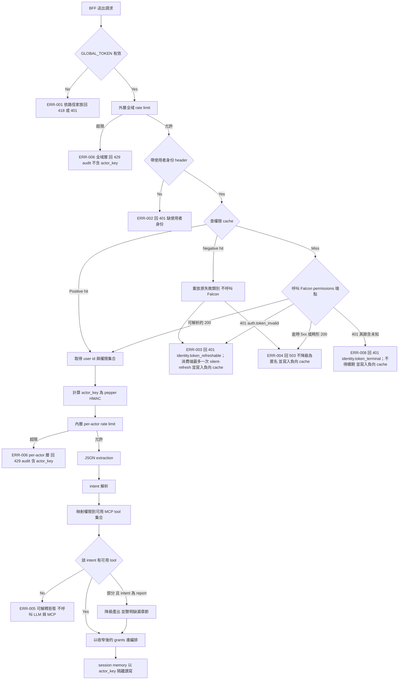

# Falcon 使用者身份與 RBAC 接進 runtime 請求路徑 PRD

| Field | Value |
|-------|-------|
| Story ID | S-RUNTIME-SEC-02 |
| Version | v2.0.0 |
| Status | Approved |
| Sprint | N/A |
| has_ui | false |
| Tickets | N/A |

---

## 1. Follow-ups

Confirmed direction：使用者的 Falcon access token 由 BFF 往下傳，runtime 自行呼叫
`GET /api/auth/me/permissions` 驗證並取得權限；權限在進 LLM 之前收窄 tool grants；
身份解析不到即 fail-closed；`actor_key` 為 pepper HMAC 假名。

無 Blocking FU（FU-005 已由 Falcon 維運回覆關閉）。Non-blocking FU：FU-001、FU-002、FU-003、FU-004（已併入 FU-007）、FU-006、FU-007。

v1.9.0 依使用者於 2026-08-28 指定的 Falcon 指南 commit
[`c5d0408b5e1847bf165e8c5f5859ef61da93e02d`](https://github.com/HDRenewables/falcon-backend/blob/c5d0408b5e1847bf165e8c5f5859ef61da93e02d/docs/External_Delegated_API_Integration.md)
改以該文件為外呼契約的唯一權威來源。該指南對 `/api/auth/me/permissions` 釘定 `Authorization: Bearer`、可解析的
`200` response shape，以及 access token 無效／過期／撤銷時的 `401`；它沒有為此端點提供逐列 `error_code` 表。
**v2.0.0 修訂**：上述 v1.9.0 的判斷對「指南寫了什麼」是正確的——已查證該指南在 `c5d0408`、
`EM-241`、`ST-7178-alembic-merge` 三處皆無七列 `auth.*` 表——但**指南落後於實作**。
對 dev 環境的免憑證探測（2026-08-31）證實 `GET /api/auth/me/permissions` 確實回傳
`error_code`：不帶 token 得 `401 {"detail": "未登入", "error_code": "auth.missing_token"}`，
垃圾 Bearer 得 `401 {"detail": "Token 無效或已過期", "error_code": "auth.token_invalid"}`。

因此 runtime **依 `error_code` 分類**，但採白名單：僅 `auth.token_invalid` 視為可續期，
其餘一切（含未知與缺漏）視為終端。論據不是文件而是安全性——七種失敗只有一種能靠 refresh
解決，收斂成單一 code 會讓前端對停用帳號做出無限 refresh 迴圈。白名單是因為這些 code
未被任何版本的指南承諾、隨時可能變動；最壞情況因此是多一次重新登入而非迴圈。指南中的 `external_auth.*` 只屬於
`/api/auth/external-login` 與 `/api/auth/external-refresh`，runtime 不呼叫這兩支端點。

v1.8.0 依使用者 2026-08-27 的範圍縮減決定移出兩項：原 FR-007（非逐字 summary 邊界）連同其兩條 AC
移出並記為 FU-007（該兩條 AC 的編號已隨之作廢，不再出現於本 PRD），且明載本刀把 `actor_key` 接上 memory 後產生的隱私回歸與其關閉時點；
`/v1/chat/completions` 的 `session_id` 傳輸與 memory 接線移出並記為 FU-006，該端點在授權模式下為單輪。
FR-004 的 report 降級產出**保留**（使用者明示「降級先讓他上線」）。FR 編號保留空號 FR-007 以免既有引用失效。

v1.7.0 依 Falcon 維運對 FU-005 的回覆重寫失敗語義：該端點**不回 403**，先前的 ERR-008 誤把 `/external-login` 與 `/external-refresh` 錯誤表中的 `external_auth.user_inactive` 與 `external_auth.user_blocklisted` 套用到查權限端點，兩者是不同的 code namespace。FR-001 新增七種 `auth.*` code 的權威對照表；ERR-003 收窄為僅 `auth.token_invalid` 且最多嘗試一次續期；ERR-008 改為「不可續期的身份失敗」涵蓋其餘五種 401；新增 ERR-010 處理 400 `auth.conflicting_credentials`（runtime 請求建構錯誤，回 500 並告警）；Flow 與 FR-006 的失敗矩陣依 code 而非 HTTP status 分流（三種身份失敗的 status 都是 401）；AC-010、AC-020、AC-025 改以 code 判定。FU-005 關閉。

v1.6.0 依第六輪審查補齊六項：FR-009 原只規定忽略 `AgentRequest.history`，但 `/v1/chat/completions`
的較早 messages 會先被 `map_request` 映射成 history、再被 `fold_history_into_prompt` 折回 prompt 與
`raw_input`，授權層看到時脈絡已在 prompt 內部——現明訂該路徑只取最後一則 `user` message、不折入，
並補 AC-026 與消費端 C9；列出 intent → required tools
的實際 rows 並顯式寫出 `report` 的判定例外；FR-006 的失敗矩陣從兩種 401 擴為五種 code 並更新 C3/C5/C6，
403 不可續期進入前端矩陣；FR-003 Output 殘留的 `ToolRegistry::resolve` 改為 wire-name grants；
負向 cache 納入 ERR-008 並拆出 AC-025 與改寫 AC-020 分別驗 401 與 403 的重放類別；
metadata 的 Status 由 Draft 同步為 Blocked。

v1.5.0 依第五輪審查修正十項授權與跨服務契約缺陷：新增 FR-009（授權模式下忽略 client `history`，
並在組裝脈絡時逐 turn 依當次權限過濾——原設計只擋當次 MCP grants，撤銷權限後舊脈絡仍會進 LLM）；
FR-003 的判定從「收窄後非空」改為 `boot grants ∩ permission grants ∩ intent required tools`
並對三張表的未涵蓋項目 default-deny（原規則會讓只有財務權限的使用者的會員查詢誤放行）；收窄 seam
從 `ToolRegistry::resolve`（`src/` 內零呼叫者，檔頭自述為未接線 groundwork）改為生產路徑的
`build_stage_tools` 與 pipeline builders；report 取得含六個 tool 的獨立 grant 上界，修掉 prompt 要求
六個而 grant 只有五個的既存不一致；新增 FR-008 在三種信封補上穩定 `code` 欄位（原本三者都只有
人類可讀字串，AC-010 的可區分性無處落地）；Flow 區分 positive 與 negative cache hit；ERR-008 把 403
從 ERR-003 拆出且明訂不觸發續期（Falcon 的 403 是 user_inactive 與 user_blocklisted，續期會造成
無限迴圈）；ERR-009 把外層 limiter 的部署前提改為開機強制；token transport 與 403 語義升為
Blocking FU-005；audit 的 `actor_key` 改為新增獨立欄位（既有 `AuditActor` 只有 ip 與 user_agent，
且 AC-013 禁止 audit 帶 IP）；非逐字 summary 的 AC 改為驗證等於 canonical 值而非不等於原文（該 AC 已於 v1.8.0 隨 FR-007 移出）。

v1.4.1 補上 v1.4.0 漏掉的驗收與同步：新增一條 AC 驗證 `answer_summary` 確實經過 sanitize 管線（已於 v1.8.0 移出）
（v1.4.0 把它列為新行為卻沒有任何 AC 驗它，實作者略過仍會全綠）；修掉 FR-007 Input 表格中殘留的
「沿用既有」措辭；§4 Flow 同步 403 與畸形 200 兩條邊並標註 ERR-003 也寫負向 cache；負向 cache
補上「每筆需記錄失敗類別」的要求，避免 10 秒窗內兩種失敗語義被混同。

v1.4.0 依第四輪獨立審查修正三項：FR-007 原稱 `answer_summary`「維持既有的 sanitize_field 管線」，
但請求路徑上並無該管線（`turn.rs:543` 是 `response.to_string()`，`sanitize_field` 唯一的非測試呼叫者
是未接線的 SQLite repository），改為明確「導入」並把字元上限設定改列為新增項；FU-006 的關閉宣稱
收斂為只關 prompt 半邊，response 半邊新增 FU-004；AC-004 原本斷言 `actor_key` 不含 user id 的
十進位表示，但版本前綴 `v1:` 本身即含 `1`，對小 id 保證失敗，改為已知答案 HMAC 比對加 preimage 缺席；
外層 limiter 預設關閉（`config.rs` 的 `enabled: false`）的事實補入 FR-005、FR-006 第三階段與 NFR，
啟用改列為部署前提而非假設；ERR-003 擴及 403、ERR-004 納入畸形 200、負向 cache 擴及 401/403、
AC-015 定位為部署前一次性檢查並補上測試拓樸需求。

v1.3.1 修正第三輪指出的一項措辭並移除一句 v1.2.0 殘留：`user_summary` 的驗收判準統一為
「僅由 intent 與已解析槽位組成」，不再寫成「不含原始提問文字」——槽位值取自封閉詞彙表，
提問含該標籤時會逐字相同，子字串比對會誤報。

v1.3.0 依第二輪對抗式審查修正六項發現：FR-007 從「把既有 sanitization 前移」改為真正的非逐字轉換
（`sanitize_field` 對短、無敏感樣式的提問是恆等函數，前移並不構成非逐字邊界；改由 intent 與已解析槽位
組成 `user_summary`），該 AC 的前提隨之改為恆等函數輸入類別；§4 Flow 補回外層全域 limiter 節點並
釘住它在身份解析之前的位置，堵住身份解析失敗流量不受任何限流約束的缺口；ERR-006 擴及兩層並說明
外層 audit 不含 `actor_key`；AC-012 前提補上兩層各自的 burst；pepper 輪替的邊界與風險改寫為
in-memory store 的靜默脈絡遺失，移除對未接線 `sessions` 表的依賴；負向 cache TTL 釘為 10 秒並
補上 ERR-004 的恢復延遲上界；Flow E1 改為依路徑家族回 418 或 401。

v1.2.0 依 Fable 的 Gate 1 對抗式審查修正九項發現：session 隔離的宣稱縮小為「取不到對方的值」
（請求路徑接線的是 in-memory store，不產生 ownership conflict）；per-actor 限流改為疊在既有全域
bucket 之內而非取代它；新增 FR-007 非逐字 summary 邊界以關閉前一份 PRD 指派給本 slice 的 FU-006；
Flow 重畫使身份解析先於限流、intent 閘門在 body 解析之後；補上 Falcon 端點的 Bearer transport 假設
與其待驗證的 platform claim 風險；ledger 歸戶的宣稱收窄；AC-009 拆成可判定斷言；AC-015 前提改為
現行線上版本；補上 C7 消費端覆蓋率觀測；更正 PermissionItem 欄位。

v1.1.0 更正 v1.0.0 的一項事實錯誤並具體化一項 FR：ERR-003 原寫「BFF 換新 token 後重送」，
但 `refresh_token` cookie 的 `Path=/api/auth/refresh` 依 RFC 6265 path matching 不會出現在
stream route 的 cookie header 中，BFF 無法自行續期，續期實為前端驅動；FR-006 從「一份文件」
具體化為六個具名消費端改動點，並記錄 SSE passthrough 把 401 壓成 200 加 error frame 的結構性事實。

### FU-001: Permission code 與 MCP endpoint 的歸屬確認

| Type | Background | Options | AI recommendation | Decision |
|------|------------|---------|-------------------|----------|
| Non-blocking | 本 PRD 的映射表由 `config/runtime/intents.toml` 與 falcon-client `menuPermissions.ts` 反推得出，`business_metrics`（經營指標）與 `station_revenue_ranking`（站點營收排名）落在財務或營運皆說得通，repo 內無落檔可證。 | A: 先採用本 PRD 的映射表，並在實作 PR 中對每一條映射留下顯式確認標記，由 domain owner 於 PR review 逐條確認 / B: 先暫停實作，等 domain owner 提供權威映射表 | A。映射表是一張獨立的 config，錯了只需改 config 不需改架構；用 PR 確認標記換取不阻擋實作。 | Confirmed A by user on 2026-08-26。Owner: domain owner（使用者）；close-by: 實作 PR 的 review。 |

### FU-002: 資料層 RBAC

| Type | Background | Options | AI recommendation | Decision |
|------|------------|---------|-------------------|----------|
| Non-blocking | `DATACENTER_MCP_URL` 是單一連線、無 per-user 憑證，因此本 PRD 的權限只在編排層生效；繞過 runtime 直接呼叫 MCP server 不會被權限攔阻。 | A: 維持網路邊界防護（MCP server 不對外暴露），資料層 RBAC 另開 slice / B: 本刀同時讓 MCP server 接受使用者憑證 | A。MCP server 是另一個服務，改它的認證模型不屬於 runtime 這一刀。 | Owner: Platform；close-by: MCP server 對外暴露前，或需要案場級隔離時。 |

### FU-003: engproj 權限目前無對應 MCP tool

| Type | Background | Options | AI recommendation | Decision |
|------|------------|---------|-------------------|----------|
| Non-blocking | Falcon 有 `hdrenewables/elecsvc/starcharger/engproj`（工程專案）權限，runtime 也有 `site-build` intent，但 `config/mcp-config.toml` 的六個 endpoint 沒有一個對應工程專案資料。 | A: 映射表把 `site-build` 標為「無可用 tool」，該 intent 一律回可解釋的拒答 / B: 本刀同時新增工程專案 MCP endpoint | A。新增 endpoint 是 datacenter API 的工作，不屬於身份與權限這一刀。 | Owner: Runtime；close-by: 工程專案 endpoint 上線時。 |

### FU-006: `/v1/chat/completions` 的多輪脈絡

| Type | Background | Options | AI recommendation | Decision |
|------|------------|---------|-------------------|----------|
| Non-blocking | FR-009 讓該端點只採最後一則 `user` message（關閉 history 旁路），但該端點今天沒有 `session_id` 傳輸——`map_request` 寫死 `session_id: None`（`src/server/openai.rs:204`），`handler.rs:583` 註明 server memory 在該路徑 inert。因此授權模式下它是單輪，且沒有回到多輪的路徑。 | A: 本刀維持單輪，另記 FU / B: 本刀新增 `session_id` 欄位並接線 memory | A。縮減範圍時移出：`/agent/stream` 是原始需求的入口，agentgateway 的多輪不是。 | Confirmed A by user on 2026-08-27（scope 縮減）。Owner: Runtime；close-by: agentgateway 需要多輪時。 |

### FU-007: summary 邊界與由此產生的隱私回歸

| Type | Background | Options | AI recommendation | Decision |
|------|------------|---------|-------------------|----------|
| Non-blocking | 原 FR-007 要把 `user_summary` 改為 canonical(intent, slots)、`answer_summary` 導入 sanitize。縮減範圍後兩者都維持現況：`turn.rs:542` 逐字寫入 `raw_input`、`turn.rs:543` 寫入未處理的 `response.to_string()`。**本刀同時把 `actor_key` 接上 session memory，因此這些逐字內容從「落在不可歸戶的 anonymous 桶」變成「可歸戶到假名 actor」——這是本刀自身造成的隱私回歸，不是既有狀態的延續。** | A: 接受回歸，記為 FU，於持久化 session memory 前關閉 / B: 保留原 FR-007 | A。使用者於縮減範圍時選擇先交付身份與授權本體。 | Confirmed A by user on 2026-08-27（scope 縮減）。Owner: Runtime；close-by: **SQLite session repository 接線（持久化）之前必須關閉**——in-memory 隨程序結束消失，持久化後就是長期保存。此 FU 同時承接前一份 PRD 的 FU-006 兩個半邊。 |

### FU-005: Falcon permissions 端點的 token transport 與失敗語義（已關閉）

| Type | Background | Options | AI recommendation | Decision |
|------|------------|---------|-------------------|----------|
| Non-blocking（已關閉） | D1 需要 runtime 以使用者 access token 的 `Authorization: Bearer` 呼叫 `GET /api/auth/me/permissions`，並對上游失敗做 fail-closed 分類。 | A: 以指定版本指南作為 SSOT，僅採用文件明載的 transport、200 shape 與 401 語義；B: 依未附來源的七列 `auth.*` 轉述擴充契約 | A。這份 commit 的指南是可定位的權威來源；不應把其他端點的錯誤表或未附文件的轉述當成 permissions 契約。 | **Confirmed by user on 2026-08-28（選項 2）**：指定 commit 的第 2 節確認 Bearer transport、`200` response 與 invalid／expired／revoked token 的 `401`，但沒有 permissions endpoint 的 `error_code` 表。**此判斷已於 2026-08-31 由 v2.0.0 修正**：指南確實沒有那張表（三個版本皆已查證），但 dev 環境實測證實端點仍回傳 `error_code`，故 runtime 依白名單分類為 `identity.token_refreshable` 與 `identity.token_terminal` 兩種；僅前者可嘗試一次 refresh。指南中的 `external_auth.*` 僅適用 external-login／external-refresh，不能套用到本端點。 |

### FU-004: Response 側的非逐字邊界（已併入 FU-007）

| Type | Background | Options | AI recommendation | Decision |
|------|------------|---------|-------------------|----------|
| Non-blocking | 前一份 PRD 的 FU-006 要求把 raw prompts 與 responses 都拿出 summary 欄位。本 PRD 的 FR-007 讓 `user_summary` 達成非逐字（由封閉詞彙表的槽位組成），並把 `answer_summary` 從完全未處理推進到 sanitized，但 sanitize 對短、無敏感樣式的回答是恆等函數，回答文字仍可能逐字留存並歸戶到假名 actor。 | A: 本刀先把 answer 側推進到 sanitized，非逐字邊界另記 FU / B: 本刀同時讓 answer 側也非逐字 | A。answer 側的非逐字轉換會使記憶脈絡失去回答內容，多輪追問將近乎失效，屬功能倒退；sanitized 是今天到不了的水準，先取得它。 | Confirmed A by user on 2026-08-26。**2026-08-27 縮減範圍後，本 FU 連同 prompt 半邊一併併入 FU-007**，不再單獨追蹤。 |

---

## 2. Context

### Goal

runtime 的 SQLite ledger、session memory 與 rate limit 全部以 `actor_key` 為軸心設計，
但 `src/` 內沒有任何生產路徑產生它——`SessionMemoryScope.actor_id` 一律是 `None`，
所有使用者的 session memory 落在同一個 `"anonymous:<session_id>"` 桶裡，
rate limit 是不分人的全域 token bucket，編排也不看使用者權限。
本 PRD 交付 `runtime-user-session-rate-limit` 明確延後的 request-path integration：
讓 runtime 知道請求背後是哪個 Falcon 使用者、他有哪些權限，並在呼叫 LLM 之前用權限收窄能力。

### Persona + Pain

| Persona | Context | Pain point |
|---------|---------|------------|
| Falcon dashboard 使用者 | 透過 falcon-client 的 chatbot 問營運與財務問題 | 只有財務權限的人，仍能透過 chatbot 問到營運與會員資料——dashboard 擋得住的，chatbot 擋不住 |
| Runtime 維運 | 需要知道成本與流量歸屬誰 | audit 與 ledger 的 actor 全是空的，超額或濫用無法歸戶，只能整台限流 |
| Falcon 資安 | 對外服務的授權邊界審查 | runtime 前只有一把共用 bearer；session memory 沒有使用者隔離，A 的對話上下文可能被 B 的 session id 取用 |

### Success metrics

| Metric | Target | Measurement |
|--------|--------|-------------|
| 身份覆蓋率 | 開啟 fail-closed 後，100% 進入 LLM 的請求都帶已驗證的 `actor_key` | audit event 的 actor 欄位非空比例 |
| 越權查詢阻擋 | 100% 無對應權限的 intent 在呼叫 LLM 與 MCP 之前被拒 | 契約測試：無權限請求的 LLM 與 MCP 呼叫次數為 0 |
| Session 隔離 | 100% 跨 actor 取用同一 session id 的嘗試取不到對方任何已存值 | 契約測試 |
| Token 不外洩 | 使用者 token 在 log、audit、SQLite 的出現次數為 0 | 針對 log 與 DB 的自動掃描測試 |

### Risk and evidence

| Item | Trigger / Source | Mitigation / Decision |
|------|------------------|-----------------------|
| Confused deputy | 使用者 token 的作用域是該使用者在 Falcon 的全部權限（含 `can_write`），不只 permissions 端點；runtime 被攻陷或被 prompt injection 誘導轉發即可代為寫入 | runtime 只用它呼叫 `GET /api/auth/me/permissions` 一個端點；程式層不存在把該 token 轉發到其他 URL 的路徑；驗證後即丟；cache 的 key 是 token 的 hash，value 只有權限結果 |
| 消費端未補 header 即開啟 fail-closed | agentgateway 的 `/v1/chat/completions` 目前完全沒有使用者身份 | 補 header 是向前相容的（runtime 忽略未知 header），因此以三階段部署順序取代 feature flag：消費端先補 → 觀測確認流量都帶了 → runtime 才開 fail-closed |
| Falcon 成為請求路徑上的相依 | permissions 端點逾時或 5xx 時，fail-closed 會讓 chatbot 整體不可用 | 短 TTL cache 吸收重複請求；Falcon 不可用時回 503 並帶可重試語義，不降級為匿名 |
| pepper 輪替造成記憶脈絡靜默遺失 | `actor_key` 改變後，舊桶的記憶脈絡不再可達；因接線的是 in-memory store，這不會產生任何錯誤訊號，使用者只會發現機器人忘了前文 | pepper 視為 break-glass、日常不輪替；runbook 註明輪替等同清空所有進行中的對話脈絡，建議在低流量時段執行；本 slice 無需清 `sessions` 表，該步驟要等 SQLite session repository 接線後才適用 |
| 映射表歸屬判斷錯誤 | 映射表由 prompt 與 config 反推，非權威來源 | FU-001：映射表是獨立 config，PR review 逐條確認 |
| error code 在 SSE passthrough 中被壓平 | falcon-client 的 stream route 在 `new Response(stream, ...)` 時已送出 200，`openAgentStream` 在 body streaming 階段才執行，因此 runtime 的 401 只能變成 200 回應內的 SSE error frame；`agentErrorInfo` 目前未特判 401，會把它壓成與 upstream 故障同一個 `AGENT_REQUEST_FAILED` | runtime 只能保證自己邊界的可區分性（AC-010）；error code 要活著走完 BFF 與前端兩跳，屬 FR-006 handoff 的驗收內容，實作在 falcon-client work item |
| 同一授權錯誤有兩條回傳路徑 | falcon-client 自己的 guard 在 200 送出前攔到會回真 401；runtime 攔到則變成 200 加 SSE frame | 前端的判斷邏輯必須以 error frame 的 payload 為準，不能以 response status 為準；此約束寫入 FR-006 的 handoff 文件 |
| Evidence | `src/runtime/turn.rs:462`、`src/runtime/turn.rs:535`（`actor_id: None`）；`src/server/rate_limit.rs:112`（`actor: None`）；`src/runtime/store/sqlite.rs`（`actor_key` 已是 schema 主鍵）；`src/agent/tools.rs:219`（`ToolRegistry::resolve` grants seam）；`config/runtime/intents.toml`；`config/mcp-config.toml`；`config/prompt_guide/fetcher_system.md:20`；falcon-client `src/lib/chief-of-staff/agent-client.ts`、`agent-runtime/identity.ts`、`src/utils/menuPermissions.ts`、`src/lib/server/getMenuPermissions.ts`；`docs/work/runtime-user-session-rate-limit/prd.md` FU-004；`docs/work/runtime-falcon-identity-rbac/brainstorm.md` | 採用 brainstorm 的 D1 至 D5 |

---

## 3. Scope

### In scope

- 使用者身份 header 契約：`Authorization` 已被 `GLOBAL_TOKEN` 佔用，使用者 token 走獨立 header。
- Falcon permissions client：呼叫 `GET /api/auth/me/permissions`、短 TTL cache、逾時與失敗處理。
- `actor_key` 假名化（pepper HMAC），並貫穿 session memory scope 與 audit actor。
- 權限驅動的編排收窄：permission code 到 MCP tool 的映射表、per-request grant 收窄、intent 閘門。
- `report` intent 的權限降級產出與缺漏聲明。
- per-actor rate limit，疊在現有全域 token bucket 之內：外層維持全服務容量上限，內層以 `actor_key` 限單一使用者。
- `/agent/stream` 與 `/v1/chat/completions` 兩條路徑的身份與權限行為一致。
- 消費端 handoff 文件：falcon-client BFF 與 agentgateway 各自要補什麼，以及三階段部署順序。
- 歷史與記憶脈絡的權限過濾：授權模式下忽略 client `history`，並在組裝脈絡時逐 turn 依當次權限過濾。

### Out of scope

- 資料層 RBAC 與 MCP server 的 per-user 憑證（FU-002）。
- 使用者 token 的 refresh 與續期：runtime 只回可區分的 401，不自行 refresh。續期由 falcon-client 前端既有的 silent-refresh 流程負責（`middleware.ts:314-326` rewrite 到 `/silent-refresh`，由該頁 client-side POST `/api/auth/refresh`）。BFF 無法自行續期：`refresh_token` cookie 的 `Path=/api/auth/refresh` 不匹配 stream route 路徑，依 RFC 6265 path matching 不會出現在該 route 的 cookie header 中。
- 以 external client API key 走 `/api/auth/external-login` 代登入：runtime 不持有 external client key。
- 月度 ledger 的實際扣款：`actor_key` 貫穿後 ledger 才有正確歸戶，但 reserve 與 settle 需要權威成本，仍待 `runtime-user-session-rate-limit` 的 FU-003（OpenRouter cost adapter）。
- 案場級或列級權限：Falcon 的 `PermissionItem` 只有 `code`、`name`、`category`、`page_path`（可為 null）、`can_read`、`can_write`，沒有 row scope，不存在這個概念。
- multi-replica 的共享額度邊界（`runtime-user-session-rate-limit` FU-002，Platform 持有）。
- Falcon `:download` 權限的判斷：匯出是 BFF 的 UI 行為，由 falcon-client 依 `:download` 決定匯出入口是否顯示。
- **summary 邊界（原 FR-007，2026-08-27 縮減範圍時移出）**：`user_summary` 維持現況的 `raw_input` 逐字寫入，`answer_summary` 維持 `response.to_string()` 未處理。見 FU-007。
- **`/v1/chat/completions` 的多輪脈絡**：該端點仍 fail-closed 並只採最後一則 `user` message（FR-009），但本刀不新增 `session_id` 傳輸、也不接線該路徑目前 inert 的 server memory，因此授權模式下為單輪。見 FU-006。

---

## 4. Flow


---

## 5. Functional Requirements (FR)

### FR-001: 使用者身份驗證與權限取得

**使用者價值**: runtime 知道請求背後是哪個 Falcon 使用者，且該使用者在 chatbot 裡的權限與他在 dashboard 裡的權限一致。

**Behavior**: 在既有 `GLOBAL_TOKEN` bearer gate 通過之後、JSON extraction 之前，runtime 從獨立的使用者身份 header 取出 Falcon access token，以它呼叫 `GET /api/auth/me/permissions`，取得 `user_id`、`roles` 與 `permissions`。結果進短 TTL cache，cache key 是 token 的 hash 而非 token 本身，cache value 只有 `user_id` 與權限集合。runtime 不呼叫該端點以外的任何 Falcon API，也不持有 external client API key。

**Input**:

| Field | Required | Notes |
|-------|----------|-------|
| service bearer header | Yes | 既有 `Authorization: Bearer <GLOBAL_TOKEN>`，語義與檢查方式不變 |
| 使用者身份 header | Yes | 獨立 header 承載使用者的 Falcon access token；名稱在 spec 定，不得重用 `Authorization` |
| Falcon base URL | Yes | 由環境變數提供，不寫死 |

**Output**:

| Field | Notes |
|-------|-------|
| `user_id` | Falcon 使用者數值 id，僅用於推導 `actor_key`，不落 log |
| 權限集合 | permission code 與 `can_read` 的集合，供 FR-003 映射 |
| cache 狀態 | hit 或 miss，供效能觀測；不含 token 與 user_id |

**Upstream failure contract**：指定版 Falcon 外部串接指南的 permissions 章節只承諾：access token 無效、過期或撤銷時，
`GET /api/auth/me/permissions` 回 `401`；該章節沒有為此端點承諾任何 `error_code` 字串或逐列錯誤表。
因此 runtime 依 `error_code` 白名單分類（僅 `auth.token_invalid` 可續期），並在 body 不符合 `200` shape 時歸為不可用。

| Upstream result | Runtime result | Cache / recovery |
|---|---|---|
| `200` 且 body 可解析 | 取得 `user_id`、role objects 與 effective `permissions`；只把 `can_read=true` 的 code 交給 FR-003 | 正向 cache，TTL 60 秒 |
| `401` + `error_code: auth.token_invalid` | `401` + `identity.token_refreshable`（ERR-003） | 負向 cache，TTL 10 秒；消費端最多 refresh／重送一次，重送仍失敗即停止 |
| `401` + 其餘任何 `error_code`（含未知、缺漏） | `401` + `identity.token_terminal`（ERR-008） | 負向 cache，TTL 10 秒；**不得**進 refresh 路徑 |
| timeout、連線失敗、5xx、或畸形 `200` | `503` + `identity.upstream_unavailable`（ERR-004） | 負向 cache，TTL 10 秒；依退避重試 |

指南中的 `external_auth.*` 錯誤表只適用 `/api/auth/external-login` 與 `/api/auth/external-refresh`，
不是 permissions endpoint 的契約；runtime 不呼叫那兩支端點，也不持有 external client API key。

**來源標記**：[`External_Delegated_API_Integration.md`](https://github.com/HDRenewables/falcon-backend/blob/c5d0408b5e1847bf165e8c5f5859ef61da93e02d/docs/External_Delegated_API_Integration.md)，
commit `c5d0408b5e1847bf165e8c5f5859ef61da93e02d`。指南的 permissions response 範例含 `user_id`、物件形式的 `roles`，
以及含 `code`、`can_read`、`can_write` 等欄位的 `permissions`。

**Data source**: Existing Falcon API `GET /api/auth/me/permissions`

**Permissions / Visibility**: 權限完全由被代理使用者既有的 RBAC 決定；runtime 不賦予、不擴張任何權限。

**Boundary conditions**:

- 使用者 token 只用於呼叫 `GET /api/auth/me/permissions`；程式層不存在把它轉發到其他 URL 的路徑。
- 使用者 token 不寫入 log、tracing、audit event 或 SQLite；驗證後即丟。
- cache 逾期後重新驗證；Falcon 端撤銷權限的生效延遲上界等於 cache TTL。
- 本地缺少身份 header、可續期的 upstream `401` 與終端的 upstream `401` 三者必須以不同 internal code 區分。upstream 的 `error_code` 只作為 runtime 內部判定輸入，不直接轉送給消費端——消費端看到的是 runtime 的 internal code，因此上游改名不會破壞公開契約。

---

### FR-002: actor_key 假名化並貫穿 session 與 audit

**使用者價值**: 一個使用者的對話上下文不會被另一個使用者取用，且流量與成本可歸戶。

**Behavior**: runtime 由 `user_id` 推導 opaque `actor_key`，形式為版本前綴加上以 pepper 為金鑰的 HMAC-SHA256 摘要的 base64url 截斷值；版本前綴置於 HMAC 訊息之外，使輪替後的新舊資料在資料庫中自然分家。`actor_key` 取代目前寫死的 `None`，貫穿 `SessionMemoryScope.actor_id`，並以一個**新增的獨立 opaque 欄位**進入 audit：既有的 `AuditActor` 只有 `ip` 與 `user_agent`，是網路 metadata 而非身份，且 AC-013 明確禁止 audit 帶 IP，因此不可把 `actor_key` 併入該 struct。`AuditRecord` 與 tracing sink 皆需新增同名欄位，否則 sink 端會靜默丟棄。pepper 由環境變數提供，長度下限 32 bytes，啟動時缺失或過短即啟動失敗。

**Input**:

| Field | Required | Notes |
|-------|----------|-------|
| `user_id` | Yes | 來自 FR-001 |
| pepper | Yes | 環境變數，至少 32 bytes，與服務 token 同級的長期 secret |
| 版本前綴 | Yes | 常數；輪替時遞增 |

**Output**:

| Field | Notes |
|-------|-------|
| `actor_key` | opaque 字串，不含 email、IP、cookie、token 或可讀的 user id |

**Data source**: Existing `src/runtime/store/sqlite.rs` 的 `actor_key` 欄位與 `SessionMemoryScope`

**Permissions / Visibility**: session memory 的 key 由 `actor_key` 與 `session_id` 共同組成，因此不同 actor 使用同一個 `session_id` 會落在不同的儲存桶，彼此取不到對方的值。

**Boundary conditions**:

- 不得直接使用 `user_id` 作為 `actor_key`：`user_id` 是小整數，無 pepper 的純 hash 可被彩虹表反推。
- 同一 `user_id` 加同一 pepper 恆得同一 `actor_key`；跨程序、跨重啟一致。
- pepper 改變後不做資料遷移。因請求路徑接線的是 `InMemorySessionStore`，輪替不會產生任何錯誤訊號：舊 `actor_key` 的記憶脈絡被靜默孤立，使用者的下一輪對話從空的 session 開始且看不到任何提示。本 slice 不寫入 `sessions` 資料表，因此不需要清表步驟；「舊前綴資料原地保留供稽核」只適用於帶舊前綴的 audit event。
- 本 PRD 只讓 `actor_key` 可供月度 ledger 使用；ledger 的 reserve 與 settle 未接上請求路徑，因此本刀不產生任何 ledger 寫入，歸戶要等 OpenRouter cost adapter 那一刀才有實際資料。

---

### FR-003: 權限驅動的編排收窄

**使用者價值**: dashboard 擋得住的資料，chatbot 也擋得住，而且在燒掉 token 與打到 MCP 之前就擋住。

**Behavior**: runtime 以一張顯式 config 映射表，把 Falcon permission code 對應到可用的 MCP tool 集合，並據此在每個請求上收窄實際生效的 stage grants。收窄點必須是生產路徑：`src/agent/wiring.rs` 的 `build_stage_tools` 與各 pipeline builder，它們解析的是 config 的 wire name 字串。`src/agent/tools.rs` 的 `ToolRegistry::resolve` 在 `src/` 內沒有任何呼叫者（該檔頂部的 `#![allow(dead_code)]` 註明它是尚未接線的 groundwork），因此不得作為收窄 seam。授權判定不是「收窄後的集合非空」——只有財務權限的使用者問會員主題時，收窄後集合仍含財務 tool 而非空，那條規則會誤放行。判定必須以該 intent **所需**的 tool 為基準：

`effective = boot grants ∩ permission grants ∩ intent required tools`

`effective` 為空即回可解釋的拒答，不呼叫 LLM、不呼叫 MCP。三張表任一方沒有涵蓋到的項目——未知 intent、未映射的 permission code、未映射的 tool——一律 default-deny，不得 fallback 為放行。映射表的初始內容為：財務對應營收與站點營收排名；營運績效對應充電與經營指標；業務發展對應會員分析與帳務會員分析；工程專案目前無對應 tool。事業部父層權限不隱含任何子頁權限。

**Input**:

| Field | Required | Notes |
|-------|----------|-------|
| 權限集合 | Yes | 來自 FR-001，只採計 `can_read` 為真的項目 |
| intent | Yes | 既有 `config/runtime/intents.toml` 的解析結果 |
| permission → tool 映射表 | Yes | 新增 config；每條映射在實作 PR 留下確認標記（FU-001） |
| intent → required tools 映射表 | Yes | 新增 config；涵蓋 `intents.toml` 的 `intent_allowlist` 全部項目，含 `unknown`。初始內容見下表 |

**Output**:

| Field | Notes |
|-------|-------|
| 收窄後的 grants | 傳給 pipeline builder / `build_stage_tools` 的 wire-name grant 集合，可為空集合 |
| 拒答理由 | 集合為空時給使用者的可解釋訊息，指出缺少哪一類權限 |

intent → required tools 的初始內容（與 FU-001 的 permission 映射表同樣在實作 PR 逐條留下確認標記）：

| intent | required tools | 說明 |
|--------|----------------|------|
| `unknown` | 無 | 永遠落在拒答分支，與現行低信心不回答的行為一致 |
| `revenue` | `bill_revenue`, `station_revenue_ranking` | 對應 Falcon 的 finance |
| `charging` | `bill_charge`, `business_metrics` | 對應 opperf |
| `member` | `member_analysis`, `bill_member_analysis` | 對應 bizdev |
| `site-build` | 無 | engproj 目前無對應 MCP endpoint，見 FU-003；此 intent 一律拒答 |
| `report` | 全部六個 | 判定規則例外，見下 |

`report` 的判定與其他 intent 不同：其他 intent 要求 `effective` 涵蓋該 intent 的 required tools 才放行，
`report` 只要 `effective` 非空即以 FR-004 的降級路徑產出，空集合才拒答。這個例外必須顯式寫在 config 或
判定邏輯中，不得靠隱含行為。

**Data source**: New 映射表 config，對應 Existing `config/mcp-config.toml` 的 endpoint 與 Existing Falcon permission code

**Permissions / Visibility**: 收窄只會減少 tool，永不新增；boot 時仍以既有 config grant 為上界。

**Boundary conditions**:

- 收窄在生產路徑上實作（`build_stage_tools` 與 pipeline builders）；`ToolRegistry` 維持未接線狀態，spec 不得以它為依據。
- 事業部父層權限不隱含子頁：只有父層權限的使用者得到空集合。
- 兩張映射表都必須全覆蓋並在啟動時驗證：`intent_allowlist` 有未映射的 intent、或映射表引用了不存在的 tool wire name，皆為啟動失敗，避免 default-deny 在執行期才被發現。
- `unknown` intent 沒有 required tools，因此永遠落在拒答分支，與現行「低信心不回答」的行為一致。
- 目前六個 MCP endpoint 全屬星舟快充，因此只有其他事業部權限的使用者得到空集合，這是預期結果。
- report 路徑取得自己的 grant 上界，不再共用 `[insight.grants].fetcher`：後者只有五個 tool 且註解明確排除 `bill_member_analysis`，而 `config/prompt_guide/fetcher_system.md:20` 卻要求報告呼叫六個，第六個從未被 advertise。新增的 report grant 含全部六個，並同樣經過 FR-003 的三方交集。
- runtime 不判斷 Falcon 的 `:download` 權限。

---

### FR-004: report intent 的權限降級產出

**使用者價值**: 只有部分主題權限的使用者仍能取得報告，且不會誤以為看到的是完整資料。

**Behavior**: `report` intent 的 grant 上界是新增的 report grant，含全部六個 tool（不再共用只有五個的 `[insight.grants].fetcher`）。當使用者只有部分主題權限時，runtime 以權限交集後的 tool 集合產出報告，並在回覆與 audit event 中明確聲明因權限不足而省略了哪些主題章節。權限交集為空集合時退回 FR-003 的拒答。

**Input**:

| Field | Required | Notes |
|-------|----------|-------|
| 收窄後的 grants | Yes | 來自 FR-003 |
| intent | Yes | 值為 report |

**Output**:

| Field | Notes |
|-------|-------|
| 報告內容 | 只含有權限主題的章節 |
| 缺漏聲明 | 使用者可見的說明，列出被省略的主題；同時進 audit event |

**Data source**: Existing report pipeline（`src/agent/pipeline.rs`）

**Permissions / Visibility**: 同 FR-003；降級不改變任何權限判斷。

**Boundary conditions**:

- 缺漏聲明必須列出被省略的主題名稱，不能只說資料不完整。
- 降級後的報告不得包含任何無權限主題的數字。這是自由生成內容的性質，無法以契約測試判定，因此 AC-009 只斷言可判定的部分（非授權 endpoint 的 MCP 呼叫次數為 0、缺漏聲明存在），數字洩漏的檢查由 QA plan 承接（與 AC-015 的追溯缺口同樣處理方式）：本刀範圍縮減後不新增 eval 步驟，該檢查以 QA plan 的人工或探索式項目落地，不作為契約測試。
- `config/prompt_guide/fetcher_system.md` 目前把六個 tool 名稱寫死在報告指示中，收窄 grants 後該指示會要求 LLM 呼叫它沒有的 tool；該 prompt 必須改為 grant-aware，由 spec 處理。
- 全部主題皆無權限時不產出報告，走 FR-003 拒答。

---

### FR-005: 雙層 rate limit

**使用者價值**: 單一使用者的爆量不會耗盡全服務的容量，服務整體也仍有一道總量上限，且超額能歸戶。

**Behavior**: 現有的全域 token bucket 保留為外層總量上限，其內新增一層以 `actor_key` 為鍵的 per-actor bucket；請求必須通過兩層才被允入，任一層拒絕即回 429。兩層位置不同且不可互換：外層全域維持在現有位置，也就是 bearer gate 之後、**身份解析之前**；內層 per-actor 必然在身份解析之後，因為它需要 `actor_key`。保留外層有兩個理由：per-actor bucket 只約束單一 actor，而 N 個 actor 同時爆量的總和仍可超過服務容量且 actor 數量無上界；更關鍵的是身份解析失敗的流量（ERR-002、ERR-003、ERR-004）永遠到不了內層，若外層也移到身份解析之後，這類流量將完全不受限流約束。任一層拒絕都回 429、整數 `Retry-After`、`Cache-Control: no-store` 與既有的 per-family 錯誤信封，並寫出恰好一筆標明拒絕層的 audit event；內層拒絕的 audit event 新增 `actor_key`，外層因發生在身份解析之前而沒有該欄位。兩者皆不含 IP、session、token、prompt 或 response。

**Input**:

| Field | Required | Notes |
|-------|----------|-------|
| `actor_key` | Yes | 來自 FR-002 |
| 限流政策 | Yes | 兩層各有自己的 burst size 與 refill period，沿用既有設定形狀 |

**Output**:

| Field | Notes |
|-------|-------|
| 允許或拒絕 | 拒絕時回 429 與整數 Retry-After；audit event 標明是哪一層拒絕的 |
| audit event | 既有欄位加上 `actor_key`；不含 IP、session、token、prompt、response |

**Data source**: Existing `src/server/rate_limit.rs`

**Permissions / Visibility**: 外層在服務 bearer 驗證之後、使用者身份解析之前生效；內層在使用者身份解析之後生效。兩層都是容量邊界而非授權邊界。

**Boundary conditions**:

- 兩層狀態皆為程序內，重啟即重置；這是短窗允入控制，不是持久化額度。
- bucket 數量隨 actor 數成長，需有上界與淘汰策略，避免記憶體無界成長。
- 非 POST 請求不消耗允入容量，沿用既有行為。
- 內層 per-actor 限流位於身份解析之後，保護不到 Falcon permissions 端點；那道保護由維持在身份解析之前的外層全域 bucket 提供。
- ERR-003 與 ERR-004 的失敗結果都寫入負向 cache，避免同一個持續失敗的 token 每次請求都打 Falcon。upstream 的 `401` 依 `error_code` 白名單分為可續期與終端兩類，負向項記錄的是分類後的結果，因此重放不會在兩者之間漂移。ERR-004 的 503 仍與 401 分開，避免把上游不可用誤當身份失敗。負向 cache 以 token hash 為鍵，TTL 為 10 秒，不超過正向 cache 的 60 秒；每筆負向項必須記錄 internal failure 類別，使重放不會在三種 internal code 之間漂移。它只涵蓋同一 token 的重複失敗；呼叫端若每次送出不同的無效 token，每次仍產生一次 Falcon 往返，該情形由外層全域 bucket 約束。
- 兩層的拒絕各自寫出恰好一筆 audit event 並標明拒絕層；外層拒絕發生在身份解析之前，其 audit event 沒有 `actor_key`。
- 外層全域 limiter 目前是 opt-in 且**預設關閉**（`src/config.rs` 的 `enabled: false`、`config/config.toml` 的 `[server.rate_limit]` 整段註解、`src/server/route.rs` 僅在 `enabled` 為真時掛載）。因此「身份解析失敗流量由外層約束」在關閉狀態下不成立。這不能只靠文件約束：身份層啟用而 limiter 關閉時必須**啟動失敗**（ERR-009），與 pepper 缺失的處理方式一致。
- per-actor 政策必須在 config 中明確設定，無隱含預設值，與外層現行的「section 存在即需明確政策」一致。
- per-actor bucket 需有數量上界與淘汰策略（最近未使用優先淘汰），淘汰只會使該 actor 回到滿額狀態，不會放寬外層總量上限。
- 兩層狀態皆為程序內，因此都是**單 replica** 的邊界。多 replica 下 per-actor 上限等於 replica 數乘以設定值，這與前一份 PRD 的 FU-002 是同一個限制，不在本刀解決。
- 內層 per-actor limiter 隨身份層一併生效，不提供 opt-out：若可關閉，D3 的 fail-closed 就有一條繞過 per-actor 約束的旁路。

---

### FR-006: 消費端 handoff 與部署順序

**使用者價值**: 這一刀上線不會打斷現有的 chatbot 與 agentgateway 流量，且 runtime 能把缺少本地 header、Falcon permissions `401` 與上游不可用清楚傳給消費端。

**Behavior**: 交付一份消費端整合文件，逐點列出 falcon-client 與 agentgateway 各自要改的位置、header 的名稱與格式、FR-008 的 `code` 列舉與**每一個 code 的處置**，以及三階段部署順序。身份相關的失敗依本地缺 header、upstream permissions `401` 與 upstream 不可用分類；runtime 不把未被 Falcon permissions 指南承諾的 `error_code` 暴露給消費端：

| 情境 | runtime 回應 | 處置 |
|------|--------------|------|
| 缺使用者身份 header（ERR-002） | 401 | 消費端程式錯誤，補 header；**不得**續期 |
| Falcon permissions 回 401 且可續期（ERR-003） | 401 `identity.token_refreshable` | 觸發前端既有 silent-refresh 後重送**一次**；重送仍失敗即停止並提示重新登入 |
| Falcon permissions 回 401 且終端（ERR-008） | 401 `identity.token_terminal` | **終端**。不得進 refresh 路徑——續期換來的 token 仍屬同一個停用／撤銷／不存在的帳號，會形成無限迴圈。提示重新登入或聯絡管理員 |
| 權限來源不可用（ERR-004） | 503 | 依退避重試 |
| 權限不足（ERR-005） | 200 | 終端，顯示拒答內容 |
| 限流（ERR-006） | 429 | 依 `Retry-After` 退避重送 |

本地 `identity.header_missing`、可續期的 `identity.token_refreshable` 與終端的 `identity.token_terminal` 三者必須依 `code` 區分；只有 `identity.token_refreshable` 可嘗試 refresh，且 retry budget 必須由消費端固定為一次。
文件同時記錄一個結構性事實：falcon-client 的 stream route 在 `new Response(stream, ...)` 時就送出 200，而 `openAgentStream` 在 body streaming 階段才執行，因此 runtime 的 401 只能以 SSE error frame 的形式抵達前端，前端的判斷邏輯必須以 frame payload 為準而非 response status。同時更新 `docs/reference/endpoints/agent-stream.md` 的公開契約。

**Input**:

| Field | Required | Notes |
|-------|----------|-------|
| header 契約 | Yes | 來自 FR-001 |
| error code 對照 | Yes | 來自 ERR-001 至 ERR-006；upstream permissions endpoint 僅以 HTTP 401/200 契約描述，不引入其未承諾的 error code |
| 消費端現況盤點 | Yes | falcon-client 與 agentgateway 的實際呼叫點與錯誤映射現況 |

**Output**:

| Field | Notes |
|-------|-------|
| `handoff-consumers.md` | 下表九個改動點（C1–C9）、error code 對照、三階段部署順序 |
| 更新後的 endpoint 參考文件 | `docs/reference/endpoints/agent-stream.md` 與 `docs/reference/endpoints/chat-completions.md` 都要更新：新 header、FR-008 的 `code` 欄位與列舉、三種身份失敗的語義，以及 chat-completions 的 history 折入章節（授權模式下不再折入） |

falcon-client 需要的改動點（實作在 falcon-client 自己的 work item，本文件是它的輸入）：

| # | 位置 | 現況 | 需要的改動 |
|---|------|------|-----------|
| C1 | `src/lib/chief-of-staff/agent-client.ts` 的 `openAgentStream` opts | 只收 prompt、history、sessionId、optionId、signal、streamPath | 新增使用者 token 參數，並在 headers 帶上使用者身份 header |
| C2 | `src/lib/chief-of-staff/stream-route.ts` | `cookieHeader` 已在 route handler scope 內但未往下傳 | 取出 `access_token` 傳給 `openAgentStream` |
| C3 | `agent-client.ts` 的 `agentErrorInfo` | 只特判 500、504、499、400、418；401 落入 `AGENT_REQUEST_FAILED`，與 upstream 故障同值 | 依 runtime 的 `code` 分流：缺身份與 permissions `401` 必須互異；兩者的 HTTP status 都是 401，因此**不能**只用 status 判定 |
| C4 | `agent-client.ts` 的非 2xx 回應解析 | 只讀 `body.error` 為字串的情況 | 一併讀取 runtime 的 error code 欄位，否則 C3 無資訊可映射 |
| C5 | `src/components/chief-of-staff/useChiefOfStaffStream.ts` 的 error frame 分支 | 一律當一般錯誤顯示 | 依 code 分流：**只有** `identity.token_refreshable` 可觸發既有 silent-refresh 並重送一次；`identity.token_terminal` 與 `identity.header_missing` 直接顯示終端訊息、**不得**進 refresh 路徑；retry 後仍 401 即停止 |
| C6 | agentgateway 的 `/v1/chat/completions` 呼叫端 | 完全沒有使用者身份 | 補上使用者身份 header，並依上表處理 permissions `401`、上游不可用與授權拒答 |
| C9 | agentgateway 送出的 `messages` | 送完整 messages 陣列 | 授權模式下 runtime 只取最後一則 `user` message，較早的一律丟棄，因此該端點為**單輪**。**不要改送 `session_id`**——`map_request` 寫死 `session_id: None`（`src/server/openai.rs:204`）、`handler.rs:583` 註明該路徑 memory inert，送了不會生效。多輪需等 FU-006 交付後才有路徑 |
| C8 | falcon-client `agent-client.ts` 的 `agentRequestBody` | 依 `usesAgentServerMemory()` 決定是否送 `history` | 授權模式下一律不送 `history`；runtime 會忽略它，繼續送只是浪費 payload |
| C7 | falcon-client 與 agentgateway 的呼叫點記錄 | 無 header 附加與否的觀測 | 各自輸出一筆「已附加使用者身份 header」的觀測記錄，使部署第二階段可被確認；D3 不允許 runtime 端 feature flag，因此覆蓋率只能由消費端自證 |

**Data source**: New 文件；對應 Existing falcon-client 上述檔案與 Existing agentgateway 的 `/v1/chat/completions` 呼叫端

**Permissions / Visibility**: 文件為內部工程文件，不含任何憑證值。

**Boundary conditions**:

- 補 header 必須是向前相容的：runtime 在尚未開啟 fail-closed 時忽略該 header，消費端可先行部署。
- 三階段部署順序為：消費端補 header、以 C7 的消費端觀測確認流量都帶了、runtime 才部署含身份層的版本。第三階段的前置條件包含把預設關閉的外層 `[server.rate_limit]` 明確啟用，否則身份解析失敗的流量不受任何限流約束。因 D3 不設 feature flag，「開 fail-closed」等同「部署新版 binary」，第二階段的觀測必須由消費端提供，runtime 端無法自證。
- 文件只以環境變數名稱與檔案路徑指涉憑證，不得出現任何 key 或 token 的實際值。
- error code 必須活著走完 BFF 與前端兩跳（C4 讀到、C3 映射、C5 辨識）；任一跳漏掉，runtime 端的可區分性即無作用。本 PRD 的 AC 只驗到 runtime 邊界（AC-010），前端的端到端驗收屬 falcon-client work item。
- C1 至 C5 屬 falcon-client repo、C6 屬 agentgateway repo，皆不在本 PRD 的實作範圍；本 FR 的交付物是文件與公開契約更新。
- AC-015 是部署前的一次性檢查，對象是當前 main 的 binary，不是本 slice 交付後可重跑的迴歸 AC：D3 不設 flag，交付後的 binary 一律強制，該前提只存在於歷史 revision。
- D3 的一項測試面後果：交付後每一條經過受管路由的整合測試與本機啟動，都需要一個可設定 base URL 的 mock Falcon permissions 端點與一個 pepper 環境變數，否則會在身份層被擋掉。spec 需連同測試拓樸一併設計。

---

### FR-009: 歷史與記憶脈絡的權限過濾

**使用者價值**: 權限被撤銷後，使用者不會再從對話脈絡裡看到他已無權查看的資料。

**Behavior**: FR-003 只收窄「這一輪能呼叫哪些 tool」，擋不住已經在脈絡裡的資料。兩條路都要堵。第一，身份層啟用時 runtime **不再接受任何 client 提供的對話脈絡**，server-side session memory 是唯一來源；否則任何持有 `GLOBAL_TOKEN` 的呼叫端都能把任意內容當脈絡送進 LLM，那是一條完整的權限旁路。這在兩條路徑上的落點不同，必須分別規定：

- `/agent/stream`：忽略 `AgentRequest.history`。
- `/v1/chat/completions`：**只取最後一則 `user` message 當 prompt，較早的 messages 一律丟棄，不折入**。單忽略 `AgentRequest.history` 在這條路徑上無效——`src/server/openai.rs` 的 `map_request` 把較早的 messages 映射成 `history`，而 `src/server/handler.rs` 又在 prelude 之前用 `fold_history_into_prompt` 把它折回 `prompt` 並寫進 `raw_input`；等授權層看到時脈絡已經在 prompt 內部。第二，讀取 session memory 組裝脈絡時，逐 turn 依**當次**權限過濾：每筆 `SessionMemoryTurn` 已存有 `intent` 與 `metric`，用 FR-003 的同一組映射判定該 turn 所屬主題是否仍在權限內，不在的整筆略過。

**Input**:

| Field | Required | Notes |
|-------|----------|-------|
| 當次權限集合 | Yes | 來自 FR-001 |
| session memory turns | Yes | 既有 `SessionMemoryTurn`，已含 `intent` 與 `metric` |
| client `history` | No | 授權模式下一律忽略 |

**Output**:

| Field | Notes |
|-------|-------|
| 過濾後的脈絡 | 只含當次權限涵蓋主題的 turn |
| 略過筆數 | 進 audit event，不含被略過的內容 |

**Data source**: Existing `src/runtime/memory/context.rs` 的脈絡組裝與 Existing `SessionMemoryTurn` 的 `intent`、`metric` 欄位

**Permissions / Visibility**: 過濾以當次解析出的權限為準，不以寫入當時的權限為準——這才是「撤銷後即生效」。

**Boundary conditions**:

- 過濾在脈絡組裝時進行，不改寫也不刪除已存的 turn：權限恢復後舊脈絡重新可見。
- `intent` 為 `unknown` 或無 `intent` 的 turn 一律略過（default-deny，與 FR-003 一致）。
- 略過整筆而非部分遮蔽：`user_summary` 與 `answer_summary` 無法逐句判定主題。
- 忽略 client 脈絡是兩條路徑上的消費端可見行為變更，分別列入 FR-006 的 C8（falcon-client）與 C9（agentgateway）。
- 對 `/v1/chat/completions` 這是**破壞性變更**：現行折入的用意是讓 intent 分類看得到前文（`handler.rs` 的註解指出，不折入時「那 AC 佔比呢」會被當 off_scope 拒答）。授權模式下該端點為單輪：本刀不新增 `session_id` 傳輸、也不接線該路徑目前 inert 的 server memory（見 FU-006），因此沒有可供 agentgateway 恢復多輪的路徑。
- 授權模式關閉時兩條路徑維持現行行為，使補 header 的部署階段仍向前相容。
- 撤銷生效延遲上界等於權限 cache 的 60 秒，與 FR-001 一致。

---

### FR-008: 三種信封的穩定錯誤碼欄位

**使用者價值**: 消費端能以程式判斷該重試、該續期、還是該停止，而不是解析人類可讀訊息。

**Behavior**: 目前三種錯誤信封都沒有可供程式判斷的欄位：`src/server/error.rs` 的 `ErrorBody` 只有 `error: String`；`src/server/openai.rs` 的 OpenAI 信封只有 `message` 與 `type`；`src/server/dto.rs` 的 `StreamFrame::Error` 只有 `data: String`。本 FR 在三者各新增一個穩定的 `code` 欄位，取值來自一組釘定的 internal 列舉，涵蓋 ERR-001 至 ERR-006；ERR-007 與 ERR-009 是啟動失敗，無 HTTP 表示，不在列舉內。Falcon permissions endpoint 未承諾的 upstream `error_code` 不進入這組公開列舉。新增是**加法式**的：既有欄位語義與名稱不變，只讀 `error` 或 `data` 的既有消費端行為不改變。

**Input**:

| Field | Required | Notes |
|-------|----------|-------|
| 錯誤情境 | Yes | 對應 ERR-001 至 ERR-009 之一 |

**Output**:

| Field | Notes |
|-------|-------|
| 標準信封的 `code` | 與既有 `error` 並存 |
| OpenAI 信封的 `code` | 與既有 `message`、`type` 並存 |
| SSE error frame 的 `code` | 與既有 `data` 並存，供 BFF 在 200 加 error frame 的情形下判斷 |

**Data source**: Existing `src/server/error.rs`、`src/server/openai.rs`、`src/server/dto.rs`

**Permissions / Visibility**: 錯誤碼不揭露任何使用者資料、權限清單或內部路徑。

**Boundary conditions**:

- 列舉是釘定的公開契約，新增值需更新 `docs/reference/endpoints/agent-stream.md`；既有值不得改名或改語義。
- SSE 的 `code` 是必要的而非便利品：runtime 的 401 在 falcon-client 的 stream route 上以 200 加 error frame 抵達（FR-006 的結構性事實），HTTP 狀態碼那條路徑不存在。
- 至少要能區分：服務 token 無效、缺使用者身份、Falcon permissions `401`、權限來源不可用（可重試）、權限不足（終端）、限流（可重試）。
- `code` 不得攜帶訊息內容；訊息留在既有欄位。

---

## 6. Non-functional Requirements (NFR)

| Category | Requirement |
|----------|-------------|
| Performance | 權限 cache 命中時，身份解析新增的處理時間為一次 HMAC 與一次 map 查詢，不含任何網路往返；cache 未命中時對 Falcon 的呼叫逾時上限 5 秒，與 falcon-client `getMenuPermissions.ts` 現行的 5 秒一致；cache TTL 60 秒，與 falcon-client `identity.ts` 的 60 秒一致，因此權限撤銷的生效延遲上界為 60 秒 |
| Security / Compliance | 外層 `[server.rate_limit]` 必須在部署身份層時明確啟用（預設為關閉），否則身份解析失敗的流量不受限流約束；使用者 token 在 log、tracing、audit event 與 SQLite 中的出現次數為 0；runtime 只呼叫 `GET /api/auth/me/permissions` 一個 Falcon 端點，程式層不存在轉發該 token 到其他 URL 的路徑；cache key 為 token 的 hash，value 不含 token；`actor_key` 為 pepper HMAC 假名，不含 email、IP、cookie、token 或可讀 user id；pepper 缺失或短於 32 bytes 時啟動失敗；runtime 不持有 external client API key；runtime 不依賴或轉送 permissions endpoint 未承諾的 upstream `error_code` |
| Accessibility | N/A (has_ui=false) |
| Compatibility | 新 header 對尚未升級的消費端向前相容：fail-closed 未開啟前，runtime 忽略未知 header，行為與現況一致；fail-closed 開啟後為 breaking change，agentgateway 的 `/v1/chat/completions` 與 falcon-client BFF 都必須先補 header；`/agent/stream` 與 `/v1/chat/completions` 的身份與權限行為一致，僅錯誤信封沿用各自既有格式；`/health`、`/ready`、`/greeting` 不受影響 |

---

## 7. Error Scenarios (ERR)

### ERR-001: 服務 token 無效

**Trigger**: `Authorization` 的 `GLOBAL_TOKEN` 缺失或不符。

**Expected behavior**: 沿用既有行為，標準路徑回 418、`/v1/chat/completions` 回 401 與 OpenAI 錯誤信封。不呼叫 Falcon、不解析使用者身份。

**Recovery**: 消費端修正服務 token；這不是使用者 token 問題，BFF 不應嘗試 refresh。

---

### ERR-002: 缺少使用者身份 header

**Trigger**: 服務 token 有效，但請求未帶使用者身份 header。

**Expected behavior**: 回 401，錯誤碼標明缺少使用者身份，與 ERR-003 的 token 失效可區分。不寫 session memory、不記 ledger、不呼叫 LLM 與 MCP。

**Recovery**: 消費端補上 header；BFF 不應以 refresh 處理此錯誤。

---

### ERR-003: Falcon permissions 回 401

**Trigger**: Falcon permissions endpoint 回 `401`，表示 access token 無效、過期或撤銷。指定版指南沒有為這個 endpoint 承諾可供 runtime 依賴的 `error_code`。

**Expected behavior**: 依 upstream `error_code` 回 401 與 `identity.token_refreshable`（僅 `auth.token_invalid`）或 `identity.token_terminal`（其餘含未知），兩者都與本地缺身份 header 的 ERR-002 可區分。不降級為匿名、不寫 session memory、不呼叫 LLM 與 MCP；負向 cache 記錄該 internal failure 類別。

**Recovery**: 消費端可依指南建議由前端驅動既有 silent-refresh 流程，取得新 token 後最多重送原請求一次；若重送後仍回 401，停止重試並要求使用者重新登入。BFF 不自行續期，因為 `refresh_token` cookie 的 path 不匹配 stream route。runtime 不以未承諾的 upstream `error_code` 判定 refreshable／terminal 子類別。

---

### ERR-004: Falcon permissions 端點不可用

**Trigger**: 呼叫 permissions 端點逾時、連線失敗、回 5xx，或回 200 但 body 無法解析成預期的權限結構。

**Expected behavior**: 回 503 並帶可重試語義，錯誤碼標明權限來源不可用。不降級為匿名、不使用逾期 cache、不呼叫 LLM 與 MCP。

**Recovery**: 消費端依退避策略重試。Falcon 恢復後不是立即生效：同一 token 的負向 cache 需先逾期，因此恢復延遲上界為負向 cache 的 10 秒。

---

### ERR-005: 使用者對該 intent 無任何可用 tool

**Trigger**: 權限映射後的 tool 集合為空，包含只有事業部父層權限、只有其他事業部權限、以及工程專案 intent 這三種情形。

**Expected behavior**: 回 200 與可解釋的拒答，指出缺少哪一類權限，不呼叫 LLM 與 MCP，不寫入 session memory。這是授權結果而非系統錯誤，不回 5xx。

**Recovery**: 使用者向 Falcon 管理員申請對應權限；權限生效後最多 60 秒（cache TTL）內可用。

---

### ERR-006: rate limit 觸發

**Trigger**: 外層全域 bucket 的總量超過政策，或單一 `actor_key` 的請求速率超過 per-actor 政策。

**Expected behavior**: 兩層皆回 429、整數 `Retry-After`、`Cache-Control: no-store` 與既有的 per-family 錯誤信封，並寫出恰好一筆標明拒絕層的 audit event，不寫 SQLite 業務資料。外層拒絕發生在身份解析之前，其 audit event 不含 `actor_key`；內層拒絕的 audit event 含 `actor_key`。

**Recovery**: 消費端依 `Retry-After` 退避重送。

---

### ERR-009: 身份層啟用但外層 limiter 關閉

**Trigger**: 啟動時身份層為啟用狀態，而 `[server.rate_limit]` 的 `enabled` 為 false。

**Expected behavior**: 啟動失敗並指出兩者必須同時啟用。這把原本只是文字約束的部署前提變成開機強制：誤部署下，無效 token 的流量會不受限地打 Falcon。

**Recovery**: 維運啟用 `[server.rate_limit]` 並設定明確政策後重啟。

---

### ERR-007: pepper 缺失或過短

**Trigger**: 啟動時 pepper 環境變數缺失、為空，或短於 32 bytes。

**Expected behavior**: 啟動失敗並輸出指出變數名稱與長度下限的錯誤，不以隨機值或空值啟動。錯誤訊息不含 pepper 的任何內容。

**Recovery**: 維運補上符合長度下限的 pepper 後重啟。

---

## 8. Acceptance Criteria (AC)

### AC-001: 身份與權限來自 Falcon 且不擴權

```gherkin
Given 服務 token 有效，且使用者身份 header 帶的 Falcon token 對應一個只有財務讀取權限的使用者
When 該請求進入 runtime
Then runtime 呼叫 Falcon permissions 端點一次，取得的權限集合只含財務讀取，且未呼叫任何其他 Falcon 端點
```

### AC-002: 使用者 token 不出現在任何持久化或觀測輸出

```gherkin
Given 一個帶有效使用者 token 的請求已完整處理完成
When 檢查該請求產生的 log、tracing 輸出、audit event 與 SQLite 內容
Then 該 token 字串出現的次數為 0，且權限 cache 的 key 是該 token 的 hash 而非 token 本身
```

### AC-003: 權限 cache 命中不再打 Falcon

```gherkin
Given 同一個使用者 token 已在 60 秒內完成過一次權限查詢
When 以同一 token 再送一個請求
Then runtime 不再呼叫 Falcon permissions 端點，並以 cache 中的權限集合完成收窄
```

### AC-004: actor_key 是穩定的 opaque 假名

```gherkin
Given pepper 與 user id 皆為固定測試值，並在兩次程序啟動中各送一個請求
When 比較兩次推導出的 actor_key 與該組輸入的已知答案 HMAC
Then 兩次結果相同且等於已知答案，且不含 preimage 字串 falcon-user 加該 id、email、IP、cookie 或 token
```

### AC-005: session memory 以 actor_key 隔離

```gherkin
Given 使用者 A 已在 session s1 存入一筆對話摘要
When 使用者 B 以同一個 session id s1 讀取或追加
Then 使用者 B 得到一個空的 session，回應不含使用者 A 的任何已存值
```

### AC-006: 無權限的 intent 在呼叫 LLM 與 MCP 之前被拒

```gherkin
Given 使用者只有財務讀取權限
When 該使用者送出一個解析為會員主題的請求
Then 回應是 200 與指出缺少業務發展權限的拒答，且該請求的 LLM 呼叫次數與 MCP 呼叫次數皆為 0
```

### AC-007: 收窄只會減少 tool，永不擴權

```gherkin
Given 映射表把某個 permission code 對應到一個不在 insight grants 內的 tool
When 具備該權限的使用者送出對應主題的請求
Then 收窄後的 grants 不含該 tool，因為結果是 insight grants 與映射結果的交集
```

### AC-008: 事業部父層權限不隱含子頁

```gherkin
Given 使用者只有星舟快充的父層總覽權限，沒有財務、營運績效、工程專案或業務發展任何子頁權限
When 該使用者送出任何資料查詢請求
Then 收窄後的 tool 集合為空集合，回應是 ERR-005 的可解釋拒答，且未呼叫 LLM 與 MCP
```

### AC-009: report intent 降級並聲明缺漏

```gherkin
Given 使用者只有財務讀取權限，沒有營運績效與業務發展權限
When 該使用者要求完整報告
Then 對非授權 endpoint 的 MCP 呼叫次數為 0，且回覆與 audit event 都列出被省略的主題名稱
```

### AC-010: 三種身份失敗可被消費端區分

```gherkin
Given 服務 token 有效，且上游對一個 token 回 401，另兩個請求分別缺少使用者身份 header 與回逾時
When 三個請求分別送出
Then 可續期 401 回 identity.token_refreshable、不可續期 401 回 identity.token_terminal、缺 header 回 identity.header_missing、逾時回 503 identity.upstream_unavailable；四個 internal code 互不相同
```

### AC-011: Falcon 不可用時 fail-closed 而非降級

```gherkin
Given Falcon permissions 端點對所有呼叫都以逾時回應，且該 token 的權限 cache 已逾期
When 使用者送出一個資料查詢請求
Then 回應是 503 與標明權限來源不可用的錯誤碼，且未以匿名身份、未以逾期 cache 繼續，LLM 與 MCP 呼叫次數皆為 0
```

### AC-012: per-actor rate limit 不互相影響

```gherkin
Given 內層 per-actor burst 為 1、外層全域 burst 至少為 3，且使用者 A 已用掉自己的 per-actor 額度
When 使用者 A 再送一個請求，使用者 B 送出第一個請求
Then 使用者 A 得到 429 與整數 Retry-After，使用者 B 被正常允入
```

### AC-013: rate limit audit event 帶 actor 但不帶敏感欄位

```gherkin
Given per-actor rate limit 已對某個 actor 觸發一次拒絕
When 檢查該次拒絕經 sink 序列化後的 audit record
Then 恰好一筆記錄，其新增的 opaque actor 欄位帶該 actor_key，並含 route、決策、retry 秒數與政策版本，且不含 IP、user agent、session id、token、prompt 或 response
```

### AC-014: pepper 缺失時啟動失敗

```gherkin
Given pepper 環境變數未設定
When 啟動 runtime
Then 啟動失敗並輸出指出變數名稱與 32 bytes 長度下限的錯誤，且不以隨機值或空值繼續啟動
```

### AC-015: 補 header 對未含身份層的 runtime 向前相容（部署前一次性檢查）

```gherkin
Given 目前線上版本的 runtime，也就是尚未含本 PRD 身份層的 binary
When 對它送出一個額外帶著使用者身份 header 的請求
Then 處理結果與未帶該 header 時完全一致，證明消費端可先行部署
```

### AC-016: 兩條路徑的身份與權限行為一致

```gherkin
Given 同一個只有財務讀取權限的使用者
When 分別對 /agent/stream 與 /v1/chat/completions 送出解析為會員主題的請求
Then 兩者都被拒且都未呼叫 LLM 與 MCP，差異僅在各自沿用的錯誤信封格式
```

### AC-023: 權限撤銷後舊脈絡不再進入 LLM

```gherkin
Given 使用者的 session memory 已有一筆會員主題的 turn，且該使用者的業務發展權限隨後被撤銷且權限 cache 已逾期
When 該使用者送出下一個請求
Then 組裝給 LLM 的脈絡不含該筆 turn，audit event 記錄略過筆數為 1 且不含被略過的內容
```

### AC-024: 授權模式下 client history 被忽略

```gherkin
Given 身份層啟用，且請求 body 的 history 帶有一段會員主題的對話內容
When 該請求由只有財務權限的使用者送出
Then 送進 LLM 的 prompt 不含該段 history 的任何內容，且該請求未因 history 內容改變授權判定
```

### AC-020: 負向 cache 命中不打 Falcon 且重放原失敗類別

```gherkin
Given 同一個使用者 token 在 10 秒內已因 Falcon permissions endpoint 回 401 失敗過一次，且該次失敗已寫入負向 cache
When 以同一 token 再送一個請求
Then runtime 不呼叫 Falcon permissions 端點，回與首次完全相同的 401 internal code，而非 identity.header_missing 或 503
```

### AC-025: 401 的負向 cache 命中重放同一類別

```gherkin
Given 同一個使用者 token 在 10 秒內已因 Falcon permissions endpoint 回 401 失敗過一次並寫入負向 cache
When 以同一 token 再送一個請求
Then runtime 不呼叫 Falcon permissions 端點，並回與首次完全相同的 401 internal code，而非 identity.header_missing 或 503
```

### AC-026: 授權模式下 OpenAI 路徑只採最後一則 user message

```gherkin
Given 身份層啟用，且 /v1/chat/completions 的 messages 含一段較早的會員主題 assistant 與 user 對話，結尾是一則財務問題
When 由只有財務權限的使用者送出該請求
Then 送進 LLM 的 prompt 只含結尾那則 user message 的內容，不含任何較早 message 的文字，且未經 fold_history_into_prompt
```

### AC-021: 身份層啟用而外層 limiter 關閉時拒絕啟動

```gherkin
Given 身份層為啟用狀態，且 config 未啟用 server.rate_limit
When 啟動 runtime
Then 啟動失敗並指出兩者必須同時啟用，不以無限流狀態繼續啟動
```

### AC-022: 授權判定以 intent 所需 tool 為基準

```gherkin
Given 使用者只有財務讀取權限，因此收窄後仍持有財務 tool
When 該使用者送出解析為會員主題的請求
Then 因會員 intent 所需的 tool 不在其權限內，effective 集合為空並回拒答，未呼叫 LLM 與 MCP
```

### AC-018: 外層全域上限仍然生效

```gherkin
Given 全域 burst 為 2、per-actor burst 為 2，且兩個不同 actor 已各自用掉一個全域額度
When 第三個 actor 送出他的第一個請求
Then 該請求被外層全域限流拒絕並回 429，audit event 標明拒絕發生在全域層而非 per-actor 層
```

---

## 9. UI / UX

UI: N/A (has_ui=false)

### Mockup evidence

- N/A (has_ui=false)。runtime 是 HTTP API 服務，manifest `has_ui` 為 false；使用者可見的拒答與缺漏聲明是回應內容，由 falcon-client 既有的對話介面呈現，不新增介面。

### Interaction and states

| State / Step | Expected behavior | Copy |
|--------------|-------------------|------|
| Default | N/A (has_ui=false) | N/A |
| Loading | N/A (has_ui=false) | N/A |
| Error | N/A (has_ui=false) | N/A |
| Empty | N/A (has_ui=false) | N/A |

### Design tokens

| Token type | Usage |
|------------|-------|
| Color | N/A (has_ui=false) |
| Typography | N/A (has_ui=false) |
| Spacing | N/A (has_ui=false) |

---

## 10. Dependencies & Constraints

- **Upstream**: Falcon `GET /api/auth/me/permissions`；`docs/work/runtime-user-session-rate-limit` 交付的 SQLite repository、`actor_key` schema 與全域 burst limiter；既有 Axum 路由與 bearer gate；`config/runtime/intents.toml` 的 intent 解析；`config/mcp-config.toml` 的 endpoint 映射。
- **Downstream**: falcon-client 的 `openAgentStream`、`stream-route.ts`、`agentErrorInfo` 與 `useChiefOfStaffStream`（FR-006 的 C1 至 C5，屬 falcon-client repo）；agentgateway 的 `/v1/chat/completions` 呼叫端（C6，屬 agentgateway repo）；`docs/reference/endpoints/agent-stream.md` 公開契約。
- **Breaking change**: Yes。fail-closed 開啟後，未帶使用者身份 header 的請求一律 401，會影響 falcon-client BFF 與 agentgateway 兩個現有消費端。緩解方式是三階段部署順序（FR-006），補 header 本身向前相容，因此不需要 runtime 端的 feature flag。
- **Accepted gap**: 請求路徑接線的是 `InMemorySessionStore`（`registry.rs` 的 `build_memory` 只會建構這一個 backend），它以 `actor_key` 與 `session_id` 組成的 key 達成隔離，但不回報 ownership conflict；具備 conflict 語義、TTL 與跨重啟存活的 SQLite session repository 仍未接上請求路徑，維持前一份 PRD 的 out-of-scope 狀態。本 PRD 只宣稱「取不到對方的值」，不宣稱 conflict 訊號。
- **Assumptions**: 指定版 Falcon 外部串接指南是外呼契約 SSOT：它確認 Bearer transport、`200` response shape 與 invalid／expired／revoked token 的 `401`，但沒有 permissions endpoint 的逐列 `error_code` 表；runtime 不依賴或轉送未承諾的 upstream code。falcon-client BFF 在呼叫 runtime 時已持有使用者的 Falcon access token——`access_token` 是 cookie（`middleware.ts:116`），且 `stream-route.ts` 的 route handler 已取得 cookie header，因此取得成本近乎零；BFF 的 cookie header 不含 `refresh_token`（path 不匹配），續期因此必須由前端驅動；Falcon `GET /api/auth/me/permissions` 對每個被代理使用者回傳與其 dashboard 一致的權限集合；`PermissionItem` 沒有 row 或案場級 scope。

---

## 11. Related Documents

| Document | Link |
|----------|------|
| Spec | `docs/work/runtime-falcon-identity-rbac/spec.md` / N/A |
| QA Plan | `docs/work/runtime-falcon-identity-rbac/qa-plan.md` / N/A |
| Design | `docs/work/runtime-falcon-identity-rbac/brainstorm.md` |
| Falcon ops inquiry | `docs/work/runtime-falcon-identity-rbac/falcon-ops-inquiry.md` |
| Ticket | N/A |

---

## 12. Gate 1 Check

- [x] Every FR has user value, data source, permissions, and boundary conditions.
- [x] Every AC uses Given-When-Then and has an executable precondition.
- [x] ERR covers the main failure and recovery path.
- [x] Scope, dependencies, breaking change, and assumptions are explicit.
- [x] Blocking FU is closed; non-blocking FU has owner and close-by point.
- [x] NFR has measurable target or N/A + reason.
- [x] UI evidence matches `has_ui`.
- [x] `scripts/check-prd.py` result is PASS.
