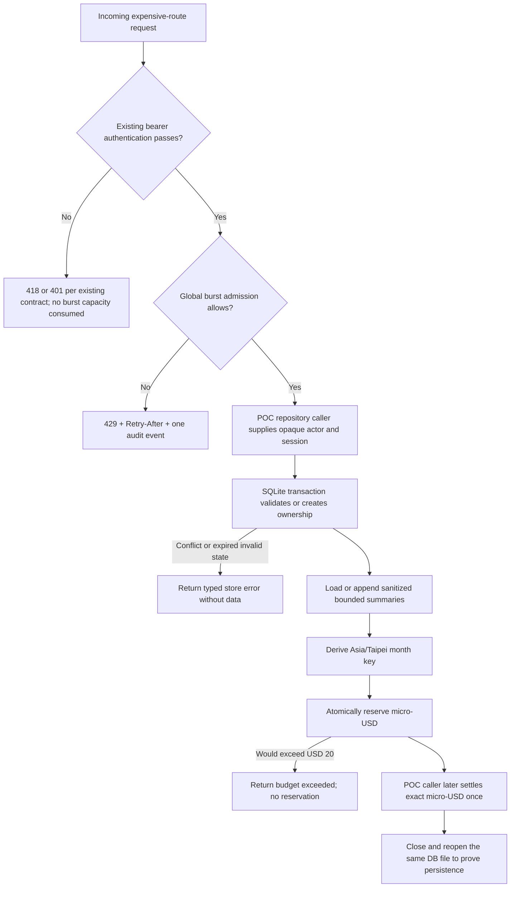

# Runtime SQLite Persistence and Layered Rate-Limit POC PRD

| Field | Value |
|-------|-------|
| Story ID | S-RUNTIME-SEC-01 |
| Version | v0.5.0 |
| Status | Approved (v0.5.0, 2026-08-13) |
| Sprint | N/A |
| has_ui | false |
| Tickets | N/A |

---

## 1. Confirmed direction

All follow-ups are decided; the resolved FU records (background, options, decisions) are archived in [Appendix: Resolved Follow-ups](#appendix-resolved-follow-ups). Non-blocking FU-002 (Platform), FU-003 (Runtime), and FU-006 (Runtime) stay open with owners and close-by points recorded there.

- Persistence and budget state are owned by the Rust runtime.
- The POC uses one SQLite database file and one runtime replica.
- The database file must live on a persistent volume; a container-local file is not durable deployment storage.
- Each opaque actor has a USD 20 monthly budget keyed by the Asia/Taipei calendar month.
- Money uses integer micro-USD; allowance decisions never use floating point.
- A session stores at most five caller-supplied summary fields for 30 days; the repository redacts configured sensitive patterns (email, IP, cookie, token) and truncates each field, but does not verify summarization — keeping raw prompts/responses out of summary fields is the calling slice's contract (FU-006).
- A settlement with authoritative cost above its reservation records the actual spend and may overdraw the month; while overdrawn, every new reservation is rejected until the next Asia/Taipei month or operator reconciliation.
- A separate process-local global burst limiter protects expensive HTTP routes after bearer authentication and returns `429` with `Retry-After`; it is not the monthly USD ledger, and unauthenticated requests never consume its capacity.
- Runtime peer IP and `session_id` are never treated as user identity or monthly-budget keys.
- Rate-limit rejection audit uses one structured event path and does not synchronously write one SQLite row per hostile request.
- Production route enforcement, Falcon actor propagation, and OpenRouter cost extraction are later slices.

---

## 2. Context

### Goal

Prove two independent protection layers in `datacenter-agent`: durable SQLite repositories for opaque users, session ownership, minimized memory, and an atomic per-user monthly USD ledger; plus a process-local global burst limiter that rejects excessive admission to expensive routes before JSON extraction. Preserve repository and limiter seams for trusted-actor enforcement and a future centralized production backend.

### Persona + Pain

| Persona | Context | Pain point |
|---------|---------|------------|
| Runtime developer | Builds the first persistence and quota slice | The current `Mutex<HashMap>` disappears when the process restarts and cannot produce a durable cost ledger. |
| Platform / SRE | Evaluates a low-operations POC | SQLite is easy to run, but its single-host and persistent-volume constraints must be explicit before production use. |
| Security reviewer | Reviews stored chat context | Current fields called summaries can contain raw request and response text and have no storage expiry. |

### Success metrics

| Metric | Target | Measurement |
|--------|--------|-------------|
| Restart persistence | 100% of user, session owner, allowed summaries, reservations, and settlements survive closing and reopening the same database file | Rust SQLite integration tests |
| Session isolation | 100% of same-session/different-actor attempts return an ownership conflict without exposing stored data | Repository contract tests |
| Monthly quota correctness | Concurrent reservations against one SQLite database never make `spent + reserved` exceed 20,000,000 micro-USD; only an authoritative over-settlement may exceed it | Transaction/concurrency tests with a deterministic clock |
| Settlement idempotency | Replaying the same reservation settlement does not increase spent twice | Repository contract tests |
| Over-settlement containment | While an actor's month is overdrawn by an authoritative settlement, 100% of new reservations return budget exceeded | Repository contract tests |
| Data minimization | Persisted rows contain none of the secret/PII fixtures or full over-budget prompt/response fixtures | Database inspection tests |
| Burst admission | The configured burst plus refill policy deterministically returns `429` before an expensive handler is invoked | Axum router/middleware contract tests |
| Probe compatibility | `/health` and `/ready` never pass through the burst limiter and retain their current response shapes | Existing probe and new route-scope tests |
| Audit amplification | One rejected request emits at most one structured rejection event and performs zero SQLite audit writes | Audit-sink spy and SQLite statement-count tests |

### Risk and evidence

| Item | Trigger / Source | Mitigation / Decision |
|------|------------------|-----------------------|
| False durability | SQLite file remains inside an ephemeral container layer | Require an explicit database path, document persistent-volume mounting, and fail startup when the configured parent/path cannot be opened. |
| Split quota | More than one runtime replica has a separate SQLite file | Mark the backend POC-only and single-replica; migration is mandatory before scaling runtime replicas. |
| Async executor blocking | SQLite calls run directly on Tokio worker threads | Use an async SQLite adapter that executes database work on its dedicated database thread. |
| Concurrent overspend | Multiple requests reserve the same remaining amount | Use one immediate SQL transaction for read/check/insert/update. |
| Sensitive retention | Existing memory append receives raw prompt and response strings | Apply deterministic redaction and character budgets before insert; cap turns and prune expired rows transactionally. |
| Proxy/IP ambiguity | Runtime receives traffic from Falcon BFF or a reverse proxy | Use a global runtime admission key for this POC; do not trust forwarding headers or persist raw peer IP. |
| Limiter reset | `tower-governor` state is process-local and resets on restart | Document it as short-window defense in depth only; SQLite remains the durable monthly ledger. |
| Audit write amplification | An attacker generates many `429` decisions | Emit structured rejection events through the existing sink; do not synchronously log each request into SQLite. |
| Evidence | `src/runtime/memory/store.rs`, `src/runtime/memory/context.rs`, `src/runtime/turn.rs`, `.agent/guardrails.md` | Add a new repository seam without changing the existing route or probe contracts in this POC. |
| External evidence | `tokio-rusqlite` official crate documentation | A cloneable connection handle schedules SQLite closures on a dedicated background thread instead of blocking Tokio workers. |

---

## 3. Scope

### In scope

- A SQLite runtime-store module and schema migration owned by `datacenter-agent`.
- Opaque user upsert and last-seen timestamps.
- Atomic session creation/ownership validation, 30-day expiry, and explicit clear.
- At most five persisted summaries with deterministic redaction and configured character limits.
- Asia/Taipei month-key and next-reset calculation.
- Atomic reserve, idempotent settle, retained unknown-cost reservation, and ledger snapshot operations using integer micro-USD.
- File-reopen, ownership, expiry, sanitization, concurrency, boundary, and idempotency tests.
- An opt-in process-local global burst limiter for `/agent/stream`, `/v1/chat/completions`, `/insight*`, and `/report*`, applied after each route family's bearer gate; `/health`, `/ready`, and `/greeting` remain outside its scope.
- A pinned `429` body per route family — uniform `{"error": "<message>"}` on standard routes, OpenAI `{"error": {"message", "type": "rate_limit_error"}}` on `/v1/chat/completions` — with integer `Retry-After`, cache prevention, and one structured rejection event through the existing audit abstraction.
- Router tests proving rejection occurs after bearer authentication, before JSON extraction, and before LLM/MCP/SQLite business operations.
- Two independently verifiable POC slices: Slice 1 SQLite repositories; Slice 2 ingress admission and audit.
- POC configuration/documentation for database path, persistent volume, backup, single replica, and migration limitations.

### Out of scope

- Wiring the SQLite monthly ledger or persisted session repository into the production `/agent/stream` execution path.
- Introducing a session header, requiring session ID, moving `session_id` out of its current optional request-body field, or using session ID as an identity/rate key.
- Trusting `X-Forwarded-For`, `Forwarded`, or peer IP as a Falcon end-user identity inside the runtime.
- Adding a trusted actor header or per-actor short-window limiter before the server-to-server identity contract is implemented.
- Parsing OpenRouter authoritative `usage.cost` or generation IDs.
- Calling OpenRouter or MCP from POC tests.
- Multiple runtime replicas, shared filesystem SQLite, Redis/PostgreSQL provisioning, deployment, secrets, or production data migration.
- Full transcript retention, user profile/email/IP/cookie/token storage, quota administration UI, or payment collection.
- Verifying that caller-supplied summary fields are genuine summaries rather than raw text; the summary-producing boundary belongs to the future request-path integration (FU-006).

---

## 4. Flow



---

## 5. Functional Requirements (FR)

### FR-001: SQLite store lifecycle and schema

**使用者價值**: Runtime state can survive a process restart without an external service during the POC.

**Behavior**: Opening the configured SQLite file initializes a versioned schema, enables foreign keys, configures a bounded busy timeout and durable journal settings, and exposes one async repository handle. Reopening the same file preserves committed records.

**Input**:

| Field | Required | Notes |
|-------|----------|-------|
| database path | Yes | Absolute or resolved by the host before open; production-like POC uses a persistent volume path. |
| max turns | Yes | Default and maximum accepted value is 5 for this POC. |
| TTL | Yes | 30 days. |
| busy timeout | No | Positive bounded duration; default 5 seconds. |

**Output**:

| Field | Notes |
|-------|-------|
| runtime store handle | Cloneable async handle used by repository methods. |
| schema version | Stored through SQLite migration metadata. |

**Data source**: New runtime SQLite module and SQLite database file.

**Permissions / Visibility**: Runtime process only; the database file is never served through HTTP.

**Boundary conditions**:

- Opening an unavailable or malformed database fails with a typed error and never silently falls back to in-memory storage.
- This backend is invalid when runtime replica count is greater than one.
- Probe endpoint response formats remain unchanged because the POC is not wired into server startup.

### FR-002: Opaque user, session ownership, and minimized memory

**使用者價值**: A session cannot disclose another actor's context, and approved context remains available after reopening the database.

**Behavior**: The repository upserts an opaque actor, atomically creates or validates a session owner, prunes expired data, and stores at most five summaries. Before persistence every summary field passes one deterministic sanitization pipeline in fixed order: redact configured sensitive patterns, normalize whitespace, then truncate to the per-field character limit. Summary content is never a rejection reason.

**Input**:

| Field | Required | Notes |
|-------|----------|-------|
| opaque actor key | Yes | Already pseudonymized by the future trusted identity boundary; no email, IP, cookie, or token. |
| session ID | Yes | Validated non-empty bounded identifier. |
| current instant | Yes | Injected UTC timestamp used for creation, last-activity tracking, expiry checks, and pruning; no wall-clock reads inside the repository. |
| summary | Conditional | Turn ID, bounded user/answer summaries, approved metadata, and timestamp; per-field character limit defaults to 500 characters and is configurable. |

**Output**:

| Field | Notes |
|-------|-------|
| session result | Created or owned-by-caller; a different owner returns a typed conflict. |
| recent memory | At most five non-expired sanitized summaries in chronological order. |

**Data source**: SQLite `users`, `sessions`, and `session_turns` tables.

**Permissions / Visibility**: Repository methods require the opaque actor key for every session read, append, and clear.

**Boundary conditions**:

- A different actor receives no owner key, summaries, or existence details beyond the typed conflict.
- A session expires 30 days after its last successful append; creation counts as the first append, reads never refresh expiry, and every expiry decision uses the injected `current instant`.
- An expired session and its turns are unavailable to every actor and are pruned during bounded maintenance operations; the expired session ID becomes claimable as a brand-new session by any actor.
- Explicit clear deletes the session row and its turns in one transaction and releases ownership; a cleared session ID behaves like a never-used ID.
- The repository contract is sanitization of caller-supplied summary fields only: it redacts configured sensitive patterns and truncates to the per-field limit, but it cannot verify that a field is a genuine summary. Keeping raw prompts/responses out of summary fields is owned by the future request-path integration and tracked as FU-006. The repository returns a typed validation error only for structurally invalid identifiers (empty or over-length actor key or session ID), never for summary content.

### FR-003: Atomic monthly USD budget ledger

**使用者價值**: One actor's POC ledger cannot reserve more than USD 20 in one Asia/Taipei calendar month.

**Behavior**: The repository derives a month key from a supplied UTC instant, then reserves integer micro-USD in one immediate transaction. A successful settlement moves one reservation from reserved to spent exactly once, always recording the authoritative actual amount — even when it exceeds the reservation and overdraws the month. Unknown final cost keeps the reservation pending for later reconciliation.

**Input**:

| Field | Required | Notes |
|-------|----------|-------|
| opaque actor key | Yes | Same scope as FR-002. |
| reservation ID | Yes | Idempotency key for one future OpenRouter generation. |
| requested amount | Yes | Positive integer micro-USD; POC monthly limit is 20,000,000. |
| current instant | Yes | Injected UTC timestamp converted to Asia/Taipei for month/reset calculation. |
| actual amount | On settlement | Non-negative integer micro-USD supplied by a future provider adapter. |

**Output**:

| Field | Notes |
|-------|-------|
| reserve result | Reserved or budget exceeded, with spent/reserved/remaining and next reset timestamp. |
| settle result | Settled once, settled with overage (month now overdrawn), already settled, or reconciliation required (unknown final cost). |

**Data source**: SQLite `monthly_budgets` and `budget_reservations` tables.

**Permissions / Visibility**: Runtime repository only; values are not exposed through an HTTP API in this POC.

**Boundary conditions**:

- `spent + reserved + requested` must be at most 20,000,000 micro-USD.
- Duplicate reservation IDs are idempotent only when actor, month, and amount match; mismatches return a typed conflict.
- A settlement with a known authoritative cost larger than the reservation charges the actual amount as spent in the same transaction and closes the reservation; the month may then be overdrawn (`spent + reserved` above 20,000,000 micro-USD) and the result reports the overage.
- While a month is overdrawn, every new reservation for that actor and month is rejected as budget exceeded until the next Asia/Taipei month starts or an operator reconciles the ledger.
- A settlement with an unknown final cost is a distinct state from known overage: the reservation stays pending at its reserved amount and counts against the month until reconciliation supplies the authoritative cost.
- A settlement smaller than the conservative reservation records the actual amount as spent and releases the unused reserved difference back to the same month's remaining budget in the same transaction.
- The first day at `00:00:00 Asia/Taipei` starts a new month ledger without deleting the prior ledger.

### FR-004: POC operational boundary

**使用者價值**: The team can evaluate SQLite without mistaking it for distributed production protection.

**Behavior**: Documentation supplies an opt-in SQLite path and persistent-volume mount, separate opt-in burst policy, and migration prerequisites. It states that ingress `429` protection is request-path behavior while SQLite monthly/session enforcement remains a repository-only POC.

**Input**:

| Field | Required | Notes |
|-------|----------|-------|
| deployment topology | Yes | Exactly one runtime replica for both process-local governor state and SQLite. |
| burst policy | Yes | Explicit refill period and burst size; no undocumented crate preset. |

**Output**:

| Field | Notes |
|-------|-------|
| POC runbook | Setup, persistence check, backup copy procedure while stopped, limitations, and next integration slice. |

**Data source**: Repository documentation and compose example.

**Permissions / Visibility**: Developer/Platform documentation; no deployment action is included.

**Boundary conditions**:

- Both POC slices are opt-in; the default memory backend and default request behavior remain unchanged.
- A future request-path integration must close FU-003 and add fail-closed HTTP/SSE behavior before production enablement.

### FR-005: Global short-window admission and safe audit

**使用者價值**: A burst of requests is rejected before it consumes JSON parsing, LLM, MCP, or SQLite business-operation capacity.

**Behavior**: A process-local limiter applies one global token-bucket policy only to expensive routes, positioned after each route family's existing bearer gate and before JSON extraction and handlers. An exceeded request returns `429` with `Retry-After` as integer delta-seconds, `Cache-Control: no-store`, and the pinned per-family error body: standard routes return the existing uniform envelope `{"error": "<message>"}`; `/v1/chat/completions` returns the OpenAI envelope `{"error": {"message": "<message>", "type": "rate_limit_error"}}`. The rejection emits one structured `RateLimitRejected` audit event through the existing sink.

**Input**:

| Field | Required | Notes |
|-------|----------|-------|
| route group | Yes | Expensive analytics/chat routes only. |
| refill period | Yes | Positive duration declared in runtime config. |
| burst size | Yes | Positive integer declared in runtime config. |

**Output**:

| Field | Notes |
|-------|-------|
| allow | Continues to existing bearer middleware and handler. |
| reject | `429`, integer `Retry-After`, `Cache-Control: no-store`, the pinned per-family error body, and one audit event. |

**Data source**: Process-local `tower-governor` state and existing runtime `AuditSink`; no SQLite request-log table.

**Permissions / Visibility**: Applies after bearer authentication and before body extraction as a coarse service-capacity boundary for authenticated traffic; it does not establish user identity or authorization.

**Boundary conditions**:

- `/health`, `/ready`, and `/greeting` are not limited.
- A request that fails the existing bearer contract is rejected with `418` (standard routes) or `401` (OpenAI route) before the limiter and consumes no burst admission capacity.
- The limiter key is global for this POC; peer/forwarded IP and session ID are not used.
- Missing session ID is not a limiter error and preserves the current optional request contract.
- A rejection invokes no endpoint handler, LLM, MCP, or SQLite business operation.
- Limiter state resets on process restart and cannot be cited as durable or multi-replica protection.
- Audit fields contain request ID, route, decision, retry delay, and policy version only; no raw IP, session, actor, token, prompt, or response.

---

## 6. Non-functional Requirements (NFR)

| Category | Requirement |
|----------|-------------|
| Performance | SQLite work executes outside Tokio worker threads; one repository operation completes within 100 ms in local integration tests excluding filesystem cold-start variance; rejected bursts do not invoke JSON extraction or business handlers. |
| Security / Compliance | No raw identity, full transcript, secret fixture, email, IP, cookie, or token is persisted; database path contains no secret; errors do not include stored values. |
| Reliability | Transactions use integer micro-USD and rollback on error; schema initialization is idempotent; committed rows survive close/reopen; SQLite uses foreign keys and a durable journal/synchronous policy documented in the spec. |
| Compatibility | The opt-in limiter adds only documented `429` behavior on expensive routes; successful HTTP/SSE shapes and all probe/greeting shapes remain unchanged; the default remains disabled during POC evaluation. |
| Accessibility | N/A (has_ui=false). |
| Operability | Runbook requires a persistent volume, single replica, filesystem permissions, backup/restore check, explicit burst policy, observed `429`/`Retry-After`, and migration before horizontal scaling. |

---

## 7. Error Scenarios (ERR)

### ERR-001: SQLite unavailable

**Trigger**: The path cannot be opened, schema migration fails, the file is corrupt, or a transaction exceeds the bounded busy timeout.

**Expected behavior**: Return a typed store-unavailable error; never silently switch to memory or return stored values in the error.

**Recovery**: Operator fixes the path, volume, permissions, or database and retries the POC operation.

### ERR-002: Session ownership conflict

**Trigger**: Actor B presents a session ID already owned by actor A and not expired.

**Expected behavior**: Return a typed ownership conflict without loading, overwriting, refreshing, or disclosing actor A's data.

**Recovery**: Caller uses a new session ID.

### ERR-003: Monthly budget exceeded

**Trigger**: A new reservation would make current-month spent plus reserved exceed 20,000,000 micro-USD.

**Expected behavior**: Return a typed budget-exceeded result with next reset time and create no reservation.

**Recovery**: Caller waits until the next Asia/Taipei month or an operator changes a later production policy outside this POC.

### ERR-004: Reservation reconciliation required (unknown final cost)

**Trigger**: Settlement lacks a final authoritative cost for a pending reservation.

**Expected behavior**: Keep the reservation counted against the monthly budget at its reserved amount and return reconciliation-required; never refund unknown spend automatically.

**Recovery**: A future OpenRouter adapter or operator retries settlement with authoritative generation data.

### ERR-005: Short-window request burst exceeded

**Trigger**: The process-local global admission bucket cannot fit another request for an expensive route.

**Expected behavior**: Return `429` with integer `Retry-After`, `Cache-Control: no-store`, and the pinned per-family body (`{"error": "<message>"}` on standard routes; `{"error": {"message", "type": "rate_limit_error"}}` on `/v1/chat/completions`); emit one redacted structured rejection event; invoke no handler, LLM, MCP, or SQLite business operation.

**Recovery**: Caller waits for the advised delay and retries. Operators tune the explicit burst/refill policy from observed metrics rather than changing code.

### ERR-006: Known over-settlement overdraws the month

**Trigger**: Settlement reports an authoritative actual cost larger than the conservative reservation.

**Expected behavior**: Charge the actual amount as spent in the same transaction, close the reservation, report the overage in the settle result, and reject every subsequent reservation for that actor and month while the ledger is overdrawn.

**Recovery**: New reservations resume at the next Asia/Taipei month, or an operator reconciles the ledger outside this POC. The overdraw evidence stays in the ledger snapshot for tuning conservative reservation sizes.

---

## 8. Acceptance Criteria (AC)

### AC-001: Committed state survives reopen

```gherkin
Given a temporary SQLite file contains an opaque user, owned session, one allowed summary, and one budget reservation
When the repository connection is closed and a new repository opens the same file
Then the same owner, summary, and reservation snapshot are returned before expiry
```

### AC-002: Session cannot cross actors

```gherkin
Given opaque actor A owns non-expired session s1 with one stored summary
When opaque actor B loads or appends to session s1
Then the repository returns an ownership conflict and returns none of actor A's stored values
```

### AC-003: Persisted memory is minimized

```gherkin
Given six summaries include an email, IP, cookie, bearer token, repeated whitespace, and text beyond configured character limits
When they are appended to one owned session
Then SQLite contains only the five newest bounded summaries and none of the raw sensitive fixtures or full over-limit text
```

### AC-004: Monthly reservation is atomic in one SQLite database

```gherkin
Given opaque actor A has 1,000,000 micro-USD remaining in the active Asia/Taipei month
When two concurrent tasks each attempt to reserve 750,000 micro-USD through the same SQLite store
Then exactly one reservation succeeds and spent plus reserved remains at most 20,000,000 micro-USD
```

### AC-005: Settlement is idempotent

```gherkin
Given reservation g1 succeeded for opaque actor A in the active month
When settlement of g1 with the same authoritative actual cost is submitted twice
Then the ledger moves the cost to spent once and the second result is already settled
```

### AC-006: Taipei month boundary is deterministic

```gherkin
Given one reservation occurs at 2026-08-31T15:59:59Z and another at 2026-08-31T16:00:00Z
When the repository derives their Asia/Taipei budget periods
Then the first uses 2026-08 and the second uses 2026-09 with reset at 2026-09-30T16:00:00Z
```

### AC-007: POC limitation is explicit

```gherkin
Given a developer reads the SQLite POC runbook and configuration example
When they evaluate deployment requirements
Then it requires one runtime replica and a persistent volume and distinguishes opt-in burst admission from unimplemented actor/month enforcement and multi-replica protection
```

### AC-008: Burst rejection happens before expensive work

```gherkin
Given the opt-in global burst policy has no remaining admission capacity
When another authenticated valid-sized request reaches an expensive route
Then it receives 429 with Retry-After and no handler, JSON extractor, LLM, MCP, or SQLite business operation is invoked
```

### AC-009: Probe and greeting routes are not limited

```gherkin
Given the expensive-route admission bucket is exhausted
When callers invoke health, ready, and greeting under their existing authentication contract
Then those routes bypass the governor and retain their current response shapes
```

### AC-010: Rate-limit audit is bounded and minimized

```gherkin
Given a rejected request contains raw IP, session, bearer, prompt, and response fixtures
When the global limiter emits its rejection decision
Then exactly one audit event is emitted, no SQLite audit write occurs, and none of the raw fixtures appears in event fields
```

### AC-011: Known over-settlement overdraws and freezes the month

```gherkin
Given opaque actor A has 16,000,000 micro-USD spent and reservation g2 holds the remaining 4,000,000 in the active month
When settlement of g2 reports an authoritative actual cost of 9,000,000 micro-USD and actor A then requests any new reservation
Then the ledger records 25,000,000 micro-USD spent with an overage result and the new reservation is rejected as budget exceeded while the month stays overdrawn
```

### AC-012: Session expiry is deterministic and releases the ID

```gherkin
Given opaque actor A owns session s2 whose last successful append is 30 days and one second before the injected current instant
When actor A loads s2 and opaque actor B then creates a session with the same ID s2
Then the load returns no stored summaries for the expired session and actor B becomes the owner of a brand-new empty session without conflict
```

### AC-013: Explicit clear releases ownership

```gherkin
Given opaque actor A owns session s3 with two stored summaries
When actor A clears s3 and opaque actor B then creates a session with ID s3
Then the clear removes the session row and its turns in one transaction and actor B owns a new empty session without conflict
```

### AC-014: Unauthenticated traffic cannot starve the burst bucket

```gherkin
Given the opt-in global burst policy has exactly one admission slot remaining
When a request without a valid bearer token reaches an expensive route and an authenticated request follows
Then the unauthenticated request is rejected by the existing authentication contract without consuming capacity and the authenticated request is admitted
```

### AC-015: The 429 body is pinned per route family

```gherkin
Given the opt-in global burst policy has no remaining admission capacity
When one authenticated request reaches /agent/stream and another reaches /v1/chat/completions
Then both return 429 with integer Retry-After seconds and Cache-Control: no-store, the first with body {"error": "<message>"} and the second with body {"error": {"message", "type": "rate_limit_error"}}
```

---

## 9. UI / UX

UI: N/A (has_ui=false).

### Mockup evidence

- N/A (runtime storage module only).

### Interaction and states

| State / Step | Expected behavior | Copy |
|--------------|-------------------|------|
| Default | N/A (no UI/API change). | N/A |
| Loading | N/A (no UI/API change). | N/A |
| Error | Typed Rust repository errors plus stable opt-in HTTP `429` on expensive routes. | N/A |
| Empty | A new actor/month/session is created by repository operations. | N/A |

### Design tokens

| Token type | Usage |
|------------|-------|
| Color | N/A (has_ui=false). |
| Typography | N/A (has_ui=false). |
| Spacing | N/A (has_ui=false). |

---

## 10. Dependencies & Constraints

- **Upstream**: Existing Axum/Tower router, Tokio runtime, runtime module layout, and future trusted opaque actor/provider-cost adapters.
- **Downstream**: Future `AppState`/`/agent/stream` enforcement and migration to a centralized production repository.
- **Breaking change**: No by default; enabling the ingress slice introduces documented `429` responses on expensive routes when the configured burst is exhausted.
- **Assumptions**: The POC runs with one `datacenter-agent` replica and the configured SQLite file is backed by a writable persistent volume.

---

## 11. Related Documents

| Document | Link |
|----------|------|
| Current memory | `docs/reference/modules/runtime-memory.md` |
| Current API | `docs/reference/endpoints/agent-stream.md` |
| Spec | `docs/work/runtime-user-session-rate-limit/spec.md` (after Gate 1 approval) |
| QA Plan | `docs/work/runtime-user-session-rate-limit/qa-plan.md` (after Gate 2 approval) |

---

## 12. Gate 1 Check

- [x] Every FR has user value, data source, permissions, and boundary conditions.
- [x] Every AC uses Given-When-Then and has an executable precondition.
- [x] ERR covers the main failure and recovery path.
- [x] Scope, dependencies, breaking change, and assumptions are explicit.
- [x] Blocking FU is closed; non-blocking FUs have owners and close-by points.
- [x] NFR has measurable targets or an N/A reason.
- [x] UI evidence matches `has_ui=false`.
- [x] Full Gate 1 result: PASS.

Gate 1: PASS  
Failed checks: none (v0.4.2 review returned FAIL with five findings; all five are resolved in v0.5.0)  
Evidence: `docs/work/runtime-user-session-rate-limit/prd.md` v0.5.0  
Reviewed at: 2026-08-13 15:40 +08:00

## PRD Interview Execution Checklist

Skill: prd-interview  
Executed At: 2026-08-13 14:11 +08:00  
Artifact: `docs/work/runtime-user-session-rate-limit/prd.md`

Phase 1 Context: PASS  
Evidence: `.agent/project-manifest.md`; `.agent/guardrails.md`; `.agent/knowledge/system-context.md`; `docs/reference/index.md`; HEAD is 0 ahead / 2 behind `origin/main` after fetch.

Phase 2 風險與範圍: PASS  
Evidence: ephemeral-file, split-quota, proxy/IP ambiguity, limiter reset, audit amplification, concurrent reservation, and sensitive-retention risks; two independently verifiable POC slices; Sprint N/A.

Phase 3 訪談: PASS  
Evidence: SQLite POC, single runtime replica, global expensive-route admission, safe audit, USD 20 monthly budget, Asia/Taipei boundary, and minimized 30-day session retention confirmed; zero blocking FUs remain.

Phase 4 產出: PASS  
Evidence: five FRs, five ERRs, ten ACs, measurable NFRs, and `UI: N/A (has_ui=false)`.

Phase 5 Gate 1: PASS  
Evidence: core checks and `prd-interview/references/gate-1.md` checks completed; no failed checks.

Metadata: PASS  
Path: `docs/work/runtime-user-session-rate-limit/meta.yml`

Notes: v0.4.0 keeps the single-replica SQLite repository POC and adds a separate opt-in global ingress-admission slice. Trusted-actor and OpenRouter cost enforcement remain later integrations. v0.4.1 applies three review fixes (under-settlement release rule, single sanitization pipeline, quantified character-limit and busy-timeout defaults) without changing scope or acceptance structure. v0.5.0 resolves the five Gate 1 review findings on v0.4.2: over-settlement/overdraw policy (ERR-006, AC-011), auth-before-limiter ordering (AC-014), narrowed summary guarantee (FU-006), session TTL/clear lifecycle (AC-012, AC-013), and pinned per-family 429 bodies (AC-015).

## 13. Approval Package

### Changes since previous Gate

- v0.5.0 resolves the five Gate 1 review findings that failed v0.4.2: (P1) known over-settlement now charges the authoritative cost, may overdraw the month, and freezes new reservations until the next month or reconciliation (ERR-006, AC-011), with unknown final cost kept as a distinct pending state (ERR-004); (P1) the burst limiter moves after bearer authentication so unauthenticated traffic cannot starve the bucket (AC-014); (P1) the raw-transcript guarantee is narrowed to sanitization of caller-supplied summary fields, with the summary-producing boundary tracked as FU-006 for the integration slice; (P2) session TTL (30 days from last append, reads never refresh), expiry ID release, and clear-releases-ownership semantics are defined with an injected clock (AC-012, AC-013); (P2) the 429 body is pinned per route family with integer Retry-After (AC-015).
- v0.4.2 structure: moved decided FU records to the appendix; section 1 keeps only the confirmed direction summary. No requirement content changed.
- v0.4.1 review fixes: defined under-settlement behavior (actual below reservation releases the unused difference in the same transaction), converged summary sanitization into one deterministic redact-normalize-truncate pipeline with rejection reserved for structurally invalid identifiers, and quantified defaults for the per-field character limit (500 characters) and SQLite busy timeout (5 seconds).
- Split rate limiting into process-local burst admission and durable monthly USD budget accounting.
- Rejected IP/session-based end-user identity; the POC limiter key is global until a trusted actor contract exists.
- Added route scoping, `429`/`Retry-After`, probe compatibility, and safe audit requirements.
- Kept SQLite authoritative only for users, sessions, and the monthly ledger; no synchronous request-log writes.

### Evidence checklist

- Current body/session contract: `src/server/dto.rs` and `src/server/route.rs`.
- Current audit seam: `src/runtime/audit.rs`.
- Current server lacks peer connect-info wiring and `tower-governor`: `src/main.rs` and `Cargo.toml`.
- Pinned `429` envelopes match the existing shapes: uniform `{"error": string}` in `src/server/error.rs`; OpenAI `{"error":{"message","type"}}` in `src/server/openai.rs`.
- Bearer authentication is a header-only constant-time check applied per sub-router before body extraction: `src/server/auth.rs` and `src/server/route.rs`.
- Reviewed draft: `user:handwritten-layered-rate-limit-draft-2026-08-13`.
- External behavior evidence: official `tower-governor` docs and RFC 6585 section 4 for `429`.

### Risks and open questions

- Accepted POC gap: governor and SQLite are single-replica protections.
- Accepted POC gap: monthly budget is repository-tested but not enforced on OpenRouter until FU-003 closes.
- Accepted POC gap: the repository sanitizes but cannot verify caller-supplied summaries; the summary-producing boundary lands with the integration slice (FU-006).
- Future decision: centralized PostgreSQL or Redis architecture before horizontal runtime scaling.

### Decision options

- Approve v0.5.0 and proceed to technical spec.
- Request named changes while keeping PRD awaiting approval.
- Stop this work item.

---

## Appendix: Resolved Follow-ups

Decided FU records moved here after confirmation; the operative summary lives in section 1 Confirmed direction.

### FU-001: POC persistence backend

| Type | Background | Options | AI recommendation | Decision |
|------|------------|---------|-------------------|----------|
| Blocking | The first delivery must survive a runtime process restart without provisioning a shared service. | A: local SQLite file on a persistent volume, restricted to one runtime replica / B: managed Redis shared store | A for this POC. It proves the storage schema and atomic ledger with lower operational cost. | Confirmed A by user on 2026-08-13. |

### FU-002: Production multi-replica backend

| Type | Background | Options | AI recommendation | Decision |
|------|------------|---------|-------------------|----------|
| Non-blocking | A local SQLite file is not a shared quota boundary when `datacenter-agent` has multiple replicas. | A: migrate the same repository contracts to PostgreSQL / B: use Redis for the hot budget boundary and a durable SQL ledger | Decide with Platform before increasing runtime replicas above one. | Owner: Platform; close before multi-replica production rollout. |

### FU-003: OpenRouter cost adapter

| Type | Background | Options | AI recommendation | Decision |
|------|------------|---------|-------------------|----------|
| Non-blocking | This storage POC can reserve and settle integer micro-USD, but the current provider events expose token usage rather than authoritative `usage.cost` and generation ID. | A: extend the OpenRouter adapter to surface authoritative cost/generation ID / B: calculate cost from a separately maintained price table | A in the next integration slice to avoid pricing drift. | Owner: Runtime; close before enabling request enforcement. |

### FU-004: Short-window ingress limiter key

| Type | Background | Options | AI recommendation | Decision |
|------|------------|---------|-------------------|----------|
| Blocking | `datacenter-agent` normally sees Falcon BFF or reverse-proxy traffic, so peer IP is not a stable end-user identity. | A: one process-local global burst limiter on expensive runtime routes; add trusted-actor limiting only after the actor contract exists / B: treat peer or forwarded IP as the end user | A. It protects runtime admission without conflating a proxy IP, session ID, or user identity. | Confirmed A by user when approving the reviewed draft optimizations on 2026-08-13. |

### FU-005: Rate-limit audit path

| Type | Background | Options | AI recommendation | Decision |
|------|------------|---------|-------------------|----------|
| Blocking | Synchronously inserting one SQLite audit row for every accepted/rejected request lets hostile traffic amplify database writes and contend with the quota ledger. | A: emit one structured rejection decision through the existing `AuditSink`/tracing path; no raw IP/session and no synchronous SQLite request log / B: synchronously persist every request decision to SQLite | A. SQLite stays authoritative for users, sessions, and monthly budgets; operational rejection evidence remains bounded and non-sensitive. | Confirmed A by user when approving the reviewed draft optimizations on 2026-08-13. |

### FU-006: Summary-producing boundary

| Type | Background | Options | AI recommendation | Decision |
|------|------------|---------|-------------------|----------|
| Non-blocking | The repository sanitizes caller-supplied summary fields (redact + truncate) but cannot verify a field is a genuine summary; a short raw prompt without a configured sensitive pattern would persist unchanged. | A: narrow the POC guarantee to sanitization of caller-supplied summary fields and place the summary-producing boundary in the request-path integration slice / B: include a deterministic summarizer boundary in this POC | A. Keeps the POC storage-focused; the integration slice that wires `/agent/stream` must produce summaries before calling the repository. | Confirmed A by user during Gate 1 review fixes on 2026-08-13. Owner: Runtime; close with the request-path integration slice, together with FU-003. |
